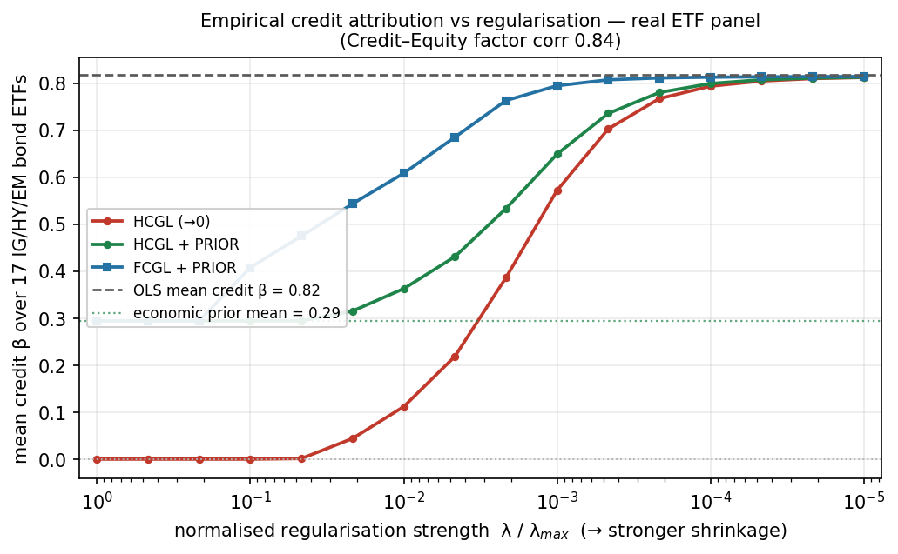

# factorlasso

**Sparse multi-output regression with sign constraints, prior-centered
regularisation, and a family of grouped and cooperative penalties —
Hierarchical Clustering Group LASSO (HCGL), Factor-Clustering Group LASSO
(FCGL), UniLasso, and cooperative LASSO — via CVXPY.**

[](https://pypi.org/project/factorlasso/)
[](https://pypi.org/project/factorlasso/)
[](LICENSE)

**Paper:** Sepp, A. and Kastenholz, M. (2026), *factorlasso: Hierarchical
Clustering Group LASSO (HCGL) with Cluster-Pooled Sign Derivation for
Multi-Asset Factor Models in Python*, submitted to the *Journal of Statistical
Software*. The manuscript is available [here](papers/jss_2026/paper/article.pdf).
See [Citation](#citation) for the BibTeX entry. The replication
material for the paper is in [`papers/jss_2026/`](papers/jss_2026/).

**Methodology:** The cluster-pooled sign derivation and the noise-floor gate
are developed in Sepp, A. and Kastenholz, M. (2026), *Gated Cluster-Pooled Sign
Constraints for Multi-Output Sparse Regression*, submitted to *Computational
Statistics and Data Analysis*. The replication material for that paper is in
[`papers/sign_pooling_2026/`](papers/sign_pooling_2026/).

`factorlasso` is a small, dependency-light Python package for fitting sparse
multi-output linear models

$$
Y = X\beta^\top + \varepsilon,
\qquad \beta \in \mathbb{R}^{N \times M}
$$

with L1 and L2 penalties along with sign constraints on factor loadings.

It targets the financial data and regime where standard sparse-regression tools quietly
misattribute risk: short samples, strongly correlated factors, and a known
group structure or inferred cluster structure. On a multi-asset benchmark it matches scikit-learn, skglm,
and asgl on generic accuracy while recovering a collinear credit factor that
every one of them shrinks to zero (see [Empirical
illustration](#empirical-illustration)).

`factorlasso` is useful when four things matter:

- Some coefficients **must be zero, non-negative, or non-positive**, possibly by
  asset, by factor, or both.
- You have a **prior** β₀ and want to penalise `‖β − β₀‖`, not `‖β‖`.
- You want **structured sparsity** — groups of responses entering or leaving
  the model together — where the groups are either user-supplied or discovered
  by hierarchical clustering of the response correlation matrix. Two grouping
  geometries are offered: **HCGL** (Hierarchical Clustering Group LASSO), which
  groups the penalty over each asset's factor loadings, and **FCGL**
  (Factor-Clustering Group LASSO), which groups it over a cluster's assets on
  each factor.
- You want to combine **group-level selection with within-group elementwise
  sparsity** via a tunable mix of group L2 and L1 penalties (Sparse Group
  LASSO).
- You want the **sign coherence within a group to be soft**, so the data can
  overrule it, through the cooperative LASSO, or a **per-response
  univariate-guided** estimator that needs no grouping, through UniLasso.

It is written in pure numpy/pandas/scipy/cvxpy. No numba, no custom
coordinate descent. The solver is CVXPY (default `CLARABEL`), so problem
formulation is explicit and auditable.

---

## Installation

```bash
pip install factorlasso
```

Requires Python ≥ 3.9, CVXPY ≥ 1.3, and numpy / pandas / scipy / openpyxl.

---

## Quickstart

```python
import numpy as np
import pandas as pd
from factorlasso import LassoModel, LassoModelType

rng = np.random.default_rng(0)
T, M, N = 200, 4, 10
X = pd.DataFrame(rng.standard_normal((T, M)), columns=[f"f{i}" for i in range(M)])
Y = pd.DataFrame(rng.standard_normal((T, N)), columns=[f"y{i}" for i in range(N)])

model = LassoModel(model_type=LassoModelType.LASSO, reg_lambda=1e-5).fit(x=X, y=Y)

model.coef_         # (N, M) estimated β
model.intercept_    # (N,) estimated α
model.predict(X)    # Ŷ
model.score(X, Y)   # mean R²
```

The API mirrors scikit-learn: `fit(x, y)`, `predict(x)`, `score(x, y)`,
`get_params()`, `set_params()`. Fitted attributes carry a trailing underscore.
`fit`/`predict`/`score` accept NumPy arrays as well as pandas objects, and the
estimator declares `__sklearn_tags__`, so it composes directly with
`sklearn.pipeline.Pipeline`, `GridSearchCV`, and `cross_val_score`. A fitted
model also exposes `summary()` (a text fit report) and `plot_signs()` (a
heatmap of the derived sign matrix).

---

## Motivation

Factor models are central to quantitative finance, underpinning the
commercial risk systems in industry use (among others, MSCI Barra, Axioma,
and Bloomberg's multi-asset-class models). These systems decompose asset
returns into a few common factors and an idiosyncratic residual
(Rosenberg and McKibben 1973; Connor 1995). Practitioners who build
factor-risk and capital-market-assumption systems must estimate the loadings
of *N* asset returns on *M* tradable factors over a sample of length *T*,
and they need software that produces loadings stable enough to feed a
portfolio optimiser. In financial applications the estimation regime is
adverse on four counts. First, the sample is short by statistical standards,
because most core cross-asset indices and funds launched in the late 2000s
and 2010s, giving 5 to 25 years of data. Second, the factors are often
strongly correlated, so the design carries severe multicollinearity. Third,
the cross-section is moderate (*N* ∈ [50, 200] at the multi-asset-class
level). Fourth, the true coefficient matrix β ∈ ℝ^(N×M) exhibits a cluster
structure that the practitioner does not know a priori, and traditional
provider-based asset classifications are a weak proxy for the interdependence
of assets. The cluster structure matters: assets in the same economic group
(regional equity, investment-grade credit, hedge funds, and so on) typically
share signs on the dominant factors, and an estimator that exploits this
structure can outperform one that treats each asset independently.

`factorlasso` is the estimation engine behind a multi-asset capital market
assumptions and allocation framework. The loadings it produces feed the ROSAA framework for robust strategic and tactical
asset allocation (Sepp, Ossa and Kastenholz 2026) and the
MATF-CMA framework for capital market assumptions (Sepp, Hansen and
Kastenholz 2026). Both papers are listed
under [Citation](#citation).

---

## What makes it different

### 1. Per-element sign constraints

A `(N × M)` matrix drives the constraints. Each entry is one of
`{0, 1, -1, NaN}`: equality-to-zero, non-negative, non-positive, or free.
This lets a single fit encode structural knowledge that spans multiple
responses.

```python
signs = pd.DataFrame(np.nan, index=Y.columns, columns=X.columns)
signs.loc["y0", "f0"] = 1      # β[y0, f0] ≥ 0
signs.loc["y0", "f1"] = 0      # β[y0, f1] == 0
signs.loc["y1", "f0"] = -1     # β[y1, f0] ≤ 0

model = LassoModel(
    reg_lambda=1e-5,
    factors_beta_loading_signs=signs,
).fit(x=X, y=Y)
```

Scikit-learn's `Lasso` supports only a single `positive` flag across the whole
coefficient matrix. Arbitrary per-element sign constraints are not expressible
without a custom CVXPY problem; this is that custom problem, packaged.

### 2. Data-driven sign constraints with a noise-floor gate

Hand-coding an `(N × M)` sign matrix scales poorly. Setting
`auto_sign_constraints=True` derives signs inside `fit()` from pooled
univariate slopes computed on the same EWMA-demeaned arrays the CVXPY
solver consumes (no train/test inconsistency, automatic per-fold
derivation under `LassoModelCV`).

```python
model = LassoModel(
    reg_lambda=1e-5,
    auto_sign_constraints=True,    # derive signs from univariate slopes
    auto_sign_threshold_t=0.75,    # noise floor (default 0.75)
).fit(x=X, y=Y)

# Inspect the matrix the solver actually saw
model.derived_signs_
```

How the pooling is dispatched depends on `model_type`:

| `model_type` | Sign-derivation pooling |
|---|---|
| `LASSO` (or single-column `y`) | Per-`y`-column independent univariate fit. Rows of `derived_signs_` may differ across responses. |
| `GROUP_LASSO` | Pool `y` within each `group_data` group. All members of a group share their `derived_signs_` row. |
| `HIERARCHICAL_CLUSTER_GROUP_LASSO` | Pool `y` within each HCGL asset cluster (the same clustering the solver uses). |
| `FACTOR_CLUSTER_GROUP_LASSO` | Pool `y` within each FCGL asset cluster — sign derivation is identical to HCGL; the modes differ only in the group norm of the penalty. |
| `UNILASSO` | Per-`y`-column, like `LASSO`, with no grouping. The sign is handled by the stage-2 non-negativity, not by gated derivation. |
| `COOPERATIVE_GROUP_LASSO` | No hard sign is derived or imposed. The cooperative penalty couples the positive and negative parts of each `group_data` group, so members tend to share a sign while the data can overrule it. |
| `COOPERATIVE_CLUSTER_GROUP_LASSO` | As above, on the discovered clusters rather than `group_data`. |

**The threshold gate.** `auto_sign_threshold_t` (default `0.75`) is a noise
floor on the per-column univariate t-statistic. Factors with `|t| <`
threshold have their sign pinned to `0`, forcing `β = 0` in the fit.
Rationale: under weak L1 (typical of factor models with `reg_lambda` ≪ 1
and `l1_weight = 0`), an unfiltered slope sign drawn from sampling noise
becomes a hard constraint that the solver can exploit to fit residual
variance via offsetting loading pairs (e.g. +Credit ↔ −Inflation on a
factor whose true effect is zero). The gate is **not a significance test**
— `|t| = 0.75` corresponds to two-sided `p ≈ 0.45`. It is a defensive
filter that removes only the worst noise-driven sign constraints.

Set `auto_sign_threshold_t=None` to disable the gate entirely
(reproduces v0.3.6 behaviour, every univariate sign is enforced regardless
of evidence strength).

**Explicit overrides still work.** Setting `factors_beta_loading_signs`
alongside `auto_sign_constraints=True` overlays the user's matrix on top
of the auto-derived signs per-cell — non-NaN entries win, NaN cells
inherit the auto value. Use this for asset-specific constraints that no
amount of marginal-correlation data could surface (e.g. forcing a
mandate-restricted bond fund to zero equity loading regardless of
spurious sample correlations).

**Adaptive L1 penalty weights (Zou 2006).** Set
`auto_sign_adaptive_weights=True` (default `False`) alongside
`auto_sign_constraints=True` to reweight the L1 penalty elementwise by
the inverse univariate-slope magnitude:

```python
model = LassoModel(
    reg_lambda=1e-5,
    auto_sign_constraints=True,
    auto_sign_adaptive_weights=True,   # opt in to magnitude-aware L1
    auto_sign_adaptive_gamma=1.0,      # Zou (2006) exponent γ
    auto_sign_adaptive_floor=1e-3,     # stabiliser on tiny slopes
).fit(x=X, y=Y)
```

The L1 penalty becomes

```
λ · |β_kj − β⁰_kj| / max(|β̂_uni_kj|, floor)^γ
```

where `β̂_uni_kj` is the same pooled univariate slope used to derive the
sign matrix. Strong-evidence factors (large `|β̂_uni|`) get a lighter L1
penalty and can take larger multivariate coefficients; weak-evidence
factors get a heavier penalty and are pushed harder toward the prior.
This is the Zou (2006) adaptive Lasso oracle property: the penalty
becomes magnitude-aware without being a thresholding operator. The
univariate-guided *sign* constraint of Richland et al. (2025) eq. (3.3)
is a separate mechanism, applied via the sign matrix above; here the
univariate slope supplies only the magnitude-aware penalty weight.

The adaptive layer is independent of the threshold gate: cells pinned
to `β = 0` by the gate continue to be forced to zero by the hard sign
constraint, with the adaptive weight acting only on the non-pinned
cells. Default behaviour (`auto_sign_adaptive_weights=False`)
reproduces v0.3.8 fits bit-for-bit on fully observed panels. (On panels
with leading-`NaN` inception prefixes, v0.4.1 corrects the univariate
slope and gate `t`-statistic to accumulate only over valid observations;
see the CHANGELOG. Fully observed panels are unaffected.)

**Group LASSO mode (`l1_weight=0`).** In pure group-LASSO configurations
where the L1 term is inactive, the adaptive reweighting is routed
through the group L2 norms following Wang & Leng (2008)'s adaptive
group lasso. Per-cell weights are aggregated per-asset by
root-mean-square over the non-pinned factors:

```
W_k  =  sqrt( mean_{j: s_kj ≠ 0} W_kj² )
```

and each asset's contribution `‖β_k − β⁰_k‖₂` to the group penalty is
scaled by `W_k`. This is what gives the adaptive flag actual impact in
the production `HIERARCHICAL_CLUSTER_GROUP_LASSO` configuration where the L1 term
is zero-weighted. Assets with uniformly strong univariate evidence
across factors get `W_k → 1` (preserved); assets with uniformly weak
evidence get `W_k > 1` (shrunk harder toward the prior). Assets with
all cells pinned by the gate fall back to `W_k = 1` (no-op).

**Related work and intellectual lineage.** The univariate-slope-as-
sign-constraint mechanism is adapted from the **uniLasso** framework of
Chatterjee, Hastie & Tibshirani (2025) and its biobank-scale follow-up
by Richland et al. (2025). Specifically, Richland et al. (2025)
eq. (3.3) imposes `sign(γ_j) = sign(β̃_j)` as a hard constraint on the
original variables — structurally identical to what
`factors_beta_loading_signs` encodes here. The broader idea of using
univariate marginal evidence to guide a multivariate fit goes back to
Zou (2006)'s adaptive Lasso, which uses univariate *magnitudes* as
adaptive penalty weights.

Two things factorlasso does *not* inherit from uniLasso, worth flagging
to avoid overclaiming:

* uniLasso's stage-2 architecture (Chatterjee et al. 2025 §2.1) fits a
  non-negative Lasso on leave-one-out fitted values used as new
  features. factorlasso instead constrains coefficients directly on
  the original variables via the CVXPY sign-constraint set — simpler
  in financial-panel sizes where `n` is typically in the hundreds,
  not the hundreds of thousands.
* The hard t-statistic noise floor (`auto_sign_threshold_t`) is not in
  uniLasso. uniLasso's LOO machinery achieves a smoother form of
  noise downweighting via stage-2 regularization on out-of-sample
  predictions. The threshold gate here is conceptually closer to
  **Sure Independence Screening** (Fan & Lv 2008): screen marginal
  evidence first, then regularize.

References:
* Sepp, A., & Kastenholz, M. (2026). Gated cluster-pooled sign constraints
  for multi-output sparse regression. *Computational Statistics and Data
  Analysis*. Submitted. (The method implemented in this section.)
* Chatterjee, S., Hastie, T., & Tibshirani, R. (2025). Univariate-
  guided sparse regression. *Harvard Data Science Review* 7(3).
* Fan, J., & Lv, J. (2008). Sure independence screening for ultrahigh
  dimensional feature space. *J. R. Stat. Soc. B* 70(5), 849–911.
* Richland, J., Kiiskinen, T., Wang, W., Lu, S., Narasimhan, B.,
  Hastie, T., Rivas, M., & Tibshirani, R. (2025). Univariate-guided
  sparse regression for biobank-scale high-dimensional -omics data.
  arXiv:2511.22049.
* Wang, H., & Leng, C. (2008). A note on adaptive group lasso.
  *Comput. Stat. Data Anal.* 52(12), 5277–5286.
* Zou, H. (2006). The adaptive Lasso and its oracle properties.
  *J. Amer. Stat. Assoc.* 101(476), 1418–1429.

### 3. Prior-centered regularisation

Pass a `(N × M)` DataFrame `factors_beta_prior` to penalise `‖β − β₀‖` instead
of `‖β‖`. The prior is a soft target, not a hard constraint — the penalty
tension between data fit and prior is still controlled by `reg_lambda`.

```python
prior = 0.5 * np.sign(X.corrwith(Y["y0"]).to_numpy())
# ... build an (N, M) DataFrame `prior_df` with that structure ...

model = LassoModel(
    reg_lambda=1e-5,
    factors_beta_prior=prior_df,
).fit(x=X, y=Y)
```

### 4. Hierarchical Clustering Group LASSO (HCGL)

The groups in classical group LASSO are user-specified. HCGL discovers them
from the data: EWMA correlation of the response matrix → Ward's linkage →
dendrogram cut at `cutoff_fraction × max(pdist)` → block-sparse penalty on
the resulting clusters.

```python
model = LassoModel(
    model_type=LassoModelType.HIERARCHICAL_CLUSTER_GROUP_LASSO,
    reg_lambda=1e-5,
    cutoff_fraction=0.5,   # tune granularity; smaller → tighter clusters
    span=60,               # EWMA span for correlation estimate
).fit(x=X, y=Y)

model.coef_        # (N, M)
model.clusters_    # pd.Series of cluster labels per response
model.linkage_     # scipy linkage matrix
```

Useful when you suspect group structure in the responses but don't know the
partition — or when the correct partition drifts over time, so any manual
grouping would need to be refit anyway.

### 5. Sparse Group LASSO

Group LASSO selects whole groups in or out — every response inside an
"active" group gets a non-zero loading. When the discovered groups are
slightly heterogeneous (and HCGL clusters often are, especially at coarser
`cutoff_fraction`), this admits noisy within-group loadings on responses
that don't actually load on the factor.

The `l1_weight` mixing parameter α ∈ [0, 1] adds an elementwise L1 penalty
on top of the group L2 (Simon, Friedman, Hastie & Tibshirani 2013):

$$
\mathcal{P}(\beta) = (1 - \alpha)\,\lambda \sum_g w_g \, \|\beta_g - \beta_0\|_{2,1}
\;+\; \alpha\,\lambda \, \|\beta - \beta_0\|_1
$$

```python
model = LassoModel(
    model_type=LassoModelType.HIERARCHICAL_CLUSTER_GROUP_LASSO,
    reg_lambda=1e-5,
    cutoff_fraction=0.65,   # coarser clusters
    l1_weight=0.10,         # α — group L2 still primary, L1 corrects within-group
).fit(x=X, y=Y)
```

The interpretation is "group-then-prune": the group L2 term still drives
group-level selection, while the L1 term zeros individual asset-factor
coefficients within active groups whose contribution is noise. Setting
`l1_weight=0.0` (the default) reduces exactly to pure group LASSO and is
backward-compatible — the L1 term is dropped from the CVX problem entirely
when α = 0, with zero runtime cost.

Typical research range: α ∈ [0.05, 0.20]. Above ~0.30 the group structure
stops driving the model and the result reverts toward plain LASSO. The
penalty is centered on the same prior `β₀` as the group term, so the two
shrinkage mechanisms compose consistently.

The L1 term respects the same per-element sign constraints and the same
prior as the group term, so all four features in this section compose: a
single fit can simultaneously enforce sign constraints, shrink toward a
prior, group-select via HCGL clusters, and apply within-group elementwise
sparsity.

### 6. Factor-Clustering Group LASSO (FCGL)

HCGL groups the penalty along the **rows** of the loading matrix: the L2
norm runs over each asset's factor loadings, and the discovered cluster
enters only through the per-cluster weight. `factorlasso` also offers the
complementary grouping, FCGL (`FACTOR_CLUSTER_GROUP_LASSO`), in which the
L2 norm runs over the **assets of a cluster on each factor**:

$$
\mathcal{P}(\beta) = (1 - \alpha)\,\lambda \sum_g w_g \sum_{j}
\,\|\beta_{g, j} - \beta^0_{g, j}\|_2 \;+\; \alpha\,\lambda \, \|\beta - \beta^0\|_1
$$

where $\beta_{g, j}$ collects the loadings of cluster $g$'s assets on
factor $j$. In FCGL the cluster is the group of the norm itself, so a
whole cluster-by-factor block enters or leaves the model together.

```python
model = LassoModel(
    model_type=LassoModelType.FACTOR_CLUSTER_GROUP_LASSO,
    reg_lambda=1e-5,
    cutoff_fraction=0.5,
    auto_sign_constraints=True,   # sign derivation is identical to HCGL
).fit(x=X, y=Y)
```

The two modes encode different beliefs about where loadings are sparse.
HCGL treats each asset as the unit and lets loadings vary freely within a
cluster, which fits a heterogeneous cluster. FCGL shrinks a cluster's
loadings on a factor jointly toward the prior through the per-block norm,
which fits a homogeneous cluster: when the shrinkage binds fully the block
collapses to the prior, and when the cluster carries a strong shared signal
the block retains loadings away from the prior, shrunk as a group rather
than equalised. The
sign derivation and adaptive reweighting are shared; the modes differ only
in the group norm. FCGL is **not** block-separable across assets (it
couples a cluster's assets through the per-block norm) and is solved as
one coupled cone programme. In practice this coupling does not add a
measurable runtime cost at production scale — FCGL matches HCGL in
wall-clock to within a couple of percent at N = 500 — because the extra
cone constraints are of the same order as the row-grouped norm. Neither
mode dominates in general — the appropriate choice depends on the
within-cluster homogeneity of the application.

### 7. UniLasso (per-response univariate-guided)

UniLasso fits each response in two stages and uses no grouping. Stage one runs
a univariate regression of the response on each factor separately. Stage two
combines those univariate fits with a non-negative coefficient on each, so the
final loading keeps the sign of its univariate slope. The estimator follows
Chatterjee, Hastie, and Tibshirani (2025).

```python
model = LassoModel(
    model_type=LassoModelType.UNILASSO,
    reg_lambda=1e-3,
    unilasso_loo=True,            # leave-one-out (prevalidated) stage-1 fits
    unilasso_non_negative=True,   # theta >= 0 in stage 2, so signs follow the univariate slope
).fit(x=X, y=Y)
```

UniLasso ignores `group_data` and `cutoff_fraction`, since it neither groups nor
clusters. It suits the case where a univariate sign is trustworthy per response
and no cluster structure is assumed. The trade-off is that it cannot borrow
strength across related responses, so a group method recovers more when the
responses share structure and the per-response sample is small.

### 8. Cooperative LASSO (soft within-group sign coherence)

The cluster methods above impose a hard pooled sign through the gate. The
cooperative LASSO of Chiquet, Grandvalet, and Charbonnier (2012) instead
encourages the members of a group to share a sign without forcing it. It splits
each coefficient into a positive and a negative part and penalises the two parts
as separate groups, so a group tends to load on a factor with one sign while the
data can still overrule it.

```python
# external groups
model = LassoModel(
    model_type=LassoModelType.COOPERATIVE_GROUP_LASSO,
    reg_lambda=1e-3,
    group_data=group_data,
).fit(x=X, y=Y)

# discovered clusters
model = LassoModel(
    model_type=LassoModelType.COOPERATIVE_CLUSTER_GROUP_LASSO,
    reg_lambda=1e-3,
    cutoff_fraction=0.5,
).fit(x=X, y=Y)
```

The cooperative modes never gate and never set a hard sign constraint, so
`auto_sign_constraints` does not apply. They suit the case where a group's sign
is a soft prior rather than a known fact. On correlated factors a soft penalty
recovers more of the signs at lower coefficient error than a hard constraint, at
the cost of a higher sign-flip rate when the leakage is strong.

---

## When to use it — and when not

**Use it when:**

- Multi-output LASSO with heterogeneous sign constraints across the coefficient
  matrix.
- You have a prior `β₀` that should shrink the fit instead of zero.
- You need discovered-group structured sparsity (HCGL).
- You need group-level selection with within-group elementwise sparsity
  (sparse group LASSO at small-to-moderate α).
- You want a small, auditable CVXPY-based tool rather than a coordinate-descent
  library with opaque internals.

**Reach for something else when:**

- You need non-linear models, random effects, or GLM link functions.

### Feature comparison

The table below compares `factorlasso` against six sparse-regression packages
in the Python and R ecosystems. A checkmark indicates that the feature is
provided natively; a dash indicates that it is absent or must be implemented
externally by the practitioner. `sklearn` refers specifically to the `Lasso`
class.

| Feature | sklearn | gglasso | sparsegl | asgl | celer | adelie | factorlasso |
|---|:---:|:---:|:---:|:---:|:---:|:---:|:---:|
| Multi-response interface (*N* × *M* in one fit) | – | – | – | – | – | ✓ | ✓ |
| ℓ₁ penalty (LASSO) | ✓ | – | ✓ | ✓ | ✓ | – | ✓ |
| Group ℓ₂ penalty (group LASSO) | – | ✓ | ✓ | ✓ | – | ✓ | ✓ |
| Sparse-group mixing (α ∈ [0, 1]) | – | – | ✓ | ✓ | – | – | ✓ |
| HCGL cluster discovery (clusters found internally) | – | – | – | – | – | – | ✓ |
| Cluster-by-factor block penalty (FCGL) | – | – | – | – | – | – | ✓ |
| Sign constraints at cell level | – | – | – | – | – | – | ✓ |
| Noise-floor *t*-statistic gate | – | – | – | – | – | – | ✓ |
| Adaptive penalty reweighting | – | – | – | ✓ | – | – | ✓ |
| Prior-centred shrinkage (β⁰ ≠ 0) | – | – | – | – | – | – | ✓ |
| EWMA observation weighting | – | – | – | – | – | – | ✓ |
| NaN-tolerant API | – | – | – | – | – | – | ✓ |
| Factor covariance assembly | – | – | – | – | – | – | ✓ |
| Implementation language | Python | R | R | Python | Python | Python | Python |

A more detailed feature-by-feature comparison is in
[`COMPARISON.md`](COMPARISON.md).

---

## Empirical illustration

The figure below is from the accompanying paper. It shows the mean Credit
loading of seventeen investment-grade, high-yield, and emerging-market bond
ETFs as a function of regularisation strength, on a 2017–2026 excess-return
panel where the Credit and Equity factors are 0.84 correlated.



These instruments are, by construction, credit exposures. Under that
collinearity an unconstrained sparse or group penalty (red) shrinks the
weakly identified Credit loading to zero and books the exposure as Equity
instead — a misattribution that no choice of penalty strength repairs. The
prior-centred HCGL estimator (green) holds the loading at its economic prior.
The prior-centred FCGL estimator (blue) retains more credit attribution under
shrinkage, because its cluster-by-factor penalty keeps the high-signal
high-yield and emerging-market sleeves above the prior rather than pulling
every sleeve to it.

The benefit for this class of factor model is concrete. A capital market
assumptions engine, or any system that decomposes portfolio risk by factor,
needs the credit risk to stay on the credit factor. `factorlasso` provides
the three mechanisms that hold the attribution in place where an
off-the-shelf LASSO cannot: cell-level sign constraints that forbid the sign
flip into Equity, prior-centred shrinkage that pulls a weakly identified
loading toward an economic target rather than toward zero, and the
cluster-grouped penalties that share signal across economically similar
assets. The loadings stay interpretable and stable enough to feed a portfolio
optimiser, which is the property a deployed factor-risk system requires and an
unconstrained penalty does not deliver.

The paper quantifies this on a calibrated 102-asset universe with known true
loadings. On generic metrics — support recovery, out-of-sample R², systematic
covariance error — `factorlasso` is statistically indistinguishable from
scikit-learn, skglm, and asgl, so **the structural machinery costs nothing in
ordinary accuracy.** But under the 0.84 credit–equity collinearity the universe
carries, every competing package and every unconstrained configuration shrinks
the weakly identified credit loading toward zero and books it as equity. The
sign- and prior-constrained configuration alone recovers it: **a mean Credit
loading of 0.32 against a true 0.36, versus at most 0.08 for the competing
packages.** The combination is the point — a prior alone can be re-centred
around any package, but no surveyed package expresses a prior *jointly* with
cell-level sign constraints and internally discovered clusters.

---

## Examples

Three runnable examples in [`examples/`](examples/):

- [`genomics_factor_model.py`](examples/genomics_factor_model.py) —
  QTL-style multi-response LASSO: genotype matrix → expression panel, with
  sign constraints derived from biological priors.
- [`finance_factor_model.py`](examples/finance_factor_model.py) —
  Multi-asset factor decomposition with sign constraints and HCGL clustering.
- [`cv_lambda_selection.py`](examples/cv_lambda_selection.py) —
  Time-series cross-validated `reg_lambda` selection via `LassoModelCV` with
  expanding-window splits.

---

## Testing

```bash
pip install -e ".[dev]"
pytest
```

The suite currently has 273 tests at 98%+ coverage, including numerical parity
tests against `qis` for the EWMA primitives and against `scikit-learn` for the
LASSO path.

---

## Citation

If you use `factorlasso` in academic work, please cite the software
paper describing the package (submitted to the *Journal of Statistical
Software*), the methodology paper for the cluster-pooled sign derivation
and noise-floor gate (submitted to *Computational Statistics and Data
Analysis*), the framework papers in which it was developed, and the
software itself:

```bibtex
@article{SeppKastenholz2026factorlasso,
  author  = {Sepp, Artur and Kastenholz, Mika},
  title   = {{factorlasso}: Hierarchical Clustering Group {LASSO} ({HCGL})
             with Cluster-Pooled Sign Derivation for Multi-Asset Factor
             Models in {Python}},
  journal = {Journal of Statistical Software},
  year    = {2026},
  note    = {Submitted.}
}

@article{SeppKastenholz2026sign,
  author  = {Sepp, Artur and Kastenholz, Mika},
  title   = {Gated Cluster-Pooled Sign Constraints for Multi-Output
             Sparse Regression},
  journal = {Computational Statistics and Data Analysis},
  year    = {2026},
  note    = {Submitted.}
}

@article{SeppHansenKastenholz2026MATF,
  author  = {Sepp, Artur and Hansen, Emilie and Kastenholz, Mika},
  title   = {Capital Market Assumptions Using Multi-Asset Tradable Factors:
             The {MATF-CMA} Framework},
  journal = {Journal of Portfolio Management},
  year    = {2026},
  note    = {Forthcoming.}
}

@article{SeppOssaKastenholz2026,
  author  = {Sepp, Artur and Ossa, Ivan and Kastenholz, Mika},
  title   = {Robust Optimization of Strategic and Tactical Asset Allocation
             for Multi-Asset Portfolios},
  journal = {The Journal of Portfolio Management},
  year    = {2026},
  volume  = {52},
  number  = {4},
  pages   = {86--120},
}

@software{factorlasso,
  author  = {Sepp, Artur and Kastenholz, Mika},
  title   = {factorlasso: Sparse Multi-Asset Factor Model Estimation with
             Cluster-Pooled Sign Derivation and Hierarchical Group {LASSO}
             in {Python}},
  year    = {2026},
  version = {0.7.2},
  url     = {https://github.com/ArturSepp/factorlasso},
}
```

---

## Contributing & feedback

Issues and pull requests welcome at
<https://github.com/ArturSepp/factorlasso>.

See [`CHANGELOG.md`](CHANGELOG.md) for release history and
[`COMPATIBILITY.md`](COMPATIBILITY.md) for the API stability policy
covering the v0.4.x line.

---

## License

GPL-3.0-or-later — see [`LICENSE`](LICENSE).
