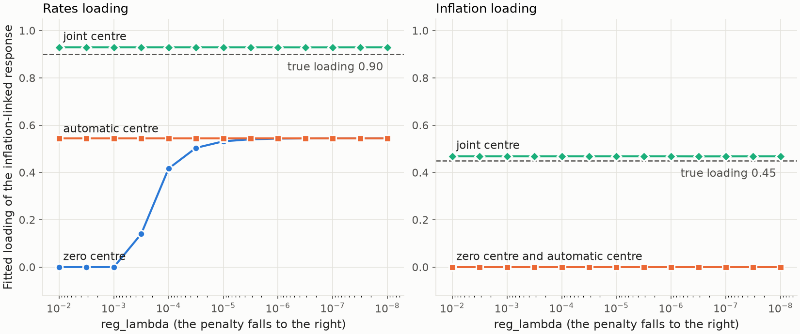
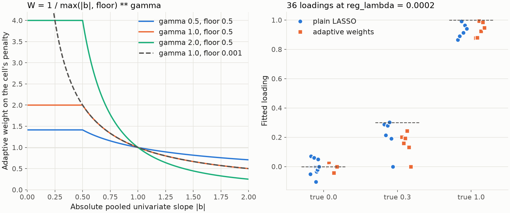
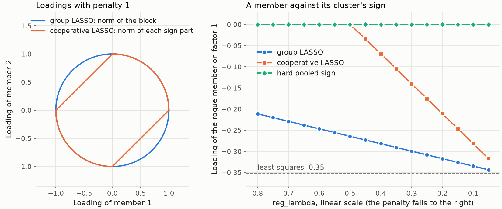
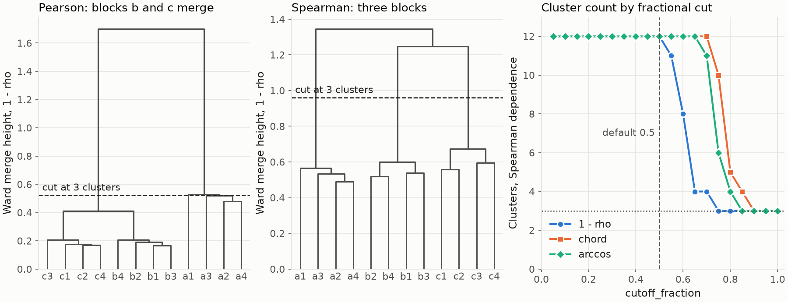
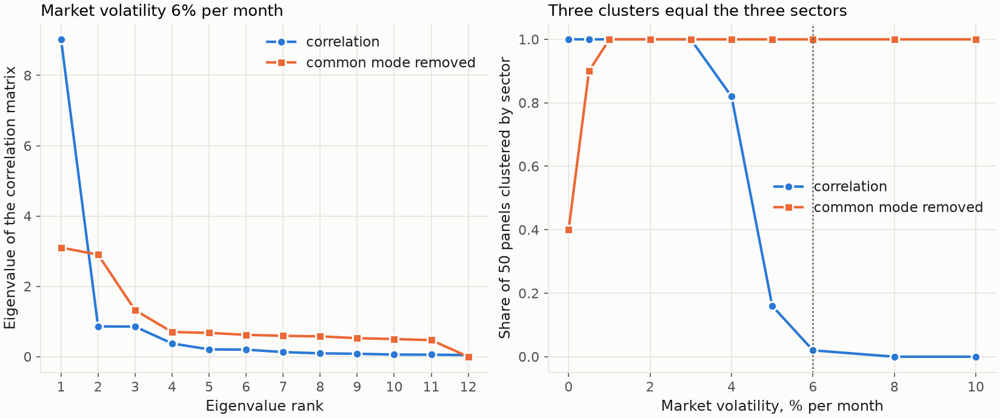
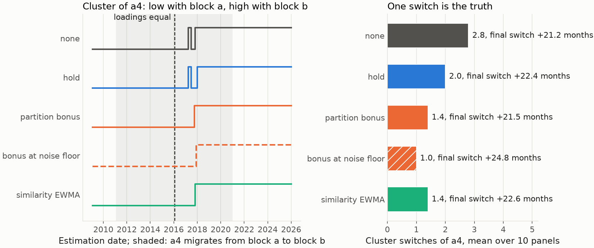
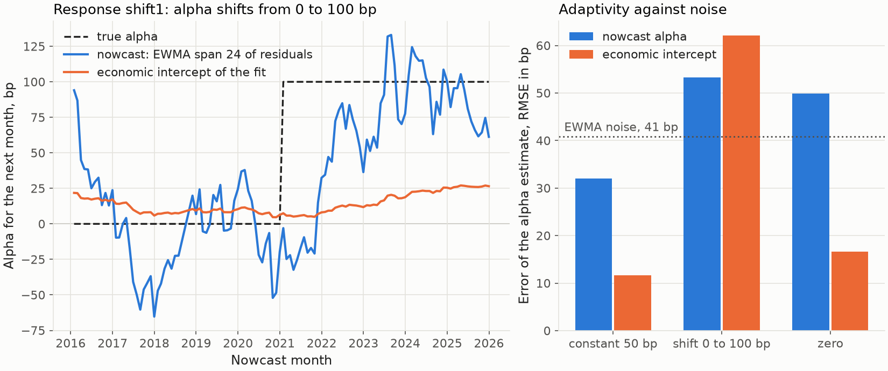

---
myst:
  html_meta:
    description: >-
      Gallery of the factorlasso documentation exhibits: for each figure the question it answers,
      the synthetic sample behind it, the script and producer that generate it, and the
      methodology article that explains it.
---

# Analytics gallery

*Author: [Artur Sepp](https://github.com/ArturSepp) / First recorded: [2026-09-22](https://github.com/ArturSepp/factorlasso/commit/fe2063860f701ac5a71951161bf391a1285d503d)*

Exhibits of [factorlasso](https://github.com/ArturSepp/factorlasso).
Software citation: [CITATION.cff](https://github.com/ArturSepp/factorlasso/blob/main/CITATION.cff).

Every figure in the documentation is listed here with the question it answers, the sample behind
it, and the code that produces it. All of them are synthetic teaching exhibits: the generating
loadings are known, so each figure can show an estimate against the truth. None is market
evidence or a replication of a paper. Empirical exhibits belong to the manuscripts under
`papers/`; they are displayed, with their study design, in the articles and case studies that
cite them, and the papers are described in
[research papers and replication](scientific-replication.md).

## Conventions

| Item | Convention |
|---|---|
| Data | Synthetic panels drawn with a fixed seed inside the canonical script of the article; no file and no network access |
| Returns | Decimal per-period returns at a monthly frequency; annualisation, where used, is a factor of 12 and is stated |
| Estimation | `LassoModel` with uniform observation weights (`span=None`), `demean=True`, CVXPY with CLARABEL |
| Penalty axis | `reg_lambda` on a logarithmic axis with the penalty falling to the right |
| Error measure | Root mean squared error of the estimated loadings against the generating loadings, unless stated |
| Colours and markers | First series blue circles, second series orange squares, third series aqua diamonds with direct labels; heatmaps run from orange (negative) through the background (zero) to blue (positive) |
| One calculation | A figure, its supporting tables and the numbers quoted in the article come from the same functions of the canonical script |
| Provenance | [analytics_manifest.json](images/analytics_manifest.json) records configuration, source hashes, package versions, numerical checks and image hashes |

Regenerate all exhibits into a new directory outside the checkout, and verify the committed
previews against the manifest:

```console
python -m tools.docs_analytics.run --all --output-root ../factorlasso-exhibits
python -m tools.docs_analytics.run --verify
```

## Workflow

### From panels to covariance

[](images/quickstart_workflow.png)

| | |
|---|---|
| Question | Does the full workflow recover known loadings, and which penalty does cross-validation select? |
| Sample | 120 months, 12 funds in three groups, 4 correlated factors; seed 20260921 |
| Method | HCGL with derived sign constraints; `LassoModelCV` with four expanding-window folds |
| Result | Penalty $10^{-5}$ selected; loading RMSE 0.053 against 0.091 for least squares |
| Script | [examples/docs/quickstart.py](../examples/docs/quickstart.py) |
| Producer | `tools/docs_analytics/estimation.py` |
| Article | [Quickstart](quickstart.md) |

## Estimation

### The penalty path of a sparse factor model

[](images/sparse_factor_model_path.png)

| | |
|---|---|
| Question | What does the L1 penalty remove, and what does it cost in shrinkage? |
| Sample | 60 months for estimation, 6 responses, 8 candidate factors of which 3 are relevant; seed 20260922 |
| Method | Cell-wise LASSO along 17 penalties from $10^{-2}$ to $10^{-6}$ |
| Result | Loading RMSE 0.045 at the best penalty against 0.074 for least squares; the exact support at $10^{-3}$ with twice the error |
| Script | [examples/docs/sparse_factor_model.py](../examples/docs/sparse_factor_model.py) |
| Producer | `tools/docs_analytics/estimation.py` |
| Article | [Sparse factor model](sparse_factor_model.md) |

### EWMA weights and ragged histories

[](images/ewma_weighting_shrinkage.png)

| | |
|---|---|
| Question | How much does a short history cost in shrinkage under each loss normalisation? |
| Sample | 240 months, one factor, four responses with a true loading of 0.8 and histories of 240, 120, 60 and 36 months; seed 20260928 |
| Method | LASSO without demeaning, equal weights and span 60; `loss_normalization` "sample" and "weight_sum" at the converted penalty |
| Result | With equal weights the 36-month history is shrunk 7.3 times as much as the full history under "sample", 1.1 times under "weight_sum"; with span 60, 1.3 and 0.9 times |
| Script | [examples/docs/ewma_weighting_and_ragged_histories.py](../examples/docs/ewma_weighting_and_ragged_histories.py) |
| Producer | `tools/docs_analytics/estimation.py` |
| Article | [EWMA weighting and ragged histories](ewma_weighting_and_ragged_histories.md) |

### Signs and priors with correlated factors

[](images/sign_constraints_and_priors_error.png)

| | |
|---|---|
| Question | What do a sign matrix and a prior-centred penalty buy when the history is short and two factors are 85% correlated? |
| Sample | 36 months, 6 bond funds, 3 factors; 50 redrawn panels for the sampling comparison; seed 20260923 |
| Method | LASSO without constraints, with `factors_beta_loading_signs`, and with `factors_beta_prior` added |
| Result | Mean loading RMSE 0.117, 0.101 and 0.077; a strong penalty returns the prior, error 0.118, in place of the empty model, error 0.555 |
| Script | [examples/docs/sign_constraints_and_priors.py](../examples/docs/sign_constraints_and_priors.py) |
| Producer | `tools/docs_analytics/estimation.py` |
| Article | [Sign constraints and priors](sign_constraints_and_priors.md) |

### Pooled signs and the noise-floor gate

[](images/pooled_sign_recovery.png)

| | |
|---|---|
| Question | How many true signs does pooling within clusters recover, and what does it cost on null cells? |
| Sample | 100 panels of 60 dates, 24 responses in 4 clusters of 6, 8 predictors, population R-squared 0.10; seed 20260929 |
| Method | `derive_sign_constraints` per response and pooled within the known clusters, thresholds 0.5 to 3 |
| Result | At the default threshold 0.75: recovery 0.98 pooled against 0.72 per response; null cells signed 0.55 against 0.47 |
| Script | [examples/docs/gated_cluster_pooled_signs.py](../examples/docs/gated_cluster_pooled_signs.py) |
| Producer | `tools/docs_analytics/estimation.py` |
| Article | [Gated cluster-pooled sign derivation](gated_cluster_pooled_signs.md) |

### Where a prior centre sends the loadings

[](images/prior_targets_paths.png)

| | |
|---|---|
| Question | How do the automatic and the joint OLS centre change the fit when the marginal Inflation slope has the wrong sign? |
| Sample | 360 months, one inflation-linked response, Rates and Inflation factors with correlation $-0.8$; seed 20260926 |
| Method | LASSO with derived signs along 13 penalties from $10^{-8}$ to $10^{-2}$; zero centre, `apply_ols_prior=True`, and `factor_for_prior` with the joint Rates/Inflation centre |
| Result | Detected signs hold Inflation at zero under the zero and automatic centres; the joint centre (0.929, 0.468) flips the sign and recovers both loadings at every penalty |
| Script | [examples/docs/prior_targets.py](../examples/docs/prior_targets.py) |
| Producer | `tools/docs_analytics/estimation.py` |
| Article | [Prior targets](prior_targets.md) |

### Adaptive penalty weights

[](images/adaptive_penalty_weights.png)

| | |
|---|---|
| Question | What do weights from the univariate slopes change in a LASSO with derived signs? |
| Sample | 60 months, 6 responses, 6 independent factors; loadings of 1.0, 0.3 and zero; seed 20260930 |
| Method | LASSO at `reg_lambda` $= 2 \times 10^{-4}$, gate $\tau = 1$, with and without adaptive weights (floor 0.5, $\gamma = 1$) |
| Result | Loadings kept on 24 true zeros fall from 7 to 2; small loadings shrunk by 0.15 instead of 0.09; large ones by about 0.07 in both |
| Script | [examples/docs/adaptive_penalty_weights.py](../examples/docs/adaptive_penalty_weights.py) |
| Producer | `tools/docs_analytics/estimation.py` |
| Article | [Adaptive penalty weights](adaptive_penalty_weights.md) |

### What a group penalty selects

[](images/group_penalties_selection.png)

| | |
|---|---|
| Question | Which loadings do the cell-wise, the row-grouped and the cluster-by-factor penalty keep? |
| Sample | 48 months, 12 funds in three clusters of four, 6 uncorrelated factors; seed 20260924 |
| Method | `LASSO`, `HIERARCHICAL_CLUSTER_GROUP_LASSO` and `FACTOR_CLUSTER_GROUP_LASSO` at `reg_lambda` $= 10^{-3}$, clusters discovered from the responses |
| Result | FCGL keeps exactly the 24 generating loadings; the LASSO misses five; HCGL keeps 71 of 72 |
| Script | [examples/docs/group_penalties_hcgl_fcgl.py](../examples/docs/group_penalties_hcgl_fcgl.py) |
| Producer | `tools/docs_analytics/estimation.py` |
| Article | [Group penalties: HCGL, sparse-group and FCGL](group_penalties_hcgl_fcgl.md) |

### A member against its cluster's sign

[](images/cooperative_lasso_geometry.png)

| | |
|---|---|
| Question | How do sign-blind, cooperative and hard-sign block penalties treat a member whose loading opposes its cluster? |
| Sample | 120 dates, two exactly orthonormal factors, eight responses in two clusters of four; one member loads -0.3 against +0.7 to +0.9; seed 20261001 |
| Method | FCGL blocks, cooperative LASSO blocks and FCGL with a hard pooled sign on the known clusters, 16 penalties from 0.05 to 0.8 |
| Result | At `reg_lambda` $= 0.3$ the rogue's loading of $-0.35$ by least squares becomes $-0.30$, $-0.14$ and zero; the solver matches the closed forms |
| Script | [examples/docs/cooperative_lasso.py](../examples/docs/cooperative_lasso.py) |
| Producer | `tools/docs_analytics/estimation.py` |
| Article | [Cooperative LASSO](cooperative_lasso.md) |

### Signs inherited from univariate slopes

[](images/unilasso_two_stage.png)

| | |
|---|---|
| Question | How do UniLasso loadings relate to their univariate slopes, and what happens to a suppressor factor? |
| Sample | 120 dates, six unit-variance factors with the first two correlated at 0.7, 12 responses; the second factor loads -0.4 against a positive univariate slope; seed 20261002 |
| Method | `LassoModelType.UNILASSO` at `reg_lambda` $= 0.02$ with the default options, with free stage-two signs, and with in-sample stage-one fits; 16 penalties from 0.001 to 0.3 |
| Result | UniLasso drops the suppressor for all 12 responses, free signs recover $-0.29$ against $-0.40$; 1, 1 and 6 of 36 noise loadings kept |
| Script | [examples/docs/unilasso.py](../examples/docs/unilasso.py) |
| Producer | `tools/docs_analytics/estimation.py` |
| Article | [UniLasso](unilasso.md) |

### Two selectors on one penalty grid

[](images/penalty_selection_paths.png)

| | |
|---|---|
| Question | Where do held-out $R^2$ selection and residual-diagonality selection disagree, and what does an omitted factor do to each? |
| Sample | 240 months, four factors, 16 responses with 24 non-zero loadings; a second panel with a hidden factor on six responses; seed 20261003 |
| Method | `LASSO` under `LassoModelCV` and `LassoModelDiagonalityCV`, four expanding-window folds, 15 penalties from $10^{-6}$ to $10^{-2.5}$ |
| Result | Complete panel: $R^2$ selects $10^{-4}$ with 45 loadings, diagonality $3.2 \times 10^{-4}$ with 26; omitted factor: no penalty passes and the missing component is the hidden block |
| Script | [examples/docs/penalty_selection.py](../examples/docs/penalty_selection.py) |
| Producer | `tools/docs_analytics/estimation.py` |
| Article | [Regularisation path and penalty selection](penalty_selection.md) |

## Clusters

### What the dependence measure and the cut decide

[](images/cluster_discovery_dendrograms.png)

| | |
|---|---|
| Question | How do the dependence measure and the distance transform change the tree and the cut? |
| Sample | 240 months, 12 responses in three blocks of four, six joint shocks of 25% on blocks b and c; seed 20261004 |
| Method | Pearson, Spearman and Gerber dependence, Ward linkage, cut at three clusters or at a fraction of the largest distance under three transforms |
| Result | Pearson merges the shocked blocks; Spearman and Gerber recover all three; the default fraction 0.5 isolates every response under Spearman |
| Script | [examples/docs/cluster_discovery.py](../examples/docs/cluster_discovery.py) |
| Producer | `tools/docs_analytics/clustering.py` |
| Article | [Cluster discovery](cluster_discovery.md) |

### A market factor that hides the sectors

[](images/common_mode_spectrum.png)

| | |
|---|---|
| Question | What does removing the dominant common mode do to the spectrum and the partition? |
| Sample | 240 months, 12 responses in three sectors of four, market betas 0.4 to 1.6 inside each sector; 50 panels per market volatility; seed 20261005 |
| Method | Ward on $1 - \rho$ cut at three clusters, on the correlation and on its residual after `remove_first_principal_component` |
| Result | At 6% market volatility the correlation recovers the sectors in 2% of panels and the residual in all; without a market factor the removal recovers 40% |
| Script | [examples/docs/common_mode_removal.py](../examples/docs/common_mode_removal.py) |
| Producer | `tools/docs_analytics/clustering.py` |
| Article | [Dominant common-mode removal](common_mode_removal.md) |

### Churn and lag of rolling partitions

[](images/rolling_smoothing_churn.png)

| | |
|---|---|
| Question | How much membership churn does each smoother remove, and at what delay? |
| Sample | 240 months, 12 responses in three blocks of four; response a4 migrates from block a to block b over ten years; ten panels; seed 20261006 |
| Method | `compute_rolling_smoothed_clusters` monthly with a 36-month EWMA correlation, cut at three clusters, under the four smoothers and a partition bonus at the noise floor |
| Result | Switches of a4, one being the truth: 2.8 unsmoothed, 2.0 hold, 1.4 bonus and similarity EWMA, 1.0 at the noise floor; the final switch 21 to 25 months after the loadings cross |
| Script | [examples/docs/rolling_cluster_smoothing.py](../examples/docs/rolling_cluster_smoothing.py) |
| Producer | `tools/docs_analytics/clustering.py` |
| Article | [Causal smoothing of rolling clusters](rolling_cluster_smoothing.md) |

### Which responses sit on cluster boundaries

[](images/stability_weights_heatmap.png)

| | |
|---|---|
| Question | Which responses sit at unstable cluster boundaries over time, and what does stability pooling change? |
| Sample | 240 months, three blocks of four responses and two bridge responses loading half on two blocks; seed 20261007 |
| Method | Monthly causal partitions, `compute_cluster_stability_statistics` with a 12-date span, `score_with_stability_pooled_clusters` on a trailing 12-month return |
| Result | Mean weight 0.75 and 0.76 for the bridges against 0.95 to 0.97 for block members; pooling changes bridge scores by 0.10 and 0.11 on average, block members' by at most 0.02 |
| Script | [examples/docs/cluster_stability_and_pooled_scoring.py](../examples/docs/cluster_stability_and_pooled_scoring.py) |
| Producer | `tools/docs_analytics/clustering.py` |
| Article | [Cluster stability statistics and stability-pooled scoring](cluster_stability_and_pooled_scoring.md) |

### Persistent identities for shuffled labels

[](images/cluster_lineage_tracks.png)

| | |
|---|---|
| Question | Are raw labels, shuffled on every date, recovered as persistent tracks through a merge and a birth? |
| Sample | 24 monthly snapshots over Equity, Rates and Credit factors; four groups of responses; a one-month merge and a mid-panel birth; seed 20261008 |
| Method | `analyze_cluster_lineage` with the default gate and bridge settings, joint and per-transition matchers |
| Result | Four tracks, one per group, with the absorbed group bridged around the merge; the per-transition matcher gives it a new id |
| Script | [examples/docs/cluster_lineage.py](../examples/docs/cluster_lineage.py) |
| Producer | `tools/docs_analytics/lineage.py` |
| Article | [Offline cluster lineage](cluster_lineage.md) |

## Covariance and residuals

### Assembled against sample covariance

[](images/factor_covariance_assembly_history.png)

| | |
|---|---|
| Question | When does the factor decomposition beat the sample covariance, and in which measure? |
| Sample | 40 series, 4 factors, histories of 48, 72, 120 and 240 months, 16 redrawn panels each; seed 20260925 |
| Method | LASSO loadings at `reg_lambda` $= 10^{-5}$; `CurrentFactorCovarData.get_y_covar`; annualised by 12 |
| Result | Frobenius errors about equal; at 48 months the minimum-variance portfolio realises 10.1% from the sample covariance and 4.9% from the assembled matrix, against an optimum of 4.4% |
| Script | [examples/docs/factor_covariance_assembly.py](../examples/docs/factor_covariance_assembly.py) |
| Producer | `tools/docs_analytics/covariance_residuals.py` |
| Article | [Factor covariance assembly](factor_covariance_assembly.md) |

### A missing factor in the residual spectrum

[](images/residual_diagnostics_spectrum.png)

| | |
|---|---|
| Question | Is the residual covariance diagonal, and can a penalty repair a missing factor? |
| Sample | 240 months, 8 responses, 4 factors, fitted with all factors and with one withheld; seed 20260920 |
| Method | `diagnose_residuals` on in-sample residuals; 9 penalties from $10^{-2}$ to $10^{-6}$ |
| Result | Sphericity 29.3 against a threshold of 41.3 with all factors; 559 with one withheld, at every penalty |
| Script | [examples/docs/residual_diagnostics.py](../examples/docs/residual_diagnostics.py) |
| Producer | `tools/docs_analytics/covariance_residuals.py` |
| Article | [Residual diagnostics](residual_diagnostics.md) |

### Which block carries the missing factor

[](images/residual_partition_share.png)

| | |
|---|---|
| Question | Does a named partition of the series carry the variation that the residual test detects? |
| Sample | The residuals of the panel above, 240 monthly cross-sections of 8 series; the partition into the 4 carriers of the withheld factor and a shuffled partition of the same sizes |
| Method | `partition_variance_share` per month; adjusted share, zero in expectation under permutation |
| Result | Mean adjusted share 0.21 for the carriers with the factor withheld, 0.01 with the complete factor set; 0.02 to 0.04 for the shuffled partition |
| Script | [examples/docs/residual_diagnostics.py](../examples/docs/residual_diagnostics.py) |
| Producer | `tools/docs_analytics/covariance_residuals.py` |
| Article | [Residual diagnostics](residual_diagnostics.md) |

### The residual block at three retentions

[](images/residual_correlation_blocks.png)

| | |
|---|---|
| Question | What does the residual block look like at $\rho \in \lbrace 0, 0.5, 1 \rbrace$? |
| Sample | Monthly residuals from January 2016 to February 2026 for eight responses in two blocks correlated at 0.5; one stored in percent; seed 20261010 |
| Method | `estimate_residual_correlation` on a quarterly grid; `get_residual_covar` with `ResidualType.EMPIRICAL` |
| Result | Estimated within-block correlation 0.41; block-portfolio residual volatility 5.20%, 6.61% and 7.77% at $\rho$ = 0, 0.5 and 1, with the diagonal unchanged |
| Script | [examples/docs/empirical_residual_correlation.py](../examples/docs/empirical_residual_correlation.py) |
| Producer | `tools/docs_analytics/covariance_residuals.py` |
| Article | [Empirical residual correlation](empirical_residual_correlation.md) |

### What the nowcast alpha adds

[](images/nowcast_alpha_tracking.png)

| | |
|---|---|
| Question | How well does the terminal residual mean estimate next month's alpha, against the fit's economic intercept? |
| Sample | 240 months, six responses on three factors with constant, shifting and zero alphas, 2% residual volatility; seed 20261009 |
| Method | Monthly expanding fits with uniform weights and `nowcast` with a 24-month alpha span, from month 120 |
| Result | Alpha error 32, 53 and 50 bp for constant, shifting and zero alphas, against 12, 62 and 17 bp for the intercept; EWMA noise 41 bp |
| Script | [examples/docs/residual_alpha_nowcasting.py](../examples/docs/residual_alpha_nowcasting.py) |
| Producer | `tools/docs_analytics/covariance_residuals.py` |
| Article | [Residual-alpha nowcasting](residual_alpha_nowcasting.md) |

### One loading matrix for return and risk

[](images/cma_decomposition.png)

| | |
|---|---|
| Question | How does one loading matrix drive both expected returns and risk? |
| Sample | 120 months of eight asset-class sleeves on Equity, Rates and Credit; illustrative premia and two declared adjustments; seed 20261011 |
| Method | `LassoModel` loadings, `CurrentFactorCovarData.get_y_covar`, CMAs from the same loadings, and the GLS audit of the MATF-CMA paper |
| Result | CMAs from 4.0% to 10.2%; squared Sharpe 0.281 = 0.145 from the implied premia + 0.136 of residual alpha, 72% of it in hedge funds |
| Script | [examples/docs/app_portfolio_risk_models.py](../examples/docs/app_portfolio_risk_models.py) |
| Producer | `tools/docs_analytics/covariance_residuals.py` |
| Article | [From loadings to portfolio risk and CMAs](app_portfolio_risk_models.md) |
