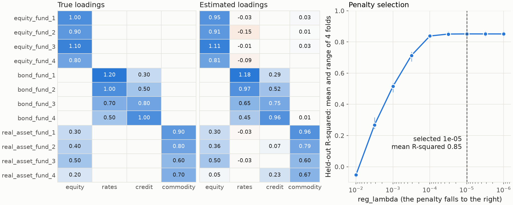
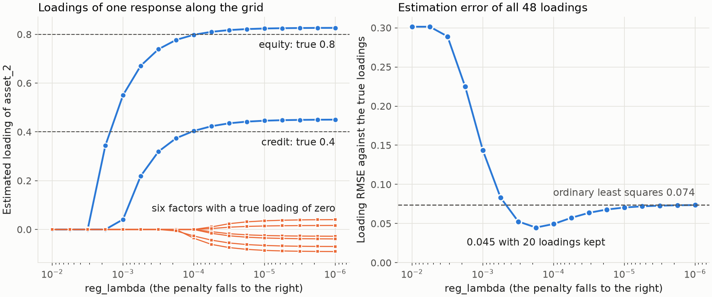
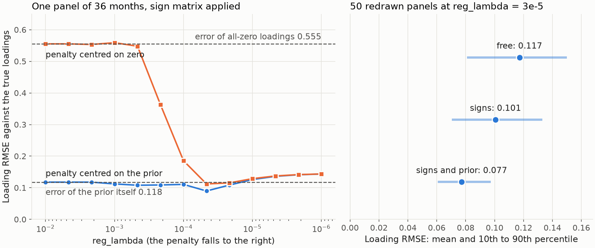
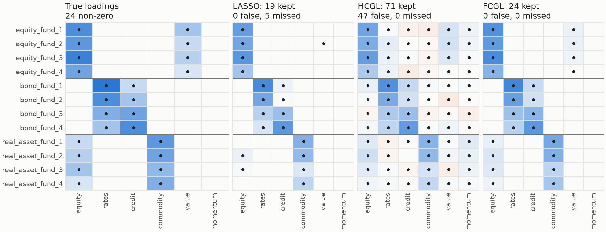
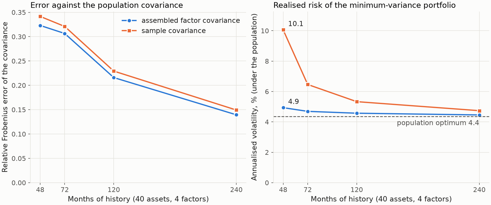
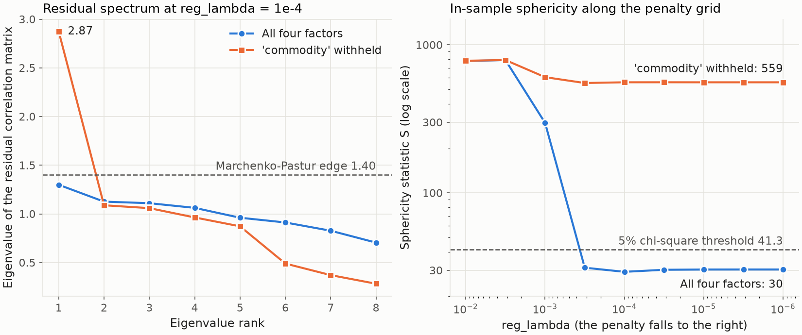

---
myst:
  html_meta:
    description: >-
      Gallery of the factorlasso documentation exhibits: for each figure the question it answers,
      the synthetic sample behind it, the script and producer that generate it, and the
      methodology article that explains it.
---

# Analytics gallery

*Author: [Artur Sepp](https://github.com/ArturSepp)*

Exhibits of [factorlasso](https://github.com/ArturSepp/factorlasso).
Software citation: [CITATION.cff](https://github.com/ArturSepp/factorlasso/blob/main/CITATION.cff).

Every figure in the documentation is listed here with the question it answers, the sample behind
it, and the code that produces it. All six are synthetic teaching exhibits: the generating
loadings are known, so each figure can show an estimate against the truth. None is market
evidence or a replication of a paper. Empirical exhibits belong to the manuscripts under
`papers/` and are described in [scientific replication](scientific-replication.rst).

## Conventions

| Item | Convention |
|---|---|
| Data | Synthetic panels drawn with a fixed seed inside the canonical script of the article; no file and no network access |
| Returns | Decimal per-period returns at a monthly frequency; annualisation, where used, is a factor of 12 and is stated |
| Estimation | `LassoModel` with uniform observation weights (`span=None`), `demean=True`, CVXPY with CLARABEL |
| Penalty axis | `reg_lambda` on a logarithmic axis with the penalty falling to the right |
| Error measure | Root mean squared error of the estimated loadings against the generating loadings, unless stated |
| Colours and markers | First series blue circles, second series orange squares; heatmaps run from orange (negative) through the background (zero) to blue (positive) |
| One calculation | A figure, its supporting tables and the numbers quoted in the article come from the same functions of the canonical script |
| Provenance | [analytics_manifest.json](images/analytics_manifest.json) records configuration, source hashes, package versions, numerical checks and image hashes |

Regenerate all exhibits into a new directory outside the checkout, and verify the committed
previews against the manifest:

```console
python -m tools.docs_analytics.run --all --output-root ../factorlasso-exhibits
python -m tools.docs_analytics.run --verify
```

## Workflow

### From panels to covariance

[](images/quickstart_workflow.png)

| | |
|---|---|
| Question | Does the full workflow recover known loadings, and which penalty does cross-validation select? |
| Sample | 120 months, 12 funds in three groups, 4 correlated factors; seed 20260921 |
| Method | HCGL with derived sign constraints; `LassoModelCV` with four expanding-window folds |
| Result | Penalty $10^{-5}$ selected; loading RMSE 0.053 against 0.091 for least squares |
| Script | [examples/docs/quickstart.py](../examples/docs/quickstart.py) |
| Producer | `tools/docs_analytics/estimation.py` |
| Article | [Quickstart](quickstart.md) |

## Estimation

### The penalty path of a sparse factor model

[](images/sparse_factor_model_path.png)

| | |
|---|---|
| Question | What does the L1 penalty remove, and what does it cost in shrinkage? |
| Sample | 60 months for estimation, 6 responses, 8 candidate factors of which 3 are relevant; seed 20260922 |
| Method | Cell-wise LASSO along 17 penalties from $10^{-2}$ to $10^{-6}$ |
| Result | Loading RMSE 0.045 at the best penalty against 0.074 for least squares; the exact support at $10^{-3}$ with twice the error |
| Script | [examples/docs/sparse_factor_model.py](../examples/docs/sparse_factor_model.py) |
| Producer | `tools/docs_analytics/estimation.py` |
| Article | [Sparse factor model](sparse_factor_model.md) |

### Signs and priors with correlated factors

[](images/sign_constraints_and_priors_error.png)

| | |
|---|---|
| Question | What do a sign matrix and a prior-centred penalty buy when the history is short and two factors are 85% correlated? |
| Sample | 36 months, 6 bond funds, 3 factors; 50 redrawn panels for the sampling comparison; seed 20260923 |
| Method | LASSO without constraints, with `factors_beta_loading_signs`, and with `factors_beta_prior` added |
| Result | Mean loading RMSE 0.117, 0.101 and 0.077; a strong penalty returns the prior, error 0.118, in place of the empty model, error 0.555 |
| Script | [examples/docs/sign_constraints_and_priors.py](../examples/docs/sign_constraints_and_priors.py) |
| Producer | `tools/docs_analytics/estimation.py` |
| Article | [Sign constraints and priors](sign_constraints_and_priors.md) |

### What a group penalty selects

[](images/group_penalties_selection.png)

| | |
|---|---|
| Question | Which loadings do the cell-wise, the row-grouped and the cluster-by-factor penalty keep? |
| Sample | 48 months, 12 funds in three clusters of four, 6 uncorrelated factors; seed 20260924 |
| Method | `LASSO`, `HIERARCHICAL_CLUSTER_GROUP_LASSO` and `FACTOR_CLUSTER_GROUP_LASSO` at `reg_lambda` $= 10^{-3}$, clusters discovered from the responses |
| Result | FCGL keeps exactly the 24 generating loadings; the LASSO misses five; HCGL keeps 71 of 72 |
| Script | [examples/docs/group_penalties_hcgl_fcgl.py](../examples/docs/group_penalties_hcgl_fcgl.py) |
| Producer | `tools/docs_analytics/estimation.py` |
| Article | [Group penalties: HCGL, sparse-group and FCGL](group_penalties_hcgl_fcgl.md) |

## Covariance and residuals

### Assembled against sample covariance

[](images/factor_covariance_assembly_history.png)

| | |
|---|---|
| Question | When does the factor decomposition beat the sample covariance, and in which measure? |
| Sample | 40 series, 4 factors, histories of 48, 72, 120 and 240 months, 16 redrawn panels each; seed 20260925 |
| Method | LASSO loadings at `reg_lambda` $= 10^{-5}$; `CurrentFactorCovarData.get_y_covar`; annualised by 12 |
| Result | Frobenius errors about equal; at 48 months the minimum-variance portfolio realises 10.1% from the sample covariance and 4.9% from the assembled matrix, against an optimum of 4.4% |
| Script | [examples/docs/factor_covariance_assembly.py](../examples/docs/factor_covariance_assembly.py) |
| Producer | `tools/docs_analytics/covariance_residuals.py` |
| Article | [Factor covariance assembly](factor_covariance_assembly.md) |

### A missing factor in the residual spectrum

[](images/residual_diagnostics_spectrum.png)

| | |
|---|---|
| Question | Is the residual covariance diagonal, and can a penalty repair a missing factor? |
| Sample | 240 months, 8 responses, 4 factors, fitted with all factors and with one withheld; seed 20260920 |
| Method | `diagnose_residuals` on in-sample residuals; 9 penalties from $10^{-2}$ to $10^{-6}$ |
| Result | Sphericity 29.3 against a threshold of 41.3 with all factors; 559 with one withheld, at every penalty |
| Script | [examples/docs/residual_diagnostics.py](../examples/docs/residual_diagnostics.py) |
| Producer | `tools/docs_analytics/covariance_residuals.py` |
| Article | [Residual diagnostics](residual_diagnostics.md) |
