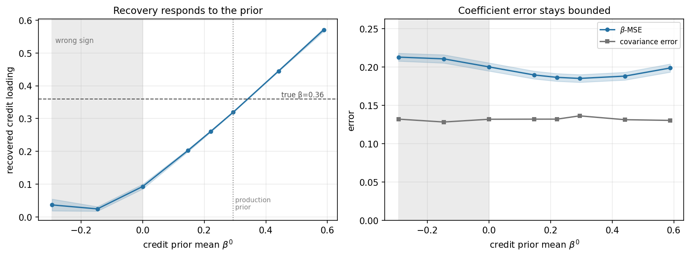
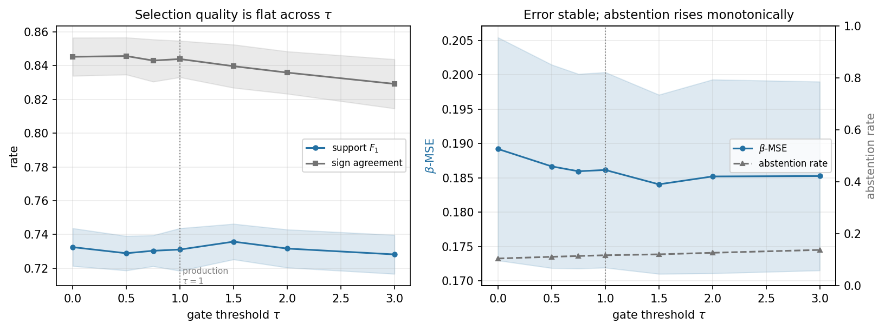
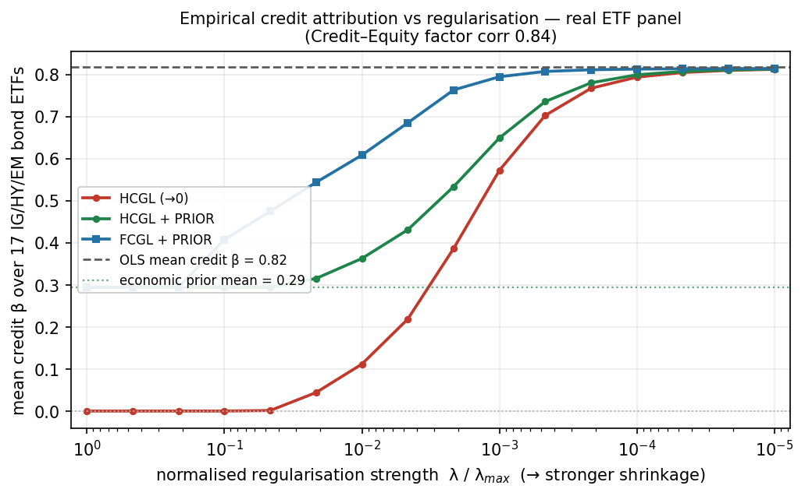

---
myst:
  html_meta:
    description: >-
      Case study from the factorlasso JSS paper: in a multi-asset ETF factor model with Credit
      and Equity factors 0.84 correlated, shrink-to-zero penalties move bond funds' credit
      exposure into Equity, while prior-centred HCGL and FCGL keep it.
---

# Credit attribution in a multi-asset ETF factor model

*Author: [Artur Sepp](https://github.com/ArturSepp)*

This case study belongs to the documentation of [factorlasso](https://github.com/ArturSepp/factorlasso).
Software citation: [CITATION.cff](https://github.com/ArturSepp/factorlasso/blob/main/CITATION.cff).

Multi-asset factor models are used to build capital market assumptions: the loadings of asset-class
proxies on a few macro factors drive both their expected returns and their risk. When two factors
are strongly correlated, a penalised regression can move exposure from one to the other without
losing fit. This page reports the evidence of the JSS software paper (Sepp and Kastenholz, 2026,
Sections 5.5 and 6) on one such case, the Credit and Equity factors, and shows the configuration
that the paper uses.

## Overview

A bond fund is a credit exposure by construction. Over the study window the Credit and Equity
factor returns have a correlation of 0.84, so a penalty that shrinks every loading towards zero
finds it cheaper to keep one large Equity loading than two smaller loadings. The paper shows that
on a calibrated design with known loadings, and then on market data:

- competing sparse-regression packages and a shrink-to-zero penalty lose the credit loading of
  bond funds and book part of it as equity;
- a penalty centred on economic credit priors, combined with cell-level signs and discovered
  clusters, keeps the credit loading without a loss of fit.

The mechanism is described in the articles on
[sign constraints and prior-centred penalties](sign_constraints_and_priors.md),
[prior targets](prior_targets.md) and
[group penalties](group_penalties_hcgl_fcgl.md).

## Study design and data

**Calibrated benchmark (Section 5.5).** The data-generating process is calibrated to a universe of
102 exchange-traded funds in eighteen sub-asset classes and nine macro factors:

- each fund's true loadings are the published loading profile of its sub-asset class, perturbed
  by independent 15% multiplicative noise per fund;
- the factor covariance is the sample covariance of the factor returns, with a Credit and Equity
  correlation of 0.84;
- each fund's idiosyncratic variance reproduces its empirical OLS $R^2$;
- the base sample has $T = 112$ months, with 60 and 240 as stress points, and fifteen seeds.

Five competitors are fitted per asset: ordinary least squares, scikit-learn's `Lasso`, and the
group LASSO or sparse-group LASSO of skglm, asgl and adelie. They are compared with factorlasso
configurations, the penalty chosen by an oracle that minimises the loading error. Seventeen funds
carry credit (investment grade, high yield and emerging markets); their mean true Credit loading
is 0.36.

**Market data (Section 6).** The same 102 funds are fitted on month-end excess log returns from
February 2017 to mid-2026, $T = 112$ months. The fund prices are public; the nine factor return
series are the excess-return factor portfolios of the MATF framework (Sepp, Hansen and Kastenholz,
2026), committed in frozen form to the replication tree. Real loadings are unobservable, so this
part demonstrates estimator behaviour and makes no forecasting claim.

## Configuration

Both parts use the paper's production configuration: clusters cut at 40% of the maximal merge
height, a noise-floor gate $\tau = 1.0$ and adaptive weights with a floor of 0.5, with equal
observation weights. The prior-centred configurations centre the Credit loadings of the
investment-grade, high-yield and emerging-market sleeves on 0.20, 0.40 and 0.30. The code below is
an excerpt of
[`examples/docs/app_multi_asset_credit_attribution.py`](../examples/docs/app_multi_asset_credit_attribution.py),
which builds this configuration on a small synthetic panel with the same 0.84 collinearity.

```python
CREDIT_PRIORS = {"IG": 0.20, "HY": 0.40, "EM": 0.30}
REG_LAMBDAS = [1e-7, 1e-5, 1e-4, 1e-3]

# The production configuration of the JSS study (Table tab:lassomodel-params), without its
# EWMA span, as in the paper's stationary designs.
PRODUCTION = {
    "cutoff_fraction": 0.40,
    "auto_sign_constraints": True,
    "auto_sign_threshold_t": 1.0,
    "auto_sign_adaptive_weights": True,
    "auto_sign_adaptive_floor": 0.5,
}
```

```python
def build_model(model_type: fl.LassoModelType, reg_lambda: float,
                prior: pd.DataFrame | None = None) -> fl.LassoModel:
    """The production configuration, with or without the credit prior."""
    return fl.LassoModel(
        model_type=model_type,
        reg_lambda=reg_lambda,
        factors_beta_prior=prior,
        **PRODUCTION,
    )
```

On the synthetic panel of thirteen funds, the script finds the mechanism the paper reports. The
bond funds' mean Credit loading is 0.28 by least squares, as is its true value. At the strongest
penalty of the grid it falls below 0.01 under the shrink-to-zero HCGL fit, while the prior-centred
HCGL and FCGL fits hold it at the prior mean of 0.30. At a moderate penalty the shrink-to-zero
fit raises the bond funds' mean Equity loading from 0.06 by least squares to 0.12. The script
asserts these values; they illustrate the mechanism and are not the paper's numbers.

## Results

**Calibrated benchmark.** At the oracle penalty and $T = 112$, the regularised estimators are close
on fit: the normalised loading error ranges from 0.16 to 0.27, and out-of-sample $R^2$ from 0.64 to
0.68 (Table tab:competitor of the paper). They differ in the credit loading:

| Estimator | Loading error | Out-of-sample $R^2$ | Mean Credit loading (truth 0.36) |
|---|---|---|---|
| OLS | 0.620 | 0.672 | 0.350 |
| scikit-learn `Lasso` | 0.216 | 0.642 | 0.009 |
| skglm group LASSO | 0.268 | 0.651 | 0.078 |
| factorlasso HCGL with signs and adaptive weights | 0.224 | 0.662 | 0.089 |
| factorlasso HCGL with signs and prior | 0.185 | 0.663 | 0.319 |
| factorlasso FCGL with signs and prior | 0.161 | 0.683 | 0.309 |

Every penalised competitor recovers a mean Credit loading of at most 0.08; ordinary least squares
recovers it only by not regularising, at the largest loading error in the table. The prior-centred
configurations recover 0.31 to 0.32 with the lowest loading errors. The paper reports the full
table, including asgl, adelie and the BIC-selected penalties.

The next exhibit tests how much the result depends on the prior being right.



*Paper exhibit. JSS manuscript, Figure prior-sweep: calibrated 102-fund design, oracle-selected
penalty, $T = 112$, mean over fifteen seeds with one-standard-error bands. The shaded region is a
credit prior of the wrong sign.*

The recovered credit loading follows the prior, but the loading error and the covariance error
stay bounded across the whole range, including a prior of the wrong sign: a misspecified prior
costs attribution, not a collapse of the fit. The second robustness exhibit holds the prior-centred
HCGL configuration fixed and varies only the gate threshold.



*Paper exhibit. JSS manuscript, Figure tau-sweep: calibrated 102-fund design, HCGL with signs and
prior held fixed, penalty selected once per seed at $\tau = 1$, $T = 112$, ten seeds.*

Support recovery, sign agreement and loading error are flat from $\tau = 0$ to 3, while the share
of cells the gate leaves unconstrained rises slowly, so the result does not hinge on the
production value of $\tau$.

**Market data.** The seventeen credit-bearing bond funds have a mean OLS Credit loading of 0.82.
As the penalty grows, the shrink-to-zero HCGL fit drives it to zero and raises their mean Equity
loading from about zero to 0.11 at a moderate penalty. The prior-centred HCGL fit holds the Credit
loading at the sleeve-weighted prior of 0.29, and the prior-centred FCGL fit keeps the high-yield
and emerging-market sleeves above the prior. At a moderate penalty the Credit loading of HYG falls
from 0.85 to 0.04 under shrink-to-zero against 0.41 with the prior; EMB from 1.16 to 0.08 against
0.35; and LQD from 0.60 to 0.04 against 0.22.



*Paper exhibit. JSS manuscript, Figure etf-credit: mean Credit loading of seventeen IG/HY/EM bond
ETFs against normalised regularisation strength on the frozen 2017-2026 excess-return panel;
stronger shrinkage to the left.*

## What the study does and does not show

- **It shows** that under strong factor collinearity the attribution of a penalised fit depends on
  the centre of the penalty, while its fit does not: estimators with similar loading error and
  out-of-sample $R^2$ report very different credit exposures.
- **It shows** that a prior-centred penalty combined with cell-level signs and discovered
  clusters recovers the calibrated credit loading at a loading error below every competing
  package in that design.
- **It does not show** that prior-centred loadings forecast better or build better portfolios. The
  market-data part has no true loadings, and the paper makes no such claim.
- **It does not show** that the prior is free. The recovered loading follows the prior; the
  bounded error in the sensitivity sweep limits the damage of a wrong prior, not its bias.
  Choosing and reviewing centres is the subject of the [prior targets](prior_targets.md) article.
- **It does not rank** HCGL against FCGL in general. FCGL leads on this design because the true
  loadings of a sub-asset class share a centre; the paper reports both and documents designs in
  which the ordering reverses.
- **The prior alone is not the differentiator.** Re-centring the response reproduces a
  prior-centred penalty around any package; what the other packages cannot express is the prior
  together with cell-level sign constraints and internally discovered groups.

## Reproduce

The synthetic mechanism runs offline after `pip install factorlasso`:

```console
python examples/docs/app_multi_asset_credit_attribution.py
```

The paper's tables and figures are reproduced from `papers/jss_2026` in a source checkout; the
[research papers page](scientific-replication.md) gives the commands and the data requirements.
The calibrated benchmark is Stage 3 and the market-data figure Stage 5 of `replicate.py`; both
need the committed factor panel in `applications/data/`.

## See also

- [Prior targets: automatic and mapped OLS centres](prior_targets.md)
- [Sign constraints and prior-centred penalties](sign_constraints_and_priors.md)
- [Group penalties: HCGL, sparse-group and FCGL](group_penalties_hcgl_fcgl.md)
- [Choosing a sparse-regression workflow](comparison.md)

## References

- Sepp, A., and Kastenholz, M. A. (2026). factorlasso: Sparse Multi-Output Regression with
  Cluster-Grouped Sign Constraints in Python. Submitted to the *Journal of Statistical
  Software*. [Manuscript](../papers/jss_2026/paper/article.pdf).
- Sepp, A., Hansen, E., and Kastenholz, M. (2026). Capital Market Assumptions and Strategic Asset
  Allocation Using Multi-Asset Tradable Factors. Working paper,
  [SSRN 6785958](https://papers.ssrn.com/sol3/papers.cfm?abstract_id=6785958).
- Sepp, A., Ossa, I., and Kastenholz, M. (2026). Robust Optimization of Strategic and Tactical
  Asset Allocation for Multi-Asset Portfolios. *The Journal of Portfolio Management* 52(4),
  86-120.
- [factorlasso software citation](https://github.com/ArturSepp/factorlasso/blob/main/CITATION.cff).
