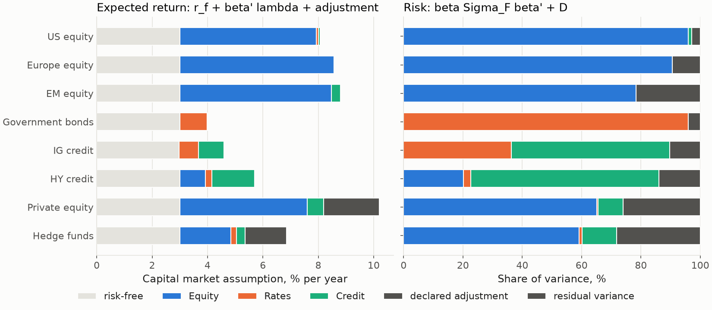

---
myst:
  html_meta:
    description: >-
      Case study: how one factorlasso loading matrix drives both the risk model and the capital
      market assumptions of a multi-asset portfolio, with the residual block chosen for risk
      budgeting or tracking error and the MATF-CMA audit of expected returns.
---

# From loadings to portfolio risk and capital market assumptions

*Author: [Artur Sepp](https://github.com/ArturSepp)*

This case study belongs to the documentation of [factorlasso](https://github.com/ArturSepp/factorlasso).
Software citation: [CITATION.cff](https://github.com/ArturSepp/factorlasso/blob/main/CITATION.cff).

The loadings that factorlasso estimates are an input to portfolio construction. In the ROSAA and
MATF-CMA frameworks, one loading matrix defines the covariance used for strategic and tactical
allocation and, applied to factor premia, the expected returns of the asset classes. This page
shows that workflow on a synthetic multi-asset universe and relates it to the two papers (Sepp,
Ossa and Kastenholz, 2026; Sepp, Hansen and Kastenholz, 2026).

## Overview

With loadings $\beta$, factor covariance $\Sigma_F$ and residual variances $D$, the risk model is

$$
\Sigma = \beta \Sigma_F \beta^{\top} + w D ,
$$

and the capital market assumption of asset $i$ is

$$
\mathrm{CMA}_i = r_f + \beta_i^{\top} \lambda + \text{declared adjustment}_i ,
$$

with factor premia $\lambda$. Because both use the same $\beta$, any expected return beyond the
factor premia is a declared adjustment that can be priced against the risk model (Sepp, Hansen and
Kastenholz, 2026). The weight $w$ on the residual block selects the use: the ROSAA replication
includes it for strategic risk budgeting and excludes it for tactical tracking error.

## Study design and data

- **Universe.** Eight asset-class sleeves on three tradable factors, Equity, Rates and Credit:
  three equity regions, government bonds, IG and HY credit, private equity and hedge funds.
- **Returns.** Ten years of synthetic monthly returns from stated loadings, annual factor
  volatilities of 16%, 5% and 7%, an Equity-Credit correlation of 0.6, and residual volatilities
  from 1% to 12% a year.
- **Premia.** Illustrative annual excess returns of 5.0% for Equity, 1.0% for Rates and 1.5% for
  Credit, a risk-free rate of 3%, and declared adjustments of 2.0% for private equity and 1.5% for
  hedge funds. They are not the papers' calibrated values.
- **What is estimated.** The loadings, by factorlasso; the factor covariance and the residual
  variances, as annualised sample moments of the factors and of the fit's residuals.

## Configuration

The risk model is one `CurrentFactorCovarData` built from a fit:

```python
def risk_model(x: pd.DataFrame, y: pd.DataFrame) -> fl.CurrentFactorCovarData:
    """Fitted loadings with the annualised factor covariance and residual variances."""
    model = fl.LassoModel(reg_lambda=REG_LAMBDA).fit(x=x, y=y)
    residuals = y - x.to_numpy() @ model.coef_.T.to_numpy()
    return fl.CurrentFactorCovarData(
        x_covar=12.0 * x.cov(),
        y_betas=model.coef_,
        y_variances=pd.DataFrame({fl.VarianceColumns.RESIDUAL_VARS.value: 12.0 * residuals.var()}),
        estimation_date=x.index[-1],
    )
```

and the capital market assumptions apply the same loadings to the premia:

```python
def capital_market_assumptions(betas: pd.DataFrame) -> pd.Series:
    """CMA_i = r_f + beta_i' lambda + declared adjustment_i."""
    return RISK_FREE + betas @ PREMIA + ADJUSTMENTS.reindex(betas.index).fillna(0.0)
```

In production, OptimalPortfolios builds rolling risk models of this kind from factorlasso fits;
its [covariance estimators](https://optimalportfolios.readthedocs.io/en/latest/covariance_estimators.html)
and [rolling factor covariance from CSV](https://optimalportfolios.readthedocs.io/en/latest/rolling_factor_covar_from_csv.html)
pages document that workflow.

## Results

**Risk.** For a diversified portfolio of 60% equity and 40% bonds and credit, the annual
volatility is 11.26% with the residual block and 11.13% without it: at this level of
diversification the residuals barely matter. For an active tilt, 10% from US into EM equity and
5% from IG into HY credit, the tracking error is 1.11% with the residual block and 0.44% without
it. The residuals of the tilted sleeves dominate its risk, which is why the choice of $w$ matters
for tactical budgets.

**Expected returns.** The CMAs range from 4.0% for government bonds to 10.2% for private equity,
whose figure includes its 2.0% adjustment. The panels below split each sleeve's expected return
and variance by the same loadings.



*Synthetic teaching exhibit. Left: each sleeve's CMA as the risk-free rate, the three factor
premium contributions $\beta_{ij} \lambda_j$ and its declared adjustment. Right: each sleeve's
variance as factor contributions $\beta_{ij} (\Sigma_F \beta_i)_j$ and residual variance, as shares
of the total. Produced by `tools/docs_analytics/covariance_residuals.py` from the example script.*

**The audit.** The MATF-CMA paper audits a CMA vector against the committee's own risk model: it
projects the excess CMAs $m$ on the loadings by generalised least squares, weighting each sleeve
by its inverse residual variance, and calls the remainder the residual alpha $h$ (Sepp, Hansen and
Kastenholz, 2026, Appendix A):

```python
def audit(m: pd.Series, betas: pd.DataFrame, residual_var: pd.Series) -> dict:
    """GLS projection of excess CMAs on the loadings: implied premia and residual alpha."""
    b, d_inv = betas.to_numpy(), 1.0 / residual_var.to_numpy()
    gram = b.T @ (d_inv[:, None] * b)
    premia = np.linalg.solve(gram, b.T @ (d_inv * m.to_numpy()))
    alpha = m.to_numpy() - b @ premia
    return {"premia": pd.Series(premia, index=betas.columns),
            "alpha": pd.Series(alpha, index=m.index),
            "sr2_alpha": float(alpha @ (d_inv * alpha))}
```

The implied premia are 5.22%, 1.00% and 1.62%: they absorb the part of the adjustments that the
factors can span. The squared Sharpe ratio of the CMA vector under the risk model, 0.281, splits
exactly into 0.145 carried by the implied premia and 0.136 of residual alpha,
$h^{\top} D^{-1} h$. Of that residual alpha, 72% sits in hedge funds and 20% in private equity,
the two sleeves with declared adjustments. At the stated premia, the factor ceiling
$\lambda^{\top} \Sigma_F^{-1} \lambda$ is 0.142 and the sleeves achieve 0.137 of it.

## What the study does and does not show

- **It shows** the arithmetic of the workflow: the assembly of the risk model, the effect of the
  residual block on total and active risk, and the audit identity, each checked against NumPy.
- **It does not show** the papers' results. The premia, adjustments and universe are
  illustrative; the MATF-CMA paper's calibrated universe of 18 sleeves on twelve factors, where the
  sleeves achieve about 40% of the factor ceiling, and its provider audit are in the paper.
- **It does not choose $w$ or the adjustments.** Those are policy decisions; the ROSAA replication
  documents $w = 1$ for strategic risk budgeting and $w = 0$ for tactical tracking error, and the
  MATF-CMA paper budgets admitted alpha against the achievable squared Sharpe.
- **It assumes a diagonal residual block.** An estimated residual correlation can replace it; see
  [empirical residual correlation](empirical_residual_correlation.md).

## Reproduce

The canonical script
[`examples/docs/app_portfolio_risk_models.py`](../examples/docs/app_portfolio_risk_models.py)
simulates the returns, fits the loadings, assembles the risk model and runs the audit, asserting
every number quoted on this page:

```console
python examples/docs/app_portfolio_risk_models.py
```

## See also

- [Factor covariance assembly](factor_covariance_assembly.md): the containers and their units.
- [Prior targets](prior_targets.md) and [credit attribution](app_multi_asset_credit_attribution.md):
  how the loadings behind a CMA are kept economically interpretable.
- [Residual-alpha nowcasting](residual_alpha_nowcasting.md): the residual mean as an alpha
  estimate.

## References

- Sepp, A., Hansen, E., and Kastenholz, M. (2026). Capital Market Assumptions and Strategic Asset
  Allocation Using Multi-Asset Tradable Factors. Working paper,
  [SSRN 6785958](https://papers.ssrn.com/sol3/papers.cfm?abstract_id=6785958).
- Sepp, A., Ossa, I., and Kastenholz, M. (2026). Robust Optimization of Strategic and Tactical
  Asset Allocation for Multi-Asset Portfolios. *The Journal of Portfolio Management* 52(4),
  86-120. Replication:
  [`papers/robust_optimisation_jpm_2026`](https://github.com/ArturSepp/OptimalPortfolios/tree/main/papers/robust_optimisation_jpm_2026)
  in OptimalPortfolios.
- [factorlasso software citation](https://github.com/ArturSepp/factorlasso/blob/main/CITATION.cff).
