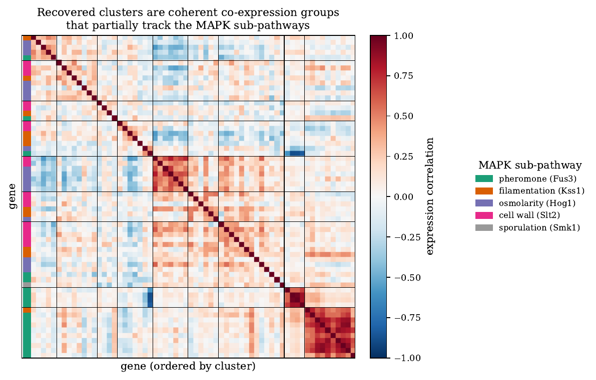
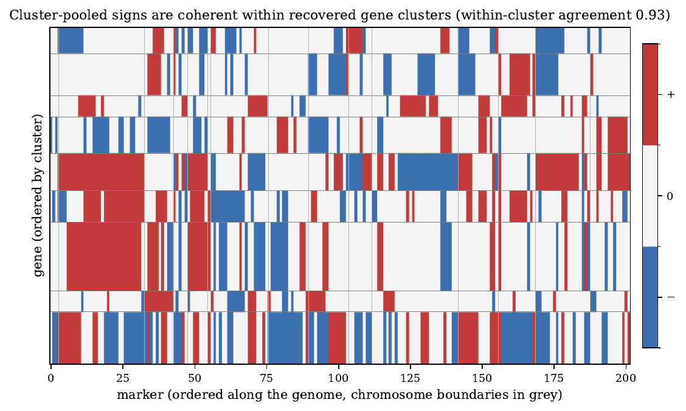
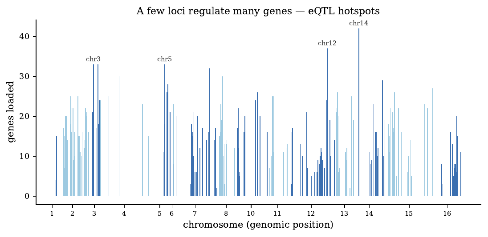

---
myst:
  html_meta:
    description: >-
      Case study from the sign-pooling paper: HCGL with gated cluster-pooled signs on the yeast
      eQTL cross, 64 MAPK genes and 202 markers; sign-coherent co-expression clusters, eQTL
      hotspots, and no prediction gain over per-gene LASSO.
---

# Sign pooling beyond finance: yeast eQTL

*Author: [Artur Sepp](https://github.com/ArturSepp)*

This case study belongs to the documentation of [factorlasso](https://github.com/ArturSepp/factorlasso).
Software citation: [CITATION.cff](https://github.com/ArturSepp/factorlasso/blob/main/CITATION.cff).

The multi-output problem of factorlasso is not specific to finance: many responses, each
regressed on the same predictors, with groups of responses that share the direction of their
dependence. Genetics has this structure. In an expression quantitative trait locus (eQTL) study
the responses are the expression levels of genes and the predictors are genetic markers, and genes
regulated together respond to the same loci in the same direction. This page reports the
application of the sign-pooling paper (Sepp and Kastenholz, 2026a, Section 5).

## Overview

The paper applies HCGL with gated cluster-pooled signs to 64 genes of the yeast MAPK signalling
pathway and 202 markers from the cross of Brem and Kruglyak (2005). It asks three questions: do
real responses carry the sign-coherent clusters that the method exploits; do the clusters and the
signs read as biology; and does pooling help prediction. The answers are yes, in part, and no.
The paper chose a data set in the low-recoverability regime of its simulations, so it reports
interpretable structure rather than a forecast gain.

## Study design and data

- **Data.** Expression and genotypes of $T = 112$ segregants of a cross between two yeast strains
  (Brem and Kruglyak, 2005), committed with the replication tree.
- **Responses.** The $N = 64$ genes of the KEGG MAPK pathway measured in the data, in four
  sub-pathways: pheromone response, filamentation, high-osmolarity response and cell-wall
  integrity, plus one sporulation gene.
- **Predictors.** The 3244 markers are collapsed into representatives of tightly linked runs and
  screened for association with at least two genes at $p \le 0.01$, the screen of Yin and Li
  (2011), leaving $M = 202$ markers. Genes and markers are standardised.
- **Weighting.** Segregants have no time order, so observations are weighted equally; the
  archived fit uses the independent gate of the paper, not the date-score gate added later.

## Configuration

The archived fit, as `eqtl_pipeline.fit_model` configures `LassoModel`:

```python
CONFIGURATION = {                        # eqtl_pipeline.fit_model, as archived in the paper
    "model_type": "HIERARCHICAL_CLUSTER_GROUP_LASSO",
    "reg_lambda": 0.3,
    "cutoff_fraction": 0.7,
    "auto_sign_constraints": True,
    "auto_sign_threshold_t": 2.0,
    "auto_sign_variance": "independent",
    "demean": True,
}
```

The clusters are discovered at a cut of 0.7 of the largest distance, and each pooled sign must
pass the gate at $\tau = 2$; see [cluster discovery](cluster_discovery.md) and the
[gated sign derivation](gated_cluster_pooled_signs.md).

## Results

**Clusters.** The method recovers nine gene clusters, of 4 to 13 genes. They track the
sub-pathways only in part: the adjusted Rand index against the four sub-pathways is 0.114 and the
mean cluster purity 0.614. The two pheromone-response clusters are clean, at purity 1.00 and 0.90,
while cell-wall and osmolarity genes mix across clusters. Co-expression groups genes by shared
regulation, which need not follow the annotation.



*Paper exhibit. Sign-pooling manuscript, Figure fig:clusters: expression correlation among the 64
MAPK genes ordered by discovered cluster, with each gene's sub-pathway in the left bar; black lines
separate clusters. Yeast eQTL cross of Brem and Kruglyak (2005), $T = 112$.*

**Signs.** Within each cluster, the genes agree on the marginal sign of their marker associations
on 0.93 of the cells with a significant association at $p \le 0.05$, and on 0.84 to 1.00 per
cluster. The paper stresses that this is a consistency check, not independent validation: the
clusters are formed from the correlations that drive the shared sign. The gate leaves 59% of the
gene-marker cells without a sign, where the pooled evidence falls below $\tau$.



*Paper exhibit. Sign-pooling manuscript, Figure fig:signs: gated sign matrix of the 64 genes, rows
ordered by cluster, against the 202 markers ordered along the genome; blue, white and red denote
$-1$, $0$ and $+1$, and grey lines mark chromosome boundaries.*

**Hotspots.** The loadings concentrate at a few loci. A locus on chromosome 14 loads 42 of the 64
genes, and loci on chromosomes 12, 3, 5 and 7 load 32 to 37. The peaks match the trans-acting
eQTL hotspots documented for this cross (Brem and Kruglyak, 2005).



*Paper exhibit. Sign-pooling manuscript, Figure fig:hotspots: number of genes loading on each of
the 202 screened markers against genomic position; alternating shades separate chromosomes.*

**Prediction.** In three-fold cross-validation the per-gene LASSO has a median out-of-sample $R^2$
of 0.118, against 0.088 for the factor-cluster variant and 0.038 for HCGL. Pooling signs over
weakly separated clusters constrains the fit without a prediction payoff, as the simulations of
the paper predict for this regime.

## What the study does and does not show

- **It shows** that real multi-output data can carry sign-coherent clusters, and that the gated
  pooled signs form readable blocks and recover known hotspots.
- **It does not show** that the clusters are the pathway structure: agreement with the annotation
  is partial, and the sign agreement is measured on the clusters that produced it.
- **It does not show a prediction gain.** At this recoverability, per-gene LASSO predicts better;
  the paper recommends the method for coherent, interpretable structure in small samples, not for
  forecasts where per-response signs suffice.
- **It is archived.** The fit predates the date-score gate and was produced with the versions
  pinned in the replication tree; the numbers are the committed results, not a refit with the
  current release.

## Reproduce

The canonical script
[`examples/docs/app_sign_pooling_genomics.py`](../examples/docs/app_sign_pooling_genomics.py) reads
the committed results and recomputes the quoted statistics: the cluster sizes and purities, the
adjusted Rand index by its formula, the hotspot counts, the share of cells without a sign and the
prediction parity. It does not refit:

```python
def adjusted_rand_index(labels: pd.Series, reference: pd.Series) -> float:
    """Hubert and Arabie's adjusted Rand index from the contingency table."""
    table = pd.crosstab(labels, reference).to_numpy()
    pairs = sum(comb(int(n), 2) for n in table.ravel())
    rows = sum(comb(int(n), 2) for n in table.sum(axis=1))
    cols = sum(comb(int(n), 2) for n in table.sum(axis=0))
    expected = rows * cols / comb(int(table.sum()), 2)
    return (pairs - expected) / (0.5 * (rows + cols) - expected)
```

```console
python examples/docs/app_sign_pooling_genomics.py
```

The full pipeline, which refits from the committed data, is
`papers/sign_pooling_2026/replication/eqtl_pipeline.py`, run by `make eqtl` from
`papers/sign_pooling_2026` with the dependencies of its `requirements.txt`.

## See also

- [Gated cluster-pooled sign derivation](gated_cluster_pooled_signs.md): the method.
- [Cluster discovery](cluster_discovery.md): the clusters the signs are pooled over.
- [Research papers and replication](scientific-replication.md): the paper and its replication
  tree.

## References

- Brem, R. B., and Kruglyak, L. (2005). The landscape of genetic complexity across 5,700 gene
  expression traits in yeast. *Proceedings of the National Academy of Sciences* 102(5),
  1572-1577. DOI 10.1073/pnas.0408709102.
- Hubert, L., and Arabie, P. (1985). Comparing partitions. *Journal of Classification* 2(1),
  193-218. DOI 10.1007/BF01908075.
- Sepp, A., and Kastenholz, M. (2026a). Gated Cluster-Pooled Sign Constraints for Multi-Output
  Sparse Regression. Submitted to *Computational Statistics & Data Analysis*.
  [Manuscript](../papers/sign_pooling_2026/paper/article.pdf).
- Yin, J., and Li, H. (2011). A sparse conditional Gaussian graphical model for analysis of
  genetical genomics data. *The Annals of Applied Statistics* 5(4), 2630-2650.
  DOI 10.1214/11-AOAS494.
- [factorlasso software citation](https://github.com/ArturSepp/factorlasso/blob/main/CITATION.cff).
