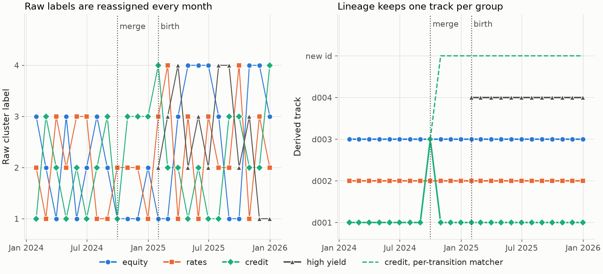

---
myst:
  html_meta:
    description: >-
      Offline cluster lineage in factorlasso: fingerprints of rolling risk clusters, the overlap
      and beta-spread gate that links them across dates, the joint path-cover matcher with bridge
      edges, lineage events, track classification and labels, and why the result is a reporting
      overlay with look-ahead.
---

# Offline cluster lineage

*Author: [Artur Sepp](https://github.com/ArturSepp)*

Implemented in [factorlasso](https://github.com/ArturSepp/factorlasso).
Software citation: [CITATION.cff](https://github.com/ArturSepp/factorlasso/blob/main/CITATION.cff).

Clusters re-estimated on every date carry no identity: the same group of responses is cluster 3
one month and cluster 7 the next. `analyze_cluster_lineage` links the clusters of a rolling
factor-model estimate across dates into persistent tracks, tags the events that change them, and
classifies and names each track. It does so with the whole panel in view, so its labels are for
reporting and governance, never for a point-in-time calculation.

## Overview

The module separates membership from identity. Membership stays with the rolling partitions,
which drive the penalties, the sign pooling and any score. Identity is an overlay that names the
clusters for reports; it never feeds back into estimation (Sepp, 2026). The construction is data
association applied to risk clusters: the event tracking of community evolution (Greene, Doyle and
Cunningham, 2010; Spiliopoulou et al., 2006), a global matcher in the min-cost-flow formulation
of multi-object tracking (Zhang, Li and Nevatia, 2008), and gap-closing links in the manner of
particle tracking (Jaqaman et al., 2008). What is specific to factor models is the fingerprint and
the use of the factor covariance to compare betas.

## Inputs, notation, and assumptions

| Symbol or input | Meaning | Units and convention |
|---|---|---|
| `covar_data` | A `RollingFactorCovarData`, one snapshot per date | Read: `x_covar`, `y_betas`, residual variances, `clusters` |
| $\Sigma_F$ | Factor covariance of a snapshot | Annualised under the stack convention |
| $C$ | A raw cluster at one date, with members $i \in C$ | Labels arbitrary |
| $w_i$ | Member weights in a fingerprint | Equal, or inverse total volatility |
| $\beta_C$ | Member-weighted cluster beta, $\sum_{i \in C} w_i \beta_i$ | Factor loadings |

## Methodology

### Fingerprints

Every raw cluster at every date is reduced to its members, its beta $\beta_C$, the factor
variance $\beta_C^{\top} \Sigma_F \beta_C$ and the idiosyncratic variance
$\sum_i w_i^2 \sigma_i^2$, their ratio as an $R^2$, and its dominant factor, the largest entry of
$\beta_C \circ (\Sigma_F \beta_C)$.

### The link gate

Two clusters $a$ and $b$ on different dates are compared by the overlap of their members, over
the responses present on both dates, and by the volatility of the difference of their betas under
the average factor covariance $\bar \Sigma_F$ of the two dates:

$$
o_{ab} = \frac{\lvert a \cap b \rvert}{\min(\lvert a \rvert, \lvert b \rvert)} , \qquad
v_{ab} = \sqrt{(\beta_b - \beta_a)^{\top} \bar\Sigma_F (\beta_b - \beta_a)} .
$$

With the band $(\ell, h)$, `overlap_band` $= (0.15, 0.60)$, and the cut `spread_vol_cut`
$= 0.015$: an overlap of at least $h$ links outright; an overlap between $\ell$ and $h$ links only
if $v_{ab}$ is within the cut; an overlap below $\ell$ never links, however close the betas.
`overlap_metric="jaccard"` replaces the overlap coefficient by the Jaccard index, and
`combine="blend"` replaces the gate by a weighted score.

### The joint matcher

The default matcher, `method="mcf"`, solves the whole panel at once: a maximum-weight set of
vertex-disjoint paths through the links, found as a minimum-cost flow. Links run between
consecutive dates and, as bridge edges, across gaps of up to `bridge_window` dates, discounted by
`bridge_decay` per extra date. Each path is one track with one derived id. Because the solve is
joint, a track absorbed into a transient merge can be routed around it and resume afterwards.
Any other `method` selects a matcher that assigns one transition at a time, which cannot revive a
track once another has taken its place.

### Events, classification and labels

Each track start is a `birth`, or a `split` if a qualifying link from an earlier cluster went to
another track; each link is a `continue` or, across a gap, a `bridge`; each end is a `death`, or a
`merge` if a qualifying link leads on to another track. A track that reaches the last date also
ends there and is recorded as a death at that date.

`TaxonomyConfig` sets the classification of each track: its type from the modal dominant factor
and, for equity, the mean equity beta (`Equity-HighBeta` at 0.70 and above, `Equity-Defensive`
at 0.30 and below); its beta stability from the median spread volatility around the track mean;
its persistence from its coverage of the dates (`Core` at 70% and above, `Transient` below 30%,
`Episodic` in between); and its volatility regime. `factor_labels` names a track from its betas
and volatility alone; `label_tracks` names it from asset metadata.

## Worked example

The canonical script [`examples/docs/cluster_lineage.py`](../examples/docs/cluster_lineage.py)
builds 24 monthly snapshots over three factors, Equity, Rates and Credit, with an annualised
factor covariance. Three groups of four responses have equity-like, rates-like and credit-like
betas; from January 2025 a group of three high-yield responses joins. The raw labels are drawn
afresh each month, the equity and credit groups share one raw cluster in September 2024, and one
credit response joins the equity group for good in May 2025. No covariance is estimated; the
snapshots are stated directly. The analysis uses the defaults:

```python
def lineage(covar_data: fl.RollingFactorCovarData, method: str = "mcf") -> fl.RiskClusterReport:
    """Persistent tracks with the default link gate and bridge settings."""
    return fl.analyze_cluster_lineage(covar_data, method=method)
```

The joint matcher returns four tracks, one per group. The equity and rates groups keep their
tracks on every date. The credit group keeps its track on every date but the merge, when its
members sit in the equity track's cluster, and the lineage records a `bridge` for the credit track
in October 2024. The high-yield group starts with a `birth` in January 2025, and the credit
response that moves in May 2025 appears in the equity track from then on. The per-transition
matcher returns five tracks: it gives the credit group a new id after the merge.

| Track | Type | Persistence | Coverage | Factor label |
|---|---|---|---|---|
| Equity | Equity-HighBeta | Core | 1.00 | Equity high-β · high-vol |
| Rates | Rates | Core | 1.00 | Rates long-duration · low-vol |
| Credit | Credit | Core | 0.96 | Credit · mid-vol |
| High yield | Equity-Core | Episodic | 0.50 | Equity core · high-vol |

The script checks each identity, the bridge and the birth, the fragmentation under the
per-transition matcher, and the classification.



*Synthetic teaching exhibit. Left: the raw label of the cluster holding each group's first
response at each date. Right: the derived track of the same response under the joint matcher;
dashed, the credit group under the per-transition matcher. Dotted lines mark the merge and the
birth. Produced by `tools/docs_analytics/lineage.py` from the example script.*

## Implementation in factorlasso

Verified with factorlasso 0.20.0.

| Name | Role |
|---|---|
| `analyze_cluster_lineage` | The analysis: `overlap_metric`, `combine`, `overlap_band`, `spread_vol_cut`, `bridge_window`, `bridge_decay`, `w_overlap`, `weighting`, `taxonomy`, `method`. |
| `RiskClusterReport` | `relabel` (raw to derived id per date), `tracks` (fingerprint history per track), `classification`, `lineage` (events), `transitions` (beta breaks within tracks), `params` and `factor_covar`; with `to_membership_panel`, `to_label_panel`, `labels_at`, `factor_labels`, `label_tracks`, `to_tables` and `to_figures`. |
| `TaxonomyConfig` | The classification thresholds. |
| `run_cluster_lineage_report` | The analysis followed by its figures and tables. |

The analysis reads the snapshots only; it fits nothing. `to_figures` imports Matplotlib when
called, which is not a runtime dependency of the package. The module documents that its matcher
defaults were chosen from a parameter sweep on a production multi-asset universe, which is not
published; treat them as starting values. To run the example from a checkout:

```console
python examples/docs/cluster_lineage.py
```

## Interpretation and limitations

- **Offline by construction.** The joint matcher uses every date, and the classification uses
  track averages over the whole life of a track. A label on a past date depends on later data.
  Use the labels for reports, not as inputs to a backtest or a trading signal.
- **The spread cut has units.** `spread_vol_cut` is a volatility under the supplied $\Sigma_F$,
  annualised under the stack convention; with a monthly $\Sigma_F$ the same number means something
  else.
- **Identity through a merge is a choice.** Which track carries the merged cluster, and which is
  bridged, follows from the link weights; the per-transition matcher makes a different choice.
- **Churn upstream stays churn.** Lineage names clusters; it does not reduce the membership churn
  of the partitions, which the [rolling smoothers](rolling_cluster_smoothing.md) address.

## See also

- [Causal smoothing of rolling clusters](rolling_cluster_smoothing.md): the partitions being
  tracked.
- [Cluster stability statistics](cluster_stability_and_pooled_scoring.md): reassignment rates need
  the persistent labels built here.
- [Factor covariance assembly](factor_covariance_assembly.md): the snapshots the analysis reads.

## References

- Greene, D., Doyle, D., and Cunningham, P. (2010). Tracking the evolution of communities in
  dynamic social networks. In *Proceedings of the 2010 International Conference on Advances in
  Social Networks Analysis and Mining*, 176-183. DOI 10.1109/ASONAM.2010.17.
- Jaqaman, K., Loerke, D., Mettlen, M., et al. (2008). Robust single-particle tracking in
  live-cell time-lapse sequences. *Nature Methods* 5, 695-702. DOI 10.1038/nmeth.1237.
- Sepp, A. (2026). *Rolling-Ward clustering: noise-calibrated stability for rolling
  correlation-based clusters*. Working paper; link to be added.
- Spiliopoulou, M., Ntoutsi, I., Theodoridis, Y., and Schult, R. (2006). MONIC: modeling and
  monitoring cluster transitions. In *Proceedings of the 12th ACM SIGKDD International Conference
  on Knowledge Discovery and Data Mining*, 706-711.
- Zhang, L., Li, Y., and Nevatia, R. (2008). Global data association for multi-object tracking
  using network flows. In *Proceedings of the IEEE Conference on Computer Vision and Pattern
  Recognition*.
- [factorlasso software citation](https://github.com/ArturSepp/factorlasso/blob/main/CITATION.cff).
