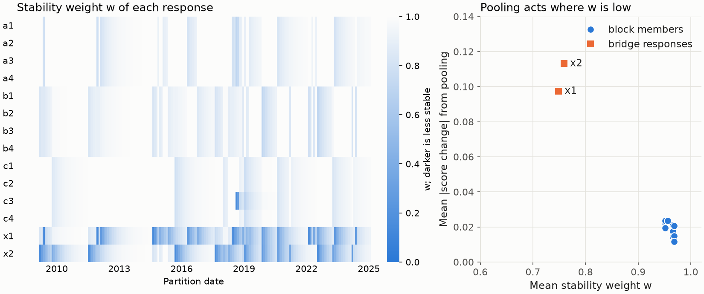

---
myst:
  html_meta:
    description: >-
      Cluster stability statistics and stability-pooled scoring in factorlasso: causal
      co-association weights for rolling partitions, their cluster and coverage summaries and
      diagnostics, and within-cluster scores whose variance is pooled toward the cross-section
      where membership is unstable.
---

# Cluster stability statistics and stability-pooled scoring

*Author: [Artur Sepp](https://github.com/ArturSepp)*

Implemented in [factorlasso](https://github.com/ArturSepp/factorlasso).
Software citation: [CITATION.cff](https://github.com/ArturSepp/factorlasso/blob/main/CITATION.cff).

A sequence of rolling partitions carries evidence about its own reliability: a response that has
shared its cluster with the same peers for a long time sits inside a cluster, and one whose peers
keep changing sits on a boundary. `compute_cluster_stability_statistics` turns that history into a
causal stability weight per response and date, and `score_with_stability_pooled_clusters` uses the
weight when it standardises a signal within clusters.

## Overview

The weight is a co-association frequency: the share of a response's current peers that also
shared its cluster on earlier dates. Counting pairs rather than labels is the device of evidence
accumulation for combining clusterings, which avoids matching labels across partitions (Fred and
Jain, 2005). It matters here because the labels of rolling partitions are renumbered on every
date, as the [rolling smoothing](rolling_cluster_smoothing.md) article shows.

A signal standardised within clusters, such as a momentum score ranked against sector peers,
depends on the cluster's mean and variance. For a response whose cluster is unreliable, the
within-cluster variance is a poor scale. The pooled score keeps the within-cluster mean and
shrinks the variance toward the cross-sectional variance in proportion to $1 - w$.

## Inputs, notation, and assumptions

| Symbol or input | Meaning | Units and convention |
|---|---|---|
| $P_t$ | Partition at date $t$ of a regular monthly or quarterly schedule | Labels arbitrary |
| $N_i(t)$ | Current peers of response $i$: the other members of its cluster in $P_t$ | |
| $w_i(t)$ | Stability weight of response $i$ at $t$ | In $[0, 1]$; 1 for a singleton |
| $w_g(t)$ | Stability weight of cluster $g$: the mean of $w_i(t)$ over its members | In $[0, 1]$ |
| $x_i$ | Raw signal of response $i$ at a date | Any units; scores are unitless |
| $\lambda$ | EWMA decay of the weights, $1 - 2 / (s + 1)$ for the span $s$ of the schedule | `span_by_freq` |

## Methodology

### The stability weight

For a response $i$ and each earlier partition date $u \le t$, let $a_i(u, t)$ be the share of
its current peers $N_i(t)$ that shared its cluster in $P_u$. The weight is their EWMA over the
available history,

$$
w_i(t) = \frac{\sum_{u \le t} \lambda^{t - u} a_i(u, t)}{\sum_{u \le t} \lambda^{t - u}} ,
$$

so $w_i(t) = 1$ when the current peers have always been together and falls toward zero when they
rarely were. A response alone in its cluster has weight one. `compute_co_association_panel`
computes the same share with a flat trailing window of six dates instead, or with an EWMA span.
Until `min_history` partition dates have been observed, the weights are set to one, so an
estimate needs history before it acts.

`compute_cluster_stability_statistics` infers the cadence of the partition dates, monthly (`ME`)
or quarterly (`QE`), takes the span for it from `span_by_freq`, and returns a
`ClusterStabilityStatistics` with:

| Field or method | Content |
|---|---|
| `w_i`, `w_g` | Dates by responses, and dates by the clusters of each date |
| `coverage` | Per date: active responses and clusters, the share with an estimated weight, and whether the warm-up applies |
| `boundary_statistics(membership)` | Reassignment rates in the bottom and top quartiles of $w$, given a panel of persistent cluster labels |
| `size_vs_w_correlation()` | Per date: the correlation between cluster size and $w_g$ |
| `within_cluster_asset_w_dispersion()` | Per date and cluster: the dispersion of $w_i$ among its members |

Reassignment needs persistent labels: raw labels change without any change in membership. The
panel of labels can come from the [offline lineage](cluster_lineage.md), which is not causal, or,
on synthetic data, from the known groups.

### Stability-pooled scores

For a cluster $g$ with more than `min_cluster_size` members, with mean $\bar x_g$, variance
$\sigma_g^2$ and cross-sectional variance $\sigma^2$ of all responses at the date, the score is

$$
z_i = \frac{x_i - \bar x_g}{\sqrt{w \sigma_g^2 + (1 - w) \sigma^2}} ,
$$

where $w$ is the cluster weight $w_g$ under `CLUSTER_VARIANCE` and the response's own $w_i$ under
`ASSET_VARIANCE`. Under `NONE`, the default, the score is the unpooled within-cluster z-score
exactly. A cluster at or below `min_cluster_size` is scored against the cross-section, whatever
the pooling. Only the variance is pooled; the centre stays the cluster mean. The weights are
taken from the latest date on or before the partition date, and a response without a weight
counts as stable.

## Worked example

The canonical script
[`examples/docs/cluster_stability_and_pooled_scoring.py`](../examples/docs/cluster_stability_and_pooled_scoring.py)
simulates 240 months of three blocks of four responses, with block volatility 3% and residual
volatility 2% per month, and two bridge responses: $x1$ loads half on block $a$ and half on
block $b$, $x2$ half on $b$ and half on $c$. Monthly partitions from month 36 use a 36-month EWMA
correlation cut at three clusters, and the stability weights a 12-month span:

```python
def stability(partitions: dict) -> fl.ClusterStabilityStatistics:
    """EWMA co-cluster stability weights with a 12-month span and a 12-date warm-up."""
    return fl.compute_cluster_stability_statistics(
        partitions, span_by_freq={"ME": STABILITY_SPAN}, min_history=MIN_HISTORY,
    )
```

The bridge responses change cluster 27 and 16 times over the 204 dates; one block member, $c3$,
strays for two months and the others never move. Their mean weights are 0.75 and 0.76, against
0.95 to 0.97 for the block members, whose weights dip when a bridge joins their cluster. With
persistent labels taken from the known blocks, the observations at which a response changed
cluster carry a mean weight of 0.40 against 0.91 for the others, and among the observations with
a weight below one, 9% of those in the bottom quartile of $w$ are reassignments against none in
the top quartile. The script
recomputes $w_i$ by counting peers, and $w_g$ as the member mean, at several dates.

A trailing 12-month return is then scored within the clusters, unpooled and with the variance
pooled by each response's weight:

```python
def score(signal: pd.DataFrame, partitions: dict, weights: pd.DataFrame,
          pooling: fl.StabilityPoolingType) -> pd.DataFrame:
    """Within-cluster z-scores, unpooled or with variance pooled by stability."""
    return fl.score_with_stability_pooled_clusters(
        signal, partitions, stability_weights=weights, min_cluster_size=3, pooling_type=pooling,
    )
```

The mean absolute change of the score is 0.10 and 0.11 for $x1$ and $x2$, and at most 0.02 for any
block member. The script checks the unpooled scores against the within-cluster z-score, the
pooled scores against the formula above, and the fallback of clusters at or below the size
threshold against the cross-sectional z-score.



*Synthetic teaching exhibit. Left: $w_i$ for each response and partition date; darker is less
stable. Right: for each response, the mean absolute change of its within-cluster momentum score
under asset-variance pooling against its mean weight. Produced by
`tools/docs_analytics/clustering.py` from the example script.*

## Implementation in factorlasso

Verified with factorlasso 0.20.0.

| Name | Role |
|---|---|
| `compute_cluster_stability_statistics` | Weights, cluster weights, coverage and diagnostics from a mapping of dates to partitions; `span_by_freq` maps `ME` or `QE` to a span, and `min_history` sets the warm-up. |
| `ClusterStabilityStatistics` | The result, with the fields and methods above. |
| `compute_co_association_panel` | The co-cluster share alone, over a flat trailing `window` or with an EWMA `span`. |
| `score_with_stability_pooled_clusters` | Within-cluster scores of a dates-by-responses signal against point-in-time partitions, with `min_cluster_size` and `pooling_type`. |
| `StabilityPoolingType` | `NONE`, `CLUSTER_VARIANCE`, `ASSET_VARIANCE`. |

The partitions can be any causal sequence, for example the `clusters` of
`compute_rolling_smoothed_clusters`. The partition dates must form a regular monthly or quarterly
schedule. To run the example from a checkout:

```console
python examples/docs/cluster_stability_and_pooled_scoring.py
```

## Interpretation and limitations

- **Stability is not validity.** A partition can be stable and wrong: stability measures how much
  mass sits near boundaries, not whether the clusters are right (von Luxburg, 2010). Use $w$ to
  weigh evidence, not to certify a partition.
- **The weight lags.** It is an EWMA over partition dates; a response that has just joined a new
  cluster for good keeps a low weight for about a span.
- **Reassignment needs identities.** The diagnostics that count reassignments require persistent
  labels. Labels from the offline lineage use the full panel and must not feed a causal
  calculation.
- **Pooling rescales.** Under `CLUSTER_VARIANCE` all scores of a cluster are divided by one
  number, so their order within the cluster is kept; under `ASSET_VARIANCE` responses with
  different weights are rescaled differently, and the order can change.

## See also

- [Causal smoothing of rolling clusters](rolling_cluster_smoothing.md): the partitions whose
  stability is measured here.
- [Offline cluster lineage](cluster_lineage.md): persistent labels for reporting.
- [Cluster discovery](cluster_discovery.md): how each partition is formed.

## References

- Fred, A. L. N., and Jain, A. K. (2005). Combining multiple clusterings using evidence
  accumulation. *IEEE Transactions on Pattern Analysis and Machine Intelligence* 27(6),
  835-850. DOI 10.1109/TPAMI.2005.113.
- von Luxburg, U. (2010). Clustering stability: an overview. *Foundations and Trends in Machine
  Learning* 2(3), 235-274.
- [factorlasso software citation](https://github.com/ArturSepp/factorlasso/blob/main/CITATION.cff).
