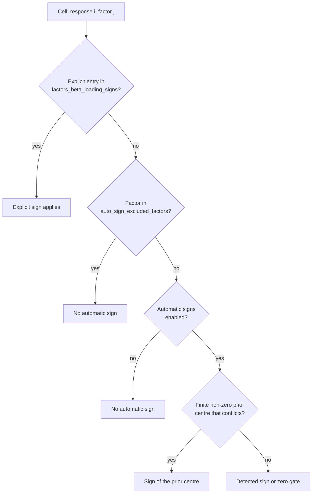

---
myst:
  html_meta:
    description: >-
      Conventions used across the factorlasso documentation: shapes and notation, return and
      covariance units, EWMA spans and half-lives, loss normalisation, the sign encoding, prior
      centres, the precedence of signs and priors, and a glossary.
---

# Conventions, notation and glossary

*Author: [Artur Sepp](https://github.com/ArturSepp)*

This page belongs to the documentation of [factorlasso](https://github.com/ArturSepp/factorlasso).
Software citation: [CITATION.cff](https://github.com/ArturSepp/factorlasso/blob/main/CITATION.cff).

Every article uses the conventions below. They are stated once here so that an article can link
to them instead of restating them; where an article departs from them, it says so.

## Notation and shapes

There are $T$ observation dates, $M$ factors and $N$ responses. The loading matrix is indexed by
response and then by factor, as in the fitted `coef_`.

| Symbol | Meaning | Shape | Fitted attribute or input |
|---|---|---|---|
| $X$ | Factor returns | $T \times M$ | `x` passed to `fit` |
| $Y$ | Response returns | $T \times N$ | `y` passed to `fit` |
| $\beta$ | Factor loadings | $N \times M$ | `coef_` |
| $\alpha$ | Regression intercepts | $N$ | `alpha_const_` |
| $\beta_0$ | Prior centres of the loadings | $N \times M$ | `factors_beta_prior` |
| $S$ | Sign matrix | $N \times M$ | `factors_beta_loading_signs`, `derived_signs_` |
| $\Sigma_x$ | Factor covariance | $M \times M$ | input to the covariance containers |
| $D$ | Residual covariance | $N \times N$ | input to the covariance containers |
| $\Sigma_y$ | Implied covariance of the responses | $N \times N$ | assembled by the covariance containers |

The model and the covariance it implies are

$$
Y_t = \alpha + \beta X_t + \varepsilon_t, \qquad \Sigma_y = \beta \Sigma_x \beta^{\top} + D.
$$

`intercept_` is a solver diagnostic, not $\alpha$; the
[sparse factor model](sparse_factor_model.md) article explains the difference.

## Data conventions

- **Returns.** Inputs are decimal returns per observation period. The package does not convert
  between simple and log returns and does not annualise anything.
- **Covariance units.** Covariance assembly returns the units of its inputs. Say whether the
  factor and residual covariances are per period or annualised; the containers do not rescale.
- **Frequency.** One fit uses one observation frequency. `span_freq_dict` is carried with the
  model specification for multi-frequency pipelines, but `fit` does not read it; the caller
  selects the span that matches the frequency of each panel.
- **Missing values.** Each response has its own mask of valid rows (`valid_mask_`), so responses
  with different start dates are fitted in one problem and a missing cell receives zero weight.
  A response with fewer than `warmup_period` valid observations (default 12) receives zero
  loadings and a warning.
- **Point in time.** Rolling and expanding estimation uses only data available at each estimation
  date, and the package's cross-validation uses expanding splits. Offline cluster lineage is the
  single exception: it is a diagnostic of a complete panel and is labelled as such wherever it
  appears.

## EWMA weighting

A span $s$ sets the decay $\lambda = 1 - 2/(s+1)$, and the observation $k$ periods before the last
date receives weight $\lambda^{k}$. The half-life is $h = \log(1/2) / \log \lambda$. The span is
neither a hard window nor a half-life. For a long history, the effective sample size
$(\sum_k w_k)^2 / \sum_k w_k^2$ equals $(1+\lambda)/(1-\lambda)$, which is exactly $s$.

| Span $s$ | Decay $\lambda$ | Half-life in periods | Effective sample size |
|---|---|---|---|
| 12 | 0.846 | 4.15 | 12 |
| 36 | 0.946 | 12.5 | 36 |
| 60 | 0.967 | 20.8 | 60 |
| 260 | 0.992 | 90.1 | 260 |

`span=None` gives equal weights. Three spans can differ within one model: `span` weights the
squared loss; `cluster_correlation_span` prepares the correlation used for cluster discovery
(default: the loss span); and `auto_sign_ewma_span`, or `auto_sign_use_fit_span=True`, weights the
univariate slopes behind derived signs (default: equal weights).

## Loss normalisation and penalty scale

`loss_normalization="sample"` (the default) divides the weighted squared error by the panel row
count. `loss_normalization="weight_sum"` divides each response's weighted squared error by that
response's own valid squared-weight mass (recorded in `loss_weight_mass_`), so a response with a
short history is not shrunk harder merely because it has fewer rows. For a balanced panel with
common weight mass $W$, the two conventions give the same fit when the penalties satisfy
$\lambda_{\mathrm{wsum}} = \lambda_{\mathrm{sample}} T / W$, where $\lambda_{\mathrm{wsum}}$ is
the penalty under `"weight_sum"`. With unequal histories the relative weights of responses
change, so no single conversion reproduces every earlier fit.

`reg_lambda` (default $10^{-5}$) is therefore meaningful only together with the loss
normalisation, the observation frequency and the return units. For group penalties,
`group_penalty="normalized"` (the default) weights a group of size $\lvert g \rvert$ among $G$
groups by $\sqrt{\lvert g \rvert / G}$, and `"yuan_lin"` by $\sqrt{\lvert g \rvert}$.

## Sign encoding

A sign matrix is an $N \times M$ DataFrame indexed like `coef_`:

| Entry | Constraint on the loading |
|---|---|
| `1` | non-negative |
| `-1` | non-positive |
| `0` | fixed at zero |
| `NaN` | free |

`nonneg=True` imposes non-negativity on every cell. Sign constraints are enforced by the `LASSO`,
`GROUP_LASSO`, `HIERARCHICAL_CLUSTER_GROUP_LASSO` and `FACTOR_CLUSTER_GROUP_LASSO` model types;
`UNILASSO` and the two cooperative types take no sign constraint and raise `ValueError` when one
is supplied.

## Prior centres

`factors_beta_prior` is an $N \times M$ matrix of penalty centres: the penalty applies to
$\beta - \beta_0$ instead of $\beta$. Without automatic OLS centres a missing prior cell means
zero. With `apply_ols_prior=True`, a missing cell defers to the computed OLS centre and a finite
cell, including zero, overrides it. The [sign constraints and priors](sign_constraints_and_priors.md)
article covers the penalty, and the [prior targets](prior_targets.md) article covers how the
centres are chosen.

## Precedence of signs and priors

Each cell of the final sign matrix is resolved in this order:

1. An explicit, non-missing entry of `factors_beta_loading_signs` always applies.
2. A factor listed in `auto_sign_excluded_factors` receives no automatic sign and no automatic
   zero gate.
3. Where automatic signs are enabled, a finite non-zero prior centre (explicit, mapped OLS or
   automatic OLS) overrides a conflicting detected sign, including an automatic zero. A zero or
   missing centre carries no direction.
4. Otherwise the detected sign or zero gate applies (`auto_sign_constraints=True`).

With `apply_ols_prior=True`, a centre that still conflicts with a hard constraint after this
resolution is set to zero; it is not moved to another factor. Adaptive penalty weights always use
the originally detected slopes.

In words: an explicit sign wins; an excluded factor is left free by the automatic layer; with
automatic signs enabled, a conflicting non-zero prior centre decides the direction; otherwise
the detected sign applies.

## Solvers

Problems are expressed in CVXPY and solved by CLARABEL by default (`solver="CLARABEL"`).
`solver_fallbacks` names solvers tried in order only when the primary solver raises or returns a
non-optimal status; without it the primary solver runs once and its error propagates. Interior-point
solvers return tiny non-zero values instead of exact zeros, so the articles report effective
sparsity at a stated tolerance rather than a bare non-zero count, and quote solver-sensitive
numbers to at most three significant figures.

## Glossary

- **Derived signs.** The sign matrix produced from pooled univariate slopes and the noise-floor
  gate, stored in `derived_signs_` after precedence is applied.
- **Effective span.** The span actually used by a fit after fit-time overrides; `effective_span_`.
- **FCGL.** Factor-clustering group LASSO: a group penalty on each cluster-by-factor block of
  loadings.
- **Gate.** The noise-floor threshold `auto_sign_threshold_t` on the pooled slope's $t$-statistic;
  below it the derived sign is zero. It is a screening rule, not a calibrated significance test.
- **Group LASSO.** A penalty on the Euclidean norm of a group of loadings, which selects or drops
  the group as a whole.
- **HCGL.** Hierarchical clustering group LASSO: responses are clustered from their correlation
  matrix and each response's row of loadings is penalised within its cluster.
- **Prior centre.** The value $\beta_0$ that a loading is shrunk towards instead of zero.
- **Sparse-group LASSO.** A mix of the group penalty and the cell-wise L1 penalty, set by
  `l1_weight`.
- **Warmup.** The minimum number of valid observations, `warmup_period`, below which a response
  receives zero loadings.

## See also

- [Documentation home](index.md)
- [API reference](api.rst), including the `LassoModel` parameters by topic
- [Documentation standard](documentation_standard.md)
