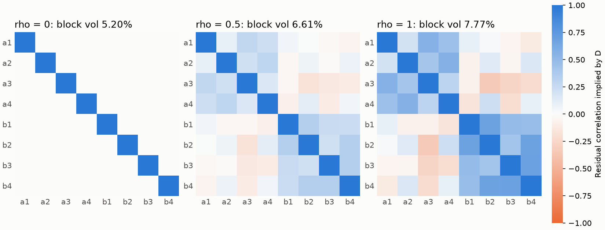

---
myst:
  html_meta:
    description: >-
      Empirical residual correlation in factorlasso: estimating a dimensionless residual
      correlation on a common grid of complete periods, its availability date, and assembling the
      residual covariance with a retention weight while keeping the stored residual variances.
---

# Empirical residual correlation

*Author: [Artur Sepp](https://github.com/ArturSepp)*

Implemented in [factorlasso](https://github.com/ArturSepp/factorlasso).
Software citation: [CITATION.cff](https://github.com/ArturSepp/factorlasso/blob/main/CITATION.cff).

The default residual covariance of a factor model is diagonal: whatever the factors leave, each
response keeps to itself. When residuals of related responses move together, a diagonal block
understates the risk of a portfolio concentrated in them. `estimate_residual_correlation`
estimates a residual correlation matrix from the fit's residuals, and the factor covariance
container blends it into the residual block with a retention weight, keeping each response's own
residual variance unchanged.

## Overview

The correlation is estimated separately from the variances. The variances stay those of the fit,
in its units; the correlation is a dimensionless matrix estimated on a common grid of complete
return periods, so responses observed at different native frequencies can be compared. The
residual block is then

$$
D = S \left[ (1 - \rho) I + \rho R \right] S ,
$$

with $S$ the diagonal matrix of residual volatilities, $R$ the estimated correlation and $\rho$
the retention weight. At $\rho = 0$ it is the orthogonal diagonal; at $\rho = 1$ the full
empirical correlation. The whole residual block can be scaled by a further weight $w$, and the
cross term between factors and residuals is zero throughout. The [factor covariance
assembly](factor_covariance_assembly.md) article covers the rest of the model.

## Inputs, notation, and assumptions

| Symbol or input | Meaning | Units and convention |
|---|---|---|
| `residuals` | Residuals at each response's native frequency, dates by responses | Log returns, possibly stored with a multiplier |
| `metadata` | Per response: `frequency`, `beta_span`, `annualisation_factor`, `residual_scale` | `residual_scale` is the stored multiplier |
| Common grid | `frequency` of the estimate, with `periods_per_year` | At most as fine as the coarsest native grid |
| $R$ | Residual correlation on the common grid | Dimensionless, unit diagonal, PSD |
| $\rho$ | `residual_corr_weight`, the retention of $R$ | In $[0, 1]$ |
| $S$ | Residual volatilities stored with the fit | The fit's units, for example annual |

## Methodology

### A common grid of complete periods

Each response's residuals are divided by its stored multiplier and summed over the native
periods that make up each common period; additive log returns make the sum exact. A common
period counts only if every native period in it is present: a missing row or value is never
treated as a zero return, and nothing is interpolated or prorated. A native period that crosses a
common boundary, such as a week spanning two months, raises an error; such panels must be rebuilt
from finer data. The history runs from the first to the last complete common period, and a gap
inside it raises an error instead of being filled, so a gapped response must be excluded.

### Span and centring

Without an explicit `span`, the estimate uses the loadings' span of the coarsest native grid,
converted to the common grid by matching the decay per unit of time:
$\lambda_c = \lambda_n^{a_n / a_c}$ for native and common annualisation factors $a_n$ and $a_c$,
and $s_c = (1 + \lambda_c) / (1 - \lambda_c)$. The common-period residuals are centred by their
causal EWMA mean, the first period, which only anchors the mean, is dropped, and the EWMA second
moment of the rest is normalised to a correlation. A positive constant multiplier of any response
cancels.

### Observation date and availability date

The last complete common period is the observation date; the fit date is the estimation date,
when the correlation becomes available. The two differ whenever a fit falls inside a common
period. `ResidualCorrelationData` refuses to return the correlation for a date before its
estimation date, because residuals recomputed with fitted loadings must not be backdated. A
rolling container keeps one correlation vintage per availability date, returned by
`get_residual_correlations`.

### Validation

`ResidualCorrelationData` rejects a correlation that is not finite, symmetric, positive
semidefinite and of unit diagonal, returns and metadata whose labels disagree, and an observation
date after the estimation date. It does not repair an indefinite matrix.

## Worked example

The canonical script
[`examples/docs/empirical_residual_correlation.py`](../examples/docs/empirical_residual_correlation.py)
simulates monthly residuals from January 2016 to February 2026 for eight responses in two blocks
of four, correlated at 0.5 within a block and not across, with 3% monthly volatility; one response
stores its residuals in percent. The fit date is 28 February 2026, and the correlation is
estimated on a quarterly grid:

```python
def estimate(residuals: pd.DataFrame, metadata: pd.DataFrame) -> fl.ResidualCorrelationData:
    """Quarterly common-grid correlation, available at the fit date."""
    return fl.estimate_residual_correlation(
        residuals, metadata, ESTIMATION_DATE, frequency="QE", periods_per_year=4.0,
    )
```

The monthly span of 36 becomes 12.0 quarters. The observation date is 31 December 2025, the last
complete quarter, and the correlation is available from 28 February 2026; a request for 31
January raises. The estimate uses 40 quarters, including the anchor. Its mean correlation is 0.41
within block $a$, against 0.5 in the population, and $-0.05$ across the blocks; 39 centred
quarters with a 12-quarter span leave that much sampling error. The script reproduces the matrix
from quarterly sums and pandas EWMA means with explicit weights, and confirms that a single missing
month fails the estimate.

The residual block, assembled with annual variances of $12 \times 0.03^2$:

| Retention $\rho$ | Off-diagonal entries | Residual volatility of an equal-weight portfolio of block $a$ |
|---|---|---|
| 0 | Zero: the orthogonal block exactly | 5.20% |
| 0.5 | Half the correlation | 6.61% |
| 1 | The full correlation | 7.77% |

The diagonal is the stored variance, bit for bit, at every $\rho$, and every block is positive
definite. The script checks each block against $S[(1 - \rho) I + \rho R]S$ computed by NumPy.



*Synthetic teaching exhibit. The residual block $D$ of the example in correlation units,
$D_{ij} / \sqrt{D_{ii} D_{jj}} = \rho R_{ij}$, at $\rho = 0$, 0.5 and 1; the titles give the
residual volatility of an equal-weight portfolio of block $a$. Produced by
`tools/docs_analytics/covariance_residuals.py` from the example script.*

## Implementation in factorlasso

Verified with factorlasso 0.20.0.

| Name | Role |
|---|---|
| `estimate_residual_correlation` | The estimate from native residuals, their metadata and the fit date, with optional common `frequency`, `span` and `periods_per_year`. |
| `ResidualCorrelationData` | `correlation`, the common-grid `residual_returns`, `asset_metadata`, `frequency`, `span`, `observation_date` and `estimation_date`; with `get_corr`, `filter_on_tickers`, `to_sheets`, `from_sheets` and `observation_count`. |

A `CurrentFactorCovarData` carries the prepared correlation as `residual_correlation`.
`get_residual_covar` and `get_y_covar` take `residual_type=ResidualType.EMPIRICAL` and
`residual_corr_weight` $= \rho$; `ResidualType.ORTHOGONAL`, the default, keeps the diagonal
block and rejects any other retention. `residual_var_weight` scales the whole block. To run the
example from a checkout:

```console
python examples/docs/empirical_residual_correlation.py
```

## Interpretation and limitations

- **What is not claimed.** The correlation is an EWMA estimate of past co-movement of residuals
  on a common grid. It is not a forecast of future residual correlation, not a model of the
  residuals, and it carries no cross term between factors and residuals.
- **The retention is a policy weight.** $\rho$ is chosen, not estimated. It shrinks the estimated
  correlation toward zero, and with it the concentration penalty a portfolio pays.
- **Sampling error is large on coarse grids.** Few common periods and a short span make $R$
  noisy, as the example's 0.41 against 0.5 shows; partial retention limits the damage.
- **Strict data rules.** Gaps, non-nested periods and fewer than two complete common periods fail
  rather than degrade silently; the caller decides which responses to exclude.

## See also

- [Factor covariance assembly](factor_covariance_assembly.md): the containers and the rest of the
  covariance.
- [Residual diagnostics](residual_diagnostics.md): testing whether residual correlation is there
  at all.
- [EWMA weighting](ewma_weighting_and_ragged_histories.md): spans and decays.

## References

- [factorlasso software citation](https://github.com/ArturSepp/factorlasso/blob/main/CITATION.cff).
