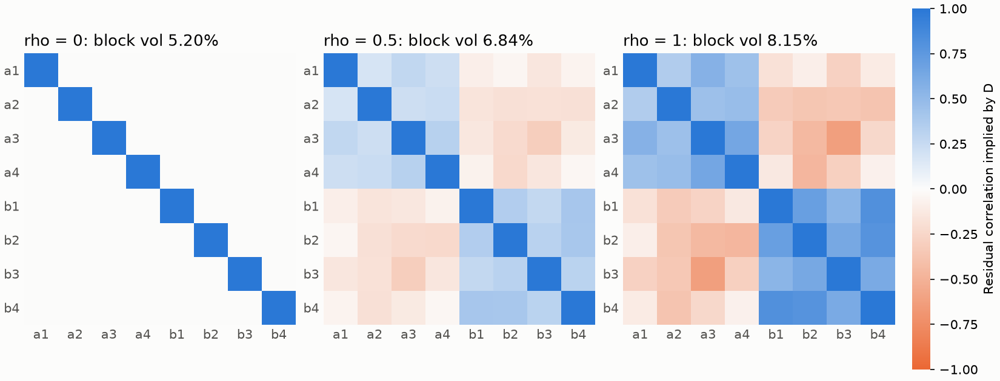

---
myst:
  html_meta:
    description: >-
      Empirical residual correlation in factorlasso: estimating a dimensionless residual
      correlation from available pairs on a common period grid, its availability date, and assembling the
      residual covariance with a retention weight while keeping the stored residual variances.
---

# Empirical residual correlation

*Author: [Artur Sepp](https://github.com/ArturSepp) / First recorded: [2026-09-26](https://github.com/ArturSepp/factorlasso/commit/26290d6bb9f527a0276eb4caa231211ce07819a9)*

Implemented in [factorlasso](https://github.com/ArturSepp/factorlasso).
Software citation: [CITATION.cff](https://github.com/ArturSepp/factorlasso/blob/main/CITATION.cff).

The default residual covariance of a factor model is diagonal: whatever the factors leave, each
response keeps to itself. When residuals of related responses move together, a diagonal block
understates the risk of a portfolio concentrated in them. `estimate_residual_correlation`
estimates a residual correlation matrix from the fit's residuals, and the factor covariance
container blends it into the residual block with a retention weight, keeping each response's own
residual variance unchanged.

## Overview

The correlation is estimated separately from the variances. The variances stay those of the fit,
in its units; the correlation is a dimensionless matrix estimated on a common return-period
grid, using each pair's available history, so responses with different start dates and native
frequencies can be compared. The
residual block is then

$$
D = S \left[ (1 - \rho) I + \rho R \right] S ,
$$

with $S$ the diagonal matrix of residual volatilities, $R$ the estimated correlation and $\rho$
the retention weight. At $\rho = 0$ it is the orthogonal diagonal; at $\rho = 1$ the full
empirical correlation. The whole residual block can be scaled by a further weight $w$, and the
cross term between factors and residuals is zero throughout. The [factor covariance
assembly](factor_covariance_assembly.md) article covers the rest of the model.

## Inputs, notation, and assumptions

| Symbol or input | Meaning | Units and convention |
|---|---|---|
| `residuals` | Residuals at each response's native frequency, dates by responses | Log returns, possibly stored with a multiplier |
| `metadata` | Per response: `frequency`, `beta_span`, `annualisation_factor`, `residual_scale` | `residual_scale` is the stored multiplier |
| Common grid | `frequency` of the estimate, with `periods_per_year` | At most as fine as the coarsest native grid |
| $R$ | Residual correlation on the common grid | Dimensionless, unit diagonal, PSD |
| $\rho$ | `residual_corr_weight`, the retention of $R$ | In $[0, 1]$ |
| $S$ | Residual volatilities stored with the fit | The fit's units, for example annual |

## Methodology

### A common grid with per-response availability

Each response's residuals are divided by its stored multiplier and summed over the native
periods that make up each common period; additive log returns make the sum exact. A common
period is valid for a response only if every native period in it is present. Otherwise that
response's aggregate remains NaN: a missing row or value is never treated as a zero return,
interpolated or prorated. A native period that crosses a common boundary, such as a week spanning
two months, raises an error; such panels must be rebuilt from finer data.

The panel retains the union of per-response histories. A new response does not truncate the
history of older pairs. Leading, internal and trailing NaNs pass to the existing EWMA kernels.
Only all-missing periods outside the observed panel are trimmed; internal all-missing rows remain.
Each response needs at least two valid common-period aggregates. `observation_count` counts grid
rows, including the initialization anchor, rather than observations shared by every response.
Per-pair counts can be obtained from the cross-product of the panel's finite-observation mask.

### Span and centring

Without an explicit `span`, the estimate uses the loadings' span of the coarsest native grid,
converted to the common grid by matching the decay per unit of time:
$\lambda_c = \lambda_n^{a_n / a_c}$ for native and common annualisation factors $a_n$ and $a_c$,
and $s_c = (1 + \lambda_c) / (1 - \lambda_c)$. The common-period residuals are centred by their
causal EWMA mean. The existing kernel's `X0` convention initializes responses present on the
first grid row from that observation, and responses missing on that row from zero when they
first appear. The first grid row only anchors the mean and is omitted from the second moment.

Both kernels use `NanBackfill.FFILL`. A missing response holds its previous mean; a missing
member of a pair holds that pair's previous second moment. For each available product the
update is $M_{ij,t} = \lambda M_{ij,t-1} + (1 - \lambda) z_{i,t}z_{j,t}$, starting from zero.
An unavailable product leaves $M_{ij,t} = M_{ij,t-1}$. Thus the decay advances on observed pairs,
and a pair never observed together retains zero. This is the existing kernel convention; it does
not divide each entry by its own accumulated weight mass. Finally,
$R_{ij} = M_{ij} / \sqrt{M_{ii}M_{jj}}$. A positive constant multiplier of any response cancels.

The optional `missing_policy='zero_innovation'` uses the same causal mean and
common-grid EWMA span, but sets missing centred scores to zero before the moment
update. Every moment then decays on the same calendar. The result is a weighted
sum of outer products and is positive semidefinite without a matrix repair.
This is a sensitivity estimator: sparse overlap attenuates dependence. It does
not impute returns, renormalize pairwise masses or change native marginal risk.
The returned residual panel retains its NaNs and the alternative policy is recorded
in `asset_metadata`. The default remains `pairwise_ffill`, which rejects a materially
indefinite result caused by asynchronous observation gaps.

### Observation date and availability date

The last grid period with at least one valid response is the observation date; the fit date is the estimation date,
when the correlation becomes available. The two differ whenever a fit falls inside a common
period. `ResidualCorrelationData` refuses to return the correlation for a date before its
estimation date, because residuals recomputed with fitted loadings must not be backdated. A
rolling container keeps one correlation vintage per availability date, returned by
`get_residual_correlations`.

### Four residual covariance choices

| `ResidualType` | Correlation target before retention |
|---|---|
| `ORTHOGONAL` (`orthogonal`) | Identity; this remains the library default. |
| `EMPIRICAL` (`empirical`) | The full prepared residual correlation. |
| `EXPOSURE_CLUSTER` (`exposure_cluster`) | Signed residual-correlation averages within the fitted exposure clusters; zero between clusters. |
| `RESIDUAL_CLUSTER` (`residual_cluster`) | The same block averaging, using clusters estimated from the prepared residual correlation. |

For either cluster choice, a block of size $n > 1$ has the arithmetic mean of its
unordered off-diagonal correlations on every off-diagonal entry. Its diagonal is one;
a singleton has no off-diagonal entries. Means retain their sign. A positive semidefinite
input block gives a mean between $-1/(n-1)$ and 1, so the constant-correlation block is
positive semidefinite. Combining independent blocks and applying the retention mixture
preserves that property without clipping or an additional PSD repair.

Residual clustering uses `compute_clusters_from_corr_matrix` with Ward linkage,
`distance_transform='one_minus_rho'`, and `cutoff_fraction=0.6`. Exposure clustering
uses the fit's existing labels, including cadence prefixes. Both choices exclude assets
with zero residual variance or fewer than two valid residual observations from the
partition and the averages; excluded assets retain independent marginal residual risk.
Exposure labels are required for eligible assets when there are at least two of them.

Targets are constructed on the full fit universe before an `assets` selection.
`filter_on_tickers` preserves the full-universe targets in the selected snapshot,
including renaming, repeated selection, Excel save/load and rolling as-of retrieval.
Selecting assets does not recut the partition or recompute its means. Factor exposures,
their clusters and the native residuals used for alpha estimation remain unchanged.
The prepared correlation vintage remains subject to its availability date; current
snapshot variances still set the residual diagonal.

`residual_corr_weight` applies to every nonorthogonal target. At zero it gives the
orthogonal matrix without requiring prepared residual correlation or cluster labels.
At one it retains the full selected target. This weight is distinct from
`residual_var_weight`, which scales the entire residual covariance.

### Validation

`ResidualCorrelationData` rejects a correlation that is not finite, symmetric, positive
semidefinite and of unit diagonal, returns and metadata whose labels disagree, and an observation
date after the estimation date. Asynchronous internal or trailing gaps can make the FFILL
moment matrix indefinite because entries stop updating at different times. Such an estimate
raises explicitly; it is not silently projected, shrunk, or switched to a complete-case estimate.

## Worked example

The canonical script
[`examples/docs/empirical_residual_correlation.py`](../examples/docs/empirical_residual_correlation.py)
simulates monthly residuals from January 2016 to February 2026 for eight responses in two blocks
of four, correlated at 0.5 within a block and not across, with 3% monthly volatility; one response
stores its residuals in percent. A Cholesky factor fixes the synthetic draw's covariance
basis across platforms. The fit date is 28 February 2026, and the correlation is estimated
on a quarterly grid:

```python
def estimate(residuals: pd.DataFrame, metadata: pd.DataFrame) -> fl.ResidualCorrelationData:
    """Quarterly common-grid correlation, available at the fit date."""
    return fl.estimate_residual_correlation(
        residuals, metadata, ESTIMATION_DATE, frequency="QE", periods_per_year=4.0,
    )
```

The monthly span of 36 becomes 12.0 quarters. The observation date is 31 December 2025, the last
complete quarter, and the correlation is available from 28 February 2026; a request for 31
January raises. The estimate uses 40 quarters, including the anchor. Its mean correlation is 0.49
within block $a$, against 0.5 in the population, and $-0.29$ across the blocks; 39 centred
quarters with a 12-quarter span leave that much sampling error. The script reproduces the matrix
from quarterly sums and pandas EWMA means with explicit weights. It also confirms that a single
missing month leaves only that response's quarter as NaN and preserves correlations among the
other responses.

The residual block, assembled with annual variances of $12 \times 0.03^2$:

| Retention $\rho$ | Off-diagonal entries | Residual volatility of an equal-weight portfolio of block $a$ |
|---|---|---|
| 0 | Zero: the orthogonal block exactly | 5.20% |
| 0.5 | Half the correlation | 6.84% |
| 1 | The full correlation | 8.15% |

The diagonal is the stored variance, bit for bit, at every $\rho$, and every block is positive
definite. The script checks each block against $S[(1 - \rho) I + \rho R]S$ computed by NumPy.



*Synthetic teaching exhibit. The residual block $D$ of the example in correlation units,
$D_{ij} / \sqrt{D_{ii} D_{jj}} = \rho R_{ij}$, at $\rho = 0$, 0.5 and 1; the titles give the
residual volatility of an equal-weight portfolio of block $a$. Produced by
`tools/docs_analytics/covariance_residuals.py` from the example script.*

## Implementation in factorlasso

Implementation and canonical example verified with factorlasso 1.0.0 on 2026-10-03.

| Name | Role |
|---|---|
| `estimate_residual_correlation` | The estimate from native residuals, their metadata and the fit date, with optional common `frequency`, `span` and `periods_per_year`. |
| `ResidualCorrelationData` | `correlation`, the common-grid `residual_returns`, `asset_metadata`, `frequency`, `span`, `observation_date` and `estimation_date`; with `get_corr`, `filter_on_tickers`, `to_sheets`, `from_sheets` and `observation_count`. |

A `CurrentFactorCovarData` carries the prepared correlation as `residual_correlation`.
`get_residual_covar` and `get_y_covar` accept all four `ResidualType` values and
`residual_corr_weight` $= \rho$; `ResidualType.ORTHOGONAL`, the default, keeps the diagonal
block and rejects any other retention. `residual_var_weight` scales the whole block. To run the
example from a checkout:

```console
python examples/docs/empirical_residual_correlation.py
```

## Interpretation and limitations

- **What is not claimed.** The correlation is an EWMA estimate of past co-movement of residuals
  on a common grid. It is not a forecast of future residual correlation, not a model of the
  residuals, and it carries no cross term between factors and residuals.
- **The retention is a policy weight.** $\rho$ is chosen, not estimated. It shrinks the estimated
  correlation toward zero, and with it the concentration penalty a portfolio pays.
- **Sampling error is large on coarse grids.** Few common periods and a short span make $R$
  noisy, as the example's across-block mean of $-0.29$ shows; partial retention limits the damage.
- **Unequal information.** Pair histories differ. Zero for an unobserved pair is an initialization
  convention, not evidence of independence. Finite-history weight mass is not corrected per pair.
- **Validation remains strict.** Non-nested periods, fewer than two valid aggregates per response,
  undefined residual variance, and indefinite estimated correlation fail explicitly.

## See also

- [Factor covariance assembly](factor_covariance_assembly.md): the containers and the rest of the
  covariance.
- [Residual diagnostics](residual_diagnostics.md): testing whether residual correlation is there
  at all.
- [EWMA weighting](ewma_weighting_and_ragged_histories.md): spans and decays.

## References

- [factorlasso software citation](https://github.com/ArturSepp/factorlasso/blob/main/CITATION.cff).
