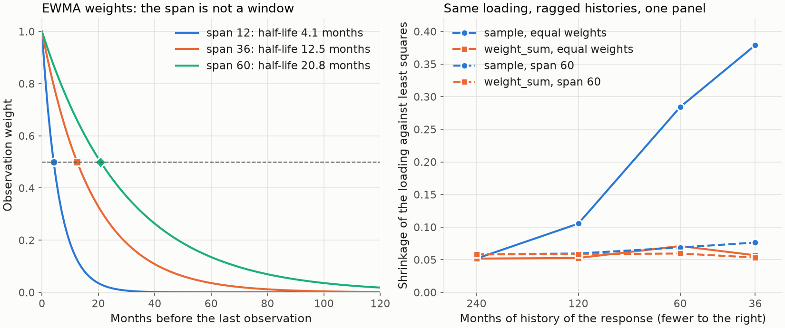

---
myst:
  html_meta:
    description: >-
      EWMA observation weighting in factorlasso: span, decay, half-life and effective sample size,
      the running-mean demeaning, ragged histories with per-response validity masks, and the
      sample and weight-sum loss normalisations with the exact penalty conversion between them.
---

# EWMA weighting, ragged histories and loss normalisation

*Author: [Artur Sepp](https://github.com/ArturSepp)*

Implemented in [factorlasso](https://github.com/ArturSepp/factorlasso).
Software citation: [CITATION.cff](https://github.com/ArturSepp/factorlasso/blob/main/CITATION.cff).

An exponentially weighted moving average (EWMA) gives the observation $k$ periods before the last
date the weight $\lambda^k$, so recent returns count more than old ones. factorlasso uses EWMA
weights in the squared loss of every estimator, demeans with a running EWMA mean, and lets each
response keep its own history: a response that starts late is simply missing before its first
observation. How the loss of such a response is normalised decides how strongly it is shrunk, and
the package offers two conventions for it.

## Overview

Factor loadings drift. Weighting recent observations more lets the loadings follow slow changes
in exposure instead of averaging a decade equally; EWMA weighting is the standard treatment of
time-varying second moments in return data (Engle, 2002), and the JSS paper uses it for this
reason (Sepp and Kastenholz, 2026, Section 2.1). Zakamulin (2015) reports that minimum-variance
portfolios built from EWMA covariance matrices tracked their risk targets better than those built
from a shrinkage estimator; that is an empirical result for covariance forecasting, not a property
of loading estimation.

Multi-asset panels are also ragged: funds and indices start on different dates. factorlasso fits
all responses in one problem and masks the cells a response does not have, so no response is cut
to the shortest common history and none is backfilled.

The two choices interact. Under the historical `loss_normalization="sample"`, every response's
weighted squared error is divided by the panel's row count. A response with a short history then
contributes a small loss against the same penalty and is shrunk harder. Under
`loss_normalization="weight_sum"`, each response's error is divided by its own valid weight
mass, and missing pre-history adds no shrinkage. The worked example measures the difference.

## Inputs, notation, and assumptions

| Symbol or input | Meaning | Units and convention |
|---|---|---|
| $s$ | EWMA span, `span` | Periods of the observation frequency; `None` gives equal weights |
| $\lambda$ | Decay, $1 - 2/(s+1)$ | Between 0 and 1 |
| $w_k$ | Weight of the observation $k$ periods before the last date, $\lambda^k$ | Largest, 1, at the last date |
| $T$ | Rows of the fitted panel | $T - 1$ of the input rows when EWMA demeaning drops the first row |
| $v_{ti}$ | Validity mask of response $i$ at row $t$, `valid_mask_` | 1 for an observed cell, 0 otherwise |
| $m_i$ | Weight mass of response $i$, $\sum_t w_t v_{ti}$ | `loss_weight_mass_` |
| $w$ | `warmup_period` | Minimum number of valid observations per response, default 12 |

Returns are decimal returns per period of one observation frequency; nothing is annualised. The
weights are relative to the last date of the panel, so a response that stops early loses weight
as well as observations. The other conventions are those of the [conventions page](conventions.md).

## Methodology

### Weights, half-life and effective sample size

The weight of an observation halves every $h = \log(1/2) / \log \lambda$ periods, the half-life.
Over a long history the weights sum to $1/(1-\lambda)$ and their squares to $1/(1-\lambda^2)$,
so the effective sample size of the weighted mean is

$$
\frac{\left(\sum_k w_k\right)^2}{\sum_k w_k^2} = \frac{1 + \lambda}{1 - \lambda} = s .
$$

The span is therefore the number of equally weighted observations that carry the same
information, which is why it is neither a hard window nor a half-life. A span of 60 months has a
half-life of 20.8 months and gives an observation ten years back a weight of about 0.02.

### Running-mean demeaning

With `demean=True` and a span, each series is demeaned by its running EWMA mean
$\mu_t = \lambda \mu_{t-1} + (1 - \lambda) x_t$, started at the first observation. The first
row is then identically zero and is dropped, so $T$ is one less than the input length. The mean is
computed on the observed values only: a series that starts late starts its recursion at its first
observation, and a gap carries the previous mean forward. Missing cells are set to zero after
demeaning and removed from the loss by the mask. Without a span the sample mean over each series'
observed values is used.

### The weighted loss and its two normalisations

The solver scales each row by the square root of its weight, $\sqrt{w_t} v_{ti}$, so that the
squared loss carries the EWMA weight itself. With residuals $r_{ti} = y_{ti} - x_t^{\top}\beta_i$,
the two losses are

$$
L_{\mathrm{sample}}(\beta) = \frac{1}{T} \sum_{i} \sum_t w_t v_{ti} r_{ti}^2,
\qquad
L_{\mathrm{wsum}}(\beta) = \sum_{i} \frac{1}{m_i} \sum_t w_t v_{ti} r_{ti}^2 .
$$

A response with no observation contributes nothing to either. Under the sample convention the
data term of response $i$ is small when $m_i$ is small, while its penalty is not; under the weight
sum each response's data term is a weighted mean.

For one factor without intercept the LASSO is a soft threshold, and the shrinkage of a positive
loading below its weighted least-squares value is

$$
\hat b_i - \hat\beta_i = \frac{\lambda_{\mathrm{sample}} T}{2 \sum_t w_t v_{ti} x_t^2}
\quad \text{or} \quad
\hat b_i - \hat\beta_i = \frac{\lambda_{\mathrm{wsum}} m_i}{2 \sum_t w_t v_{ti} x_t^2} .
$$

The first grows by the factor $T/m_i$ when the history shortens; the second does not. The same
holds for any number of factors: because the LASSO penalty separates across responses, the joint
fit of response $i$ under the sample convention equals a fit of that response alone, on the same
arrays restricted to its $T_i$ rows, with the penalty scaled by $T/T_i$. (Demeaning over a
different window would change the arrays, so the identity is stated without it.)

### Converting the penalty

For a balanced panel with common weight mass $W$, the two conventions give identical fits when

$$
\lambda_{\mathrm{wsum}} = \lambda_{\mathrm{sample}} \frac{T}{W}.
$$

With ragged histories no single conversion reproduces every earlier fit, because the relative
weights of the responses change. The fixed-income working paper applies exactly this conversion:
a sample-normalised penalty of $10^{-5}$ on 318 monthly rows with span 60, whose complete-grid
mass is 30.49924, becomes $1.0426 \times 10^{-4}$ under the weight sum (Sepp, 2026, Section 2.3).

### Warmup and mixed frequencies

A response with fewer than `warmup_period` valid observations receives zero loadings, NaN
diagnostics and a warning, and is left out of the cluster assignment; `None` disables the check.
`span_freq_dict` records a span per observation frequency, such as monthly and quarterly, for
pipelines that fit each frequency separately. `fit` does not read it: the caller passes the span of
the panel being fitted, either at construction or as `fit(x, y, span=...)`.

## Worked example

The canonical script
[`examples/docs/ewma_weighting_and_ragged_histories.py`](../examples/docs/ewma_weighting_and_ragged_histories.py)
first checks the weight conventions: the half-lives of spans 12, 36 and 60 are 4.15, 12.47 and
20.79 periods, the effective sample size equals the span, and `compute_ewm` reproduces
`pandas.DataFrame.ewm(span=s, adjust=False).mean()`.

It then builds four responses with the same true loading of 0.8 on one factor and histories of
240, 120, 60 and 36 months, in one panel of 240 months:

```python
def make_ragged_panel(seed: int = SEED) -> tuple[pd.DataFrame, pd.DataFrame]:
    """One zero-mean factor and four responses with equal loadings and ragged histories."""
    rng = np.random.default_rng(seed)
    dates = pd.date_range("2006-01-31", periods=N_OBS, freq="ME")
    x = pd.DataFrame({"equity": FACTOR_VOL * rng.standard_normal(N_OBS)}, index=dates)
    noise = RESIDUAL_VOL * rng.standard_normal((N_OBS, len(HISTORIES)))
    y = pd.DataFrame(TRUE_BETA * x.to_numpy() + noise, index=dates,
                     columns=[f"history_{h}" for h in HISTORIES])
    for column, history in zip(y.columns, HISTORIES):
        y.iloc[: N_OBS - history, y.columns.get_loc(column)] = np.nan
    return x, y
```

Each normalisation is fitted once, with the weight-sum penalty converted so that the
full-history response receives exactly the same fit:

```python
def fit(x: pd.DataFrame, y: pd.DataFrame, loss_normalization: str, reg_lambda: float,
        span: float | None) -> fl.LassoModel:
    """LASSO with EWMA row weights, no demeaning, and the given loss normalisation."""
    model = fl.LassoModel(
        model_type=fl.LassoModelType.LASSO,
        reg_lambda=reg_lambda,
        span=span,
        demean=False,
        loss_normalization=loss_normalization,
    )
    return model.fit(x=x, y=y)
```

With span 60 the weight masses of the four responses, `loss_weight_mass_`, are 30.5, 29.9,
26.4 and 21.3: the months a short history lacks are the old ones, which carry little weight. The
shrinkage of each loading below its own weighted least-squares value is:

<!-- fragment -->
```text
                  equal weights          span 60
history      sample   weight_sum   sample   weight_sum
240           0.052        0.052    0.058        0.058
120           0.105        0.053    0.060        0.059
60            0.284        0.071    0.069        0.060
36            0.379        0.057    0.076        0.053
```

With equal weights, the 36-month response is shrunk 7.3 times as much as the full history under
the sample convention, close to the ratio $240/36$ of the penalties; under the weight sum the
ratio is 1.1. With span 60 the sample convention costs the short history only 1.3 times the
shrinkage, because the missing months were lightly weighted anyway. The script checks every
shrinkage against the closed-form soft threshold above, and the joint sample fit of the 36-month
response against its own-window fit at the penalty scaled by $240/36$, to $10^{-4}$.



*Synthetic teaching exhibit. Left: weights $\lambda^k$ of spans 12, 36 and 60, with the half-life
marked. Right: shrinkage of the loading of four responses with a true loading of 0.8, one factor,
240 monthly observations, LASSO without demeaning, with equal weights and with span 60. Produced
by `tools/docs_analytics/estimation.py` from the example script.*

## Implementation in factorlasso

Verified with factorlasso 0.20.0 and CVXPY with the CLARABEL solver.

| Name | Role |
|---|---|
| `span` | EWMA span of the loss weights and of the running-mean demeaning; `None` gives equal weights. A span passed to `fit` overrides it for that call; `effective_span_` records the span used. |
| `loss_normalization` | `"sample"` (default) divides the loss by the row count; `"weight_sum"` divides each response's loss by its weight mass. `UNILASSO` keeps its own unweighted loss and rejects `"weight_sum"`. |
| `warmup_period` | Minimum number of valid observations of a response, default 12. |
| `span_freq_dict` | Carried per-frequency spans for multi-frequency pipelines; not read by `fit`. |
| `loss_weight_mass_`, `loss_denominator_`, `n_loss_rows_` | Fitted weight mass per response, the denominator actually used (the row count or the mass) and the number of loss rows. |
| `compute_ewm` | Recursive EWMA mean of a Series, DataFrame or array, with NaN-aware start and gap handling. |
| `compute_ewm_covar` | Recursive EWMA covariance or correlation matrix at the last observation. |
| `compute_expanding_power` | The geometric sequence $1, \lambda, \lambda^2, \dots$ from which the row weights are built. |

`compute_ewm` and `compute_ewm_covar` start from the first observation and, by default, carry the
previous value through missing observations; other policies are available through their
`init_type` and `nan_backfill` arguments. The fitted `valid_mask_` holds the mask $v_{ti}$, and
`get_x_y_np`, described in the [sparse factor model](sparse_factor_model.md) article, returns
the demeaned arrays and the mask that the solver receives.

To run the example from a checkout:

```console
python examples/docs/ewma_weighting_and_ragged_histories.py
```

## Interpretation and limitations

- **Adaptivity against noise.** A shorter span follows changes in exposure faster and estimates
  them from fewer effective observations. The span is a modelling choice; the package does not
  select it.
- **The weights are anchored at the panel's last date.** A response that stops before the end
  of the panel has small weights on all its observations, and under either normalisation its
  fit rests on little effective information.
- **The weight sum changes the relative weight of responses.** A response with a short history
  counts as much as a long one in the joint objective, which is the purpose, but it also means
  that a penalty calibrated under the sample convention must be recalibrated; the conversion
  above is exact only for balanced panels.
- **Demeaning costs one row with a span.** The first row of an EWMA-demeaned panel is dropped,
  and the running mean of a late-starting series begins at its first observation, where it is
  noisy.
- **EWMA weighting is not a model of time variation.** It discounts the past at a fixed rate and
  does not detect breaks; Engle (2002) models the dynamics of correlations explicitly, which the
  package does not do.

## See also

- [Sparse multi-output factor model](sparse_factor_model.md): the loss, the penalty and the
  intercepts.
- [Conventions and glossary](conventions.md): spans, units and the missing-data policy.
- [Prior targets](prior_targets.md): OLS centres computed with the same effective span.
- [Residual diagnostics](residual_diagnostics.md): the degrees of freedom of the residual test.
- [API reference](api.rst).

## References

- Engle, R. (2002). Dynamic conditional correlation: a simple class of multivariate generalized
  autoregressive conditional heteroskedasticity models. *Journal of Business & Economic
  Statistics* 20(3), 339-350. DOI 10.1198/073500102288618487.
- Sepp, A. (2026). Selecting Priors for Fixed-Income Factor Models: Validation and Capital Market
  Assumptions. Working paper, revised 26 September 2026.
  [Manuscript](../papers/prior_targets_2026/paper/article.pdf).
- Sepp, A., and Kastenholz, M. A. (2026). factorlasso: Sparse Multi-Output Regression with
  Cluster-Grouped Sign Constraints in Python. Submitted to the *Journal of Statistical
  Software*. [Manuscript](../papers/jss_2026/paper/article.pdf).
- Zakamulin, V. (2015). A test of covariance-matrix forecasting methods. *The Journal of Portfolio
  Management* 41(3), 97-108. DOI 10.3905/jpm.2015.41.3.097.
- [factorlasso software citation](https://github.com/ArturSepp/factorlasso/blob/main/CITATION.cff).
