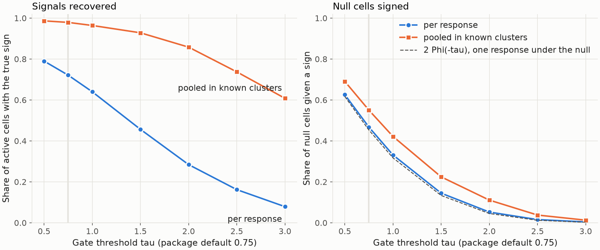
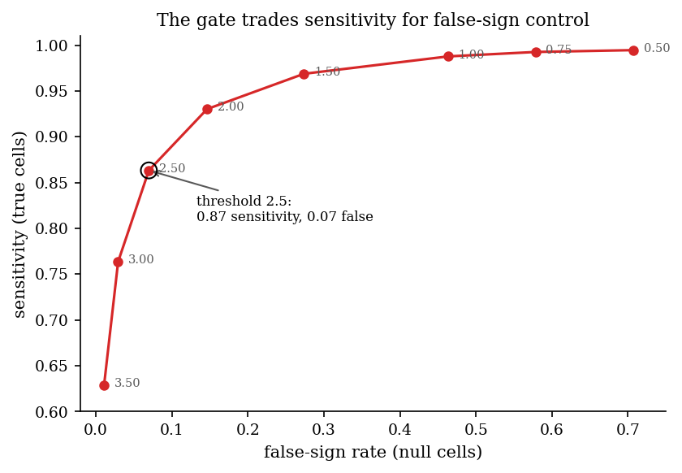
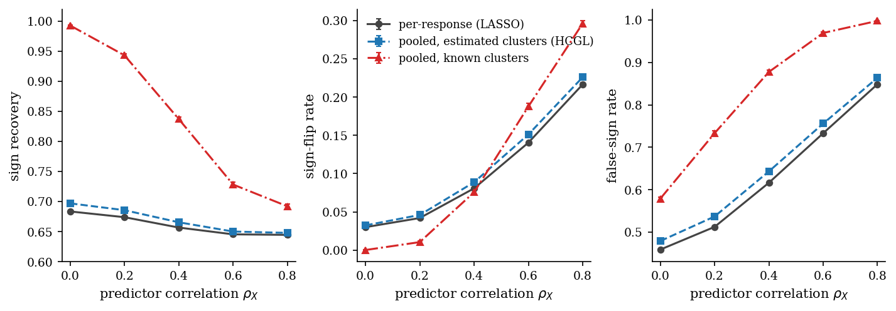

---
myst:
  html_meta:
    description: >-
      Gated cluster-pooled sign derivation in factorlasso: pooled univariate slopes within
      response clusters, a closed-form noise-floor gate, hard sign constraints from the surviving
      signs, the weighted date-score variant, and a simulation of recovery and false signs.
---

# Gated cluster-pooled sign derivation

*Author: [Artur Sepp](https://github.com/ArturSepp)*

Implemented in [factorlasso](https://github.com/ArturSepp/factorlasso).
Software citation: [CITATION.cff](https://github.com/ArturSepp/factorlasso/blob/main/CITATION.cff).

Gated cluster-pooled sign derivation estimates the sign matrix of a factor model from the data.
For each cluster of similar responses and each factor it computes one pooled univariate slope,
keeps the slope's sign only when its t-statistic clears a noise floor, and passes the surviving
signs to the estimator as hard constraints. Pooling raises the sample behind each sign by the
cluster size; the gate abstains where even the pooled evidence is weak.

## Overview

The [sign constraints](sign_constraints_and_priors.md) article describes what a sign matrix does
once it is given. Often it is not given: an analyst knows that funds of one style share their
exposures, but not the sign of every loading. The univariate slope of a response on one factor
carries that sign, and a hard constraint built from it is the device of univariate-guided sparse
regression (Chatterjee, Hastie and Tibshirani, 2025; Richland et al., 2025, equation 3.3). With a
short history, however, a single response's slope is noisy and its sign often wrong or
uninformative.

factorlasso pools. Responses in one cluster, such as the HCGL clusters discovered from the
response correlations, are assumed to share the direction of their exposures, so their slopes
are estimated jointly. A closed-form gate then decides, cluster by cluster and factor by factor,
whether the pooled slope is distinguishable from noise. The method, its consistency argument and
its simulation study are in Sepp and Kastenholz (2026a); this article describes it as implemented
and reproduces its central trade-off on a small panel.

Two parts of uniLasso are not inherited. Its second stage fits a non-negative LASSO on
leave-one-out predictions, whereas here the signs constrain the coefficients of the original
factors directly. And uniLasso has no hard noise floor: the gate is closer to screening by
marginal evidence before regularisation (Fan and Lv, 2008).

## Inputs, notation, and assumptions

| Symbol or input | Meaning | Units and convention |
|---|---|---|
| $x_j$ | Column of factor $j$ over $T$ dates, demeaned as the solver sees it | Decimal returns per period |
| $y_k$ | Column of response $k$ | Decimal returns per period |
| $\mathcal{C}$, $m$ | A cluster of responses and its size | Supplied groups or discovered clusters |
| $\hat\beta_{j,\mathcal{C}}$ | Pooled univariate slope of cluster $\mathcal{C}$ on factor $j$ | Dimensionless |
| $t_{j,\mathcal{C}}$ | Its t-statistic | Dimensionless |
| $\tau$ | Gate threshold, `auto_sign_threshold_t` | Default 0.75; `None` disables the gate |
| $s_{kj}$ | Derived sign of response $k$ on factor $j$ | $1$, $-1$ or $0$ |

The derivation runs inside `fit` on the demeaned, masked arrays that the solver receives, so
under cross-validation it is repeated on each training fold and sees no held-out data. Missing
cells are excluded from every sum. The other conventions are those of the
[conventions page](conventions.md).

## Methodology

### Pooled slope

For a cluster $\mathcal{C}$ of $m$ responses, the pooled slope on factor $j$ is the slope of the
summed responses, divided by the cluster size,

$$
\hat\beta_{j,\mathcal{C}} = \frac{x_j^{\top} y_{\mathcal{C}}}{m x_j^{\top} x_j},
\qquad y_{\mathcal{C}} = \sum_{k \in \mathcal{C}} y_k ,
$$

which is the least-squares slope of all $mT$ response observations of the cluster on the
repeated factor column. Every member of the cluster receives the same slope, so the derived
signs are coherent within the cluster by construction.

### The noise-floor gate

With equal weights and no missing data, the residual sum of squares of the pooled regression is
$\mathrm{SSR}_j = \sum_{k \in \mathcal{C}} y_k^{\top} y_k - m \hat\beta_{j,\mathcal{C}}^2 x_j^{\top} x_j$,
and the t-statistic is

$$
t_{j,\mathcal{C}} = \hat\beta_{j,\mathcal{C}} \left( \frac{\mathrm{SSR}_j}{(mT - m) m x_j^{\top} x_j} \right)^{-1/2}.
$$

The derived sign of response $k$ in cluster $\mathcal{C}(k)$ is

$$
s_{kj} = \mathrm{sign}(\hat\beta_{j,\mathcal{C}(k)}) \quad \text{if } \lvert t_{j,\mathcal{C}(k)} \rvert \ge \tau,
\qquad s_{kj} = 0 \quad \text{otherwise}.
$$

A zero is a hard constraint too: the loading is fixed at zero, which excludes a factor without
marginal evidence from the regression. The gate is a screening rule, not a significance test.
Under the null of no association, a single response's statistic is approximately standard normal,
so a null cell keeps a sign with probability about $2\Phi(-\tau)$; at the default $\tau = 0.75$
that is 0.45. The expected number of false constraints in an $N \times M$ matrix is therefore
about $2\Phi(-\tau) N M$ (Sepp and Kastenholz, 2026a, Section 4.3), which the default leaves large
and $\tau$ between 2 and 2.5 controls.

### Which responses are pooled

The pooling unit follows the model type:

| `model_type` | Pooling |
|---|---|
| `LASSO` | None: each response derives its own signs. |
| `GROUP_LASSO` | Within each group of `group_data`. |
| `HIERARCHICAL_CLUSTER_GROUP_LASSO`, `FACTOR_CLUSTER_GROUP_LASSO` | Within each cluster discovered from the response correlations, the same clusters the penalty uses. |
| `UNILASSO`, `COOPERATIVE_GROUP_LASSO`, `COOPERATIVE_CLUSTER_GROUP_LASSO` | Not enforced: these solvers take no sign constraint. |

### Weights, missing data and dependent responses

The general form weights date $t$ by $w_t$, an EWMA weight on the original row grid, and masks
missing cells with $v_{tk}$:

$$
\hat b_j = \frac{\sum_t \sum_{k \in \mathcal{C}} w_t v_{tk} x_{tj} y_{tk}}{\sum_t \sum_{k \in \mathcal{C}} w_t v_{tk} x_{tj}^2} .
$$

`auto_sign_variance="independent"`, the default, treats the response cells of a pool as
independent observations, as in the formula above. `auto_sign_variance="date"` sums the scores
of each date before squaring,

$$
u_{tj} = w_t x_{tj} \sum_{k \in \mathcal{C}} v_{tk} (y_{tk} - \hat b_j x_{tj}),
\qquad
\hat V_j = \frac{n_{\mathrm{eff}}}{n_{\mathrm{eff}} - 1} \frac{\sum_t u_{tj}^2}{\left(\sum_t \sum_{k} w_t v_{tk} x_{tj}^2\right)^2},
$$

a one-way cluster-robust sandwich over dates (Cameron and Miller, 2015) with the effective number
of dates $n_{\mathrm{eff}}$ in the correction. It allows the responses of a date to be correlated,
so duplicated or near-identical responses no longer inflate the evidence, and it assumes
independence across dates (Sepp and Kastenholz, 2026a, Section 2.4). The weights come from
`auto_sign_ewma_span`, or from the fit's own span with `auto_sign_use_fit_span=True`; the default
weights dates equally.

### Order of precedence

Derived signs are the lowest layer: explicit entries of `factors_beta_loading_signs` override
them, factors in `auto_sign_excluded_factors` are left free, and a finite non-zero prior centre
replaces a conflicting derived sign. The [conventions page](conventions.md#precedence-of-signs-and-priors)
draws the full order.

## Worked example

The canonical script
[`examples/docs/gated_cluster_pooled_signs.py`](../examples/docs/gated_cluster_pooled_signs.py)
follows the simulation design of Sepp and Kastenholz (2026a) at a smaller size: 24 responses in
four clusters of six, eight independent standard-normal predictors, three active predictors per
cluster with signs shared inside the cluster and magnitudes drawn from $[0.5, 1.5]$, 60 dates,
and a population $R^2$ of 0.10 per response. It first reproduces the pooled slope and gate of one
cluster by hand:

```python
members = list(clusters.index[clusters == 0])
y_cluster = y[members].to_numpy()
xx = np.sum(x.to_numpy() ** 2, axis=0)
size = len(members)
slope = x.to_numpy().T @ y_cluster.sum(axis=1) / (size * xx)
ssr = np.sum(y_cluster ** 2) - size * slope ** 2 * xx
se = np.sqrt(ssr / (size * N_OBS - size) / (size * xx))
t_stat = slope / se
```

The same derivation runs inside the estimator when groups are supplied; the script checks that
`derived_signs_` and `sign_t_stats_` equal the standalone calculation:

```python
model = fl.LassoModel(
    model_type=fl.LassoModelType.GROUP_LASSO,
    group_data=clusters,
    reg_lambda=1e-3,
    auto_sign_constraints=True,
    auto_sign_threshold_t=0.75,
).fit(x=x, y=y)
```

Over 100 redrawn panels, per-response and pooled derivations are compared for thresholds from 0.5
to 3:

```python
def derive_signs(x: pd.DataFrame, y: pd.DataFrame, clusters: pd.Series, tau: float,
                 pooled: bool) -> np.ndarray:
    """Gated sign matrix, per response or pooled within each known cluster."""
    x_np, y_np, labels = x.to_numpy(), y.to_numpy(), clusters.to_numpy()
    groups = ([[k] for k in range(y_np.shape[1])] if not pooled
              else [list(np.flatnonzero(labels == g)) for g in np.unique(labels)])
    signs = np.empty((y_np.shape[1], x_np.shape[1]))
    for members in groups:
        signs[members] = fl.derive_sign_constraints(x_np, y_np[:, members],
                                                    auto_sign_threshold_t=tau)
    return signs
```

At the default $\tau = 0.75$, per-response derivation recovers the true sign in 0.72 of the active
cells and abstains on 0.26; pooling in the known clusters recovers 0.98 and abstains on 0.02. The
gain comes from abstention, not from fewer wrong signs: neither derivation flips more than a few
per cent of active cells. Pooling pays on the null cells, signing 0.55 of them against 0.47 per
response, whose rate matches $2\Phi(-0.75) = 0.45$. At $\tau = 2.5$ pooling still recovers 0.74
of the true signs while signing only 0.04 of the null cells.



*Synthetic teaching exhibit. Means over 100 panels of 24 responses in four clusters, eight
predictors, 60 dates and a population $R^2$ of 0.10. The light vertical line marks the package
default $\tau = 0.75$. Produced by `tools/docs_analytics/estimation.py` from the example script.*

The paper's base design, with 60 responses in six clusters, 20 predictors and 80 dates, shows the
same frontier at a larger scale. With known clusters it recovers 0.993 of the true signs at a
false-sign rate of 0.579 for $\tau = 0.75$, and 0.863 at 0.070 for $\tau = 2.5$; the frontier
bends between 2.0 and 2.5, which the paper reads as the useful range for a final sign report
(Sepp and Kastenholz, 2026a, Section 4.3).



*Paper exhibit. Sepp and Kastenholz (2026a), Figure fig:gate: base configuration, known-cluster
pooling, $\tau$ from 0.5 to 3.5, means over 200 replications.*

## Implementation in factorlasso

Verified with factorlasso 0.20.0.

| Name | Role |
|---|---|
| `auto_sign_constraints` | Derive signs inside `fit`, pooled as in the table above. Default `False`. |
| `auto_sign_threshold_t` | The gate $\tau$; `None` keeps every slope's sign. |
| `auto_sign_variance` | `"independent"` (default) or `"date"`, the date-score sandwich. |
| `auto_sign_ewma_span`, `auto_sign_use_fit_span` | Weights of the sign statistics: a separate span, or the fit's own span. The default weights dates equally. |
| `auto_sign_excluded_factors` | Factors exempt from derived signs and from the zero gate. |
| `derived_signs_` | The final sign matrix the solver used, after explicit signs and prior centres. |
| `detected_signs_`, `sign_slopes_`, `sign_t_stats_`, `sign_effective_n_`, `sign_valid_counts_` | The detection layer before overrides: signs, pooled slopes, statistics, effective dates and observation counts. |
| `derive_sign_constraints` | The standalone derivation for one pool of responses: the columns of `y` passed are pooled. Its `clusters` argument groups factors, not responses, and `master_constraints` overrides single factors. |
| `validate_cluster_signs` | For a grouping of factors, lists the factors whose own marginal sign disagrees with the sign of their group's average, a hint that the group mixes opposite exposures. |

`derive_sign_constraints` returns a response-by-factor frame for pandas input, ready for
`factors_beta_loading_signs`, and the pooled slopes with `return_slopes=True`. Signs from
`LASSO` mode differ by response; from the group modes they are equal within each cluster before
explicit signs and prior centres are applied. To run the example from a checkout:

```console
python examples/docs/gated_cluster_pooled_signs.py
```

## Interpretation and limitations

- **A screening rule, not a test.** The gate controls neither a family-wise error nor a false
  discovery rate, and at the default threshold roughly half of the null cells keep a sign. Raise
  $\tau$ towards 2 to 2.5 when the sign matrix itself is reported.
- **Pooling assumes coherent clusters.** A cluster that mixes opposite exposures pools them into
  one slope, and the minority members receive the wrong sign. HCGL clusters are chosen for
  coherence of the response correlations; the JSS paper describes HCGL as a sign-coherent
  grouping method, not a cluster-recovery method (Sepp and Kastenholz, 2026b, Section 5.4).
- **Discovered clusters need signal.** In the paper's base design, estimated-cluster pooling
  recovered 0.697 of the signs against 0.993 with the true clusters, because at a population
  $R^2$ of 0.10 the response correlations do not yet reveal the partition.
- **Correlated predictors break the marginal sign.** A marginal slope absorbs correlated
  factors, so its sign can differ from the conditional loading, and as the predictor correlation
  rises the derived signs flip more often (figure below). A wrong hard sign holds the coefficient
  in the wrong half-space, where the penalty drives it to zero, so the fitted model abstains
  rather than reports the wrong sign. The cooperative LASSO (Chiquet, Grandvalet and Charbonnier,
  2012), a soft alternative, commits to a sign on more cells and flips 0.10 to 0.22 of them across
  the same designs (Sepp and Kastenholz, 2026a, Section 4.5).
- **The `"independent"` variance overstates the evidence of correlated responses.** It divides
  by the cluster size as if the responses were independent and omits the design effect
  $1 + (m-1)\bar\rho$ of their residual correlation $\bar\rho$. The `"date"` variance removes that
  inflation but assumes independent dates; neither is robust to serial correlation.



*Paper exhibit. Sepp and Kastenholz (2026a), Figure fig:correlated: base configuration with
correlated predictors, $\rho_X$ from 0 to 0.8, per-response, estimated-cluster (HCGL) and
known-cluster derivations.*

## See also

- [Sign constraints and prior-centred penalties](sign_constraints_and_priors.md): what the derived
  signs do in the estimator.
- [Prior targets](prior_targets.md): a centre's sign can replace a derived sign.
- [Group penalties: HCGL, sparse-group and FCGL](group_penalties_hcgl_fcgl.md): the clusters the
  pooling uses.
- [EWMA weighting and ragged histories](ewma_weighting_and_ragged_histories.md): the weights and
  masks of the sign statistics.
- [Credit attribution case study](app_multi_asset_credit_attribution.md): the gate at
  $\tau = 1.0$ in the JSS study, with its $\tau$ sweep.

## References

- Cameron, A. C., and Miller, D. L. (2015). A practitioner's guide to cluster-robust inference.
  *Journal of Human Resources* 50(2), 317-372. DOI 10.3368/jhr.50.2.317.
- Chatterjee, S., Hastie, T., and Tibshirani, R. (2025). Univariate-guided sparse regression.
  *Harvard Data Science Review* 7(3). DOI 10.1162/99608f92.c79ff6db.
- Chiquet, J., Grandvalet, Y., and Charbonnier, C. (2012). Sparsity with sign-coherent groups of
  variables via the cooperative-Lasso. *The Annals of Applied Statistics* 6(2), 795-830.
  DOI 10.1214/11-AOAS520.
- Fan, J., and Lv, J. (2008). Sure independence screening for ultrahigh dimensional feature
  space. *Journal of the Royal Statistical Society: Series B* 70(5), 849-911.
- Richland, J., Kiiskinen, T., Wang, W., Lu, S., Narasimhan, B., Hastie, T., Rivas, M., and
  Tibshirani, R. (2025). Univariate-guided sparse regression for biobank-scale high-dimensional
  omics data. arXiv:2511.22049.
- Sepp, A., and Kastenholz, M. (2026a). Gated Cluster-Pooled Sign Constraints for Multi-Output
  Sparse Regression. Submitted to *Computational Statistics & Data Analysis*.
  [Manuscript](../papers/sign_pooling_2026/paper/article.pdf).
- Sepp, A., and Kastenholz, M. A. (2026b). factorlasso: Sparse Multi-Output Regression with
  Cluster-Grouped Sign Constraints in Python. Submitted to the *Journal of Statistical
  Software*. [Manuscript](../papers/jss_2026/paper/article.pdf).
- [factorlasso software citation](https://github.com/ArturSepp/factorlasso/blob/main/CITATION.cff).
