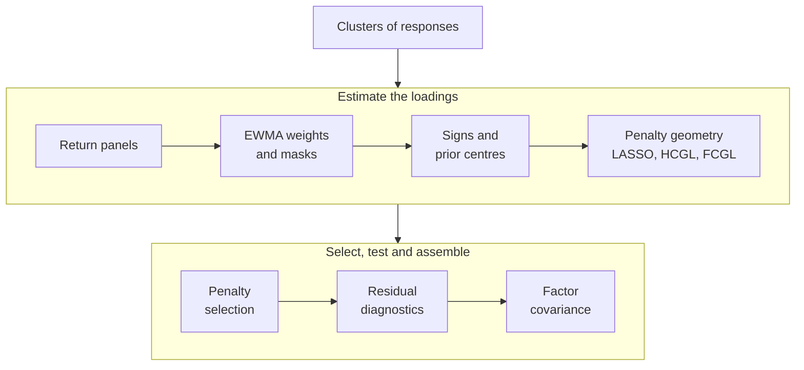

---
myst:
  html_meta:
    description: >-
      factorlasso documentation: sparse multi-output factor models in Python with cell-level
      sign constraints, prior-centred shrinkage, clustered group penalties, residual diagnostics
      and factor covariance assembly, with methods, runnable examples and reproducible exhibits.
---

# factorlasso

*Author: [Artur Sepp](https://github.com/ArturSepp) / First recorded: [2026-08-16](https://github.com/ArturSepp/factorlasso/commit/01d87fd8542897d6157b8b3ffb250d6240ae5e9a)*

[factorlasso](https://github.com/ArturSepp/factorlasso) is a Python library for sparse
multi-output regression and factor-model estimation. It fits the loadings of many responses on a
common set of factors in one problem, under cell-level sign constraints, shrinkage towards prior
loadings and group penalties built from supplied or discovered clusters of responses. It then
tests the residuals for strict factor structure and assembles the factor covariance that the
model implies. The estimator follows scikit-learn conventions. factorlasso is a leaf of the
ArturSepp open-source stack: portfolio construction in
[OptimalPortfolios](https://github.com/ArturSepp/OptimalPortfolios) consumes it, and it depends on
no sibling package.

Software citation: [CITATION.cff](https://github.com/ArturSepp/factorlasso/blob/main/CITATION.cff).

## Start here

1. [Install factorlasso and run a first fit](getting-started.md). The core installation command
   is `python -m pip install factorlasso`.
2. Follow the [quickstart](quickstart.md): penalty selection, estimation with derived signs,
   residual diagnostics and covariance assembly on one synthetic panel with known loadings.
3. Keep the [conventions and glossary](conventions.md) at hand: shapes, units, EWMA spans, the
   sign encoding and the precedence of signs and priors are defined there once for every page.
4. Browse the [analytics gallery](analytics_gallery.md) for every exhibit with its question,
   sample, script and producer, or the [examples and recipes](task-guides.md) for runnable scripts.

After installation, every example on this site runs offline on fixed synthetic data. Each
article shows its code inline; the same lines are part of a canonical script under
[`examples/docs/`](https://github.com/ArturSepp/factorlasso/tree/main/examples/docs) that the
test suite runs and that asserts every number the article quotes.

## The model in one picture

For $T$ dates, $M$ factors and $N$ responses, factorlasso estimates the $N \times M$ loading
matrix $\beta$ of

$$
Y_t = \alpha + \beta X_t + \varepsilon_t, \qquad \Sigma_y = \beta \Sigma_x \beta^{\top} + D,
$$

where $\Sigma_x$ is the factor covariance and $D$ the residual covariance. The estimation runs
through the steps below; each has an article.



In words: the return panels are weighted and masked; derived or supplied signs and prior centres
constrain the problem; the penalty geometry pools evidence across clusters of responses; the
penalty strength is selected on held-out data; the residuals are tested for leftover common
structure; and the covariance is assembled from the fitted loadings.

| Step of the diagram | Articles |
|---|---|
| Return panels | [Installation and first fit](getting-started.md), [quickstart](quickstart.md) |
| EWMA weights and masks | [EWMA weighting and ragged histories](ewma_weighting_and_ragged_histories.md) |
| Signs and prior centres | [Sign constraints and priors](sign_constraints_and_priors.md), [gated sign derivation](gated_cluster_pooled_signs.md), [prior targets](prior_targets.md), [adaptive weights](adaptive_penalty_weights.md) |
| Penalty geometry | [Sparse factor model](sparse_factor_model.md), [group penalties](group_penalties_hcgl_fcgl.md), [cooperative LASSO](cooperative_lasso.md), [UniLasso](unilasso.md) |
| Clusters of responses | [Cluster discovery](cluster_discovery.md), [common-mode removal](common_mode_removal.md), [rolling smoothing](rolling_cluster_smoothing.md), [stability statistics](cluster_stability_and_pooled_scoring.md), [lineage](cluster_lineage.md) |
| Penalty selection | [Regularisation path and penalty selection](penalty_selection.md) |
| Residual diagnostics | [Residual diagnostics](residual_diagnostics.md) |
| Factor covariance | [Factor covariance assembly](factor_covariance_assembly.md), [empirical residual correlation](empirical_residual_correlation.md), [residual-alpha nowcasting](residual_alpha_nowcasting.md) |

## Model and estimation

- [Sparse multi-output factor model](sparse_factor_model.md): the model, the weighted loss, the
  L1 penalty, the economic intercept and the solver contract.

- [EWMA weighting, ragged histories and loss normalisation](ewma_weighting_and_ragged_histories.md):
  spans, half-lives and effective sample size, per-response histories, and how the two loss
  normalisations shrink a short history.

## Signs and priors

- [Sign constraints and prior-centred penalties](sign_constraints_and_priors.md): the cell-level
  sign matrix, the prior-centred penalty and the two limits of the penalty strength.
- [Gated cluster-pooled sign derivation](gated_cluster_pooled_signs.md): signs estimated from
  pooled univariate slopes within response clusters, and the noise-floor gate that abstains on
  weak evidence.
- [Prior targets: automatic and mapped OLS centres](prior_targets.md): where the centres come
  from, why a marginal slope can point the wrong way, and how a centre's sign overrides a
  detected sign.

- [Adaptive penalty weights](adaptive_penalty_weights.md): cell penalties scaled by the
  strength of the univariate evidence, and their aggregation into group and block weights.

## Structured penalties

- [Group penalties: HCGL, sparse-group and FCGL](group_penalties_hcgl_fcgl.md): supplied and
  discovered groups, row-grouped and cluster-by-factor penalties and the sparse-group mix.

- [Cooperative LASSO](cooperative_lasso.md): a block penalty on the positive and negative
  parts of each cluster-by-factor block, which favours sign-coherent clusters without imposing
  signs.

- [UniLasso](unilasso.md): two-stage univariate-guided regression, in which each loading keeps
  the sign of its univariate slope or is zero.

## Selection and diagnostics

- [Residual diagnostics for strict factor structure](residual_diagnostics.md): the sphericity
  statistic, the Marchenko–Pastur edge, missing-factor components and effective sparsity.

- [Regularisation path and penalty selection](penalty_selection.md): expanding-window
  selection by held-out $R^2$ and by held-out residual diagonality, and the path solver.

## Clusters

- [Cluster discovery](cluster_discovery.md): the dependence measure, the distance transform, Ward
  linkage and the dendrogram cut, and which settings carry over between panels.

- [Dominant common-mode removal](common_mode_removal.md): removing the largest eigencomponent
  before discovery, when it restores sectors hidden by a market factor and when it removes one.

- [Causal smoothing of rolling clusters](rolling_cluster_smoothing.md): why re-estimated
  partitions churn, the hold, partition-bonus and similarity-EWMA smoothers, and their lag.

- [Cluster stability statistics and stability-pooled scoring](cluster_stability_and_pooled_scoring.md):
  causal co-association weights for rolling partitions, and within-cluster scores whose variance
  is pooled where membership is unstable.

- [Offline cluster lineage](cluster_lineage.md): persistent track identities for rolling risk
  clusters, lineage events and track labels, as a reporting overlay with look-ahead.

## Covariance and forecasts

- [Factor covariance assembly](factor_covariance_assembly.md): the two covariance containers,
  residual variance, model volatilities and the unit contract on their inputs.

- [Empirical residual correlation](empirical_residual_correlation.md): a residual correlation
  estimated on complete common periods, its availability date, and the residual block
  $D = S[(1 - \rho) I + \rho R]S$.

- [Residual-alpha nowcasting](residual_alpha_nowcasting.md): the factor component of realised
  factor returns plus the terminal EWMA mean of the residuals, its fail-closed rules and its
  noise.

## Applications

Case studies report the evidence of the research papers in context: the study design, the
configuration, the paper's exhibits, and what the study does and does not show.

- [Credit attribution in a multi-asset ETF factor model](app_multi_asset_credit_attribution.md):
  with Credit and Equity factors 0.84 correlated, shrink-to-zero penalties move bond funds' credit
  exposure into Equity, and prior-centred penalties keep it (JSS paper, Sections 5.5 and 6).

- [Sign pooling beyond finance: yeast eQTL](app_sign_pooling_genomics.md): 64 MAPK genes on 202
  markers give sign-coherent co-expression clusters and recover eQTL hotspots, with no prediction
  gain over per-gene LASSO (sign-pooling paper, Section 5).

- [From loadings to portfolio risk and capital market assumptions](app_portfolio_risk_models.md):
  one loading matrix drives the risk model and the expected returns of a multi-asset portfolio,
  with the MATF-CMA audit of the CMAs (ROSAA and MATF-CMA papers).

## Implementation and reference

- [Software design](software_design.md): the module layers, the data flow of a fit and of a
  rolling estimation, the scikit-learn boundary and the dependency surface.
- [scikit-learn interoperability](interoperability.md): what the estimator guarantees to
  scikit-learn tools, and what it deliberately does not.
- [Choosing a sparse-regression workflow](comparison.md): a dated, source-audited comparison with
  scikit-learn, skglm and groupyr.
- [Research papers and replication](scientific-replication.md): the papers behind the methods,
  their status and how to reproduce them.
- [API reference](api.rst): every public name, grouped by the article that explains it, and the
  `LassoModel` parameters by topic.
- [Documentation standard](documentation_standard.md): article structure, notation, citations,
  executable examples and exhibit provenance.

## Research papers

The methods are described in the following papers. The
[research papers page](scientific-replication.md) lists which article uses which paper and how to
reproduce each one.

- Sepp, A. and Kastenholz, M. A. (2026). *factorlasso: Sparse Multi-Output Regression with
  Cluster-Grouped Sign Constraints in Python*. Submitted to the Journal of Statistical Software.
- Sepp, A. and Kastenholz, M. (2026). *Gated Cluster-Pooled Sign Constraints for Multi-Output
  Sparse Regression*. Submitted to Computational Statistics & Data Analysis.
- Sepp, A. (2026). *Selecting Priors for Fixed-Income Factor Models: Validation and Capital
  Market Assumptions*. Working paper.
- Sepp, A., Ossa, I. and Kastenholz, M. (2026). *Robust Optimization of Strategic and Tactical
  Asset Allocation for Multi-Asset Portfolios*.
  [The Journal of Portfolio Management, 52(4), 86–120](https://www.pm-research.com/content/iijpormgmt/52/4/86).
- Sepp, A., Hansen, E. and Kastenholz, M. (2026). *Capital Market Assumptions and Strategic
  Asset Allocation Using Multi-Asset Tradable Factors*. Working paper.
  [SSRN 6785958](https://papers.ssrn.com/sol3/papers.cfm?abstract_id=6785958).

Four further working papers use factorlasso; they are listed with their status on the
[research papers page](scientific-replication.md).

## Project resources

- [PyPI package](https://pypi.org/project/factorlasso/) and
  [source repository](https://github.com/ArturSepp/factorlasso).
- [Issue tracker](https://github.com/ArturSepp/factorlasso/issues) and
  [contributor guide](https://github.com/ArturSepp/factorlasso/blob/main/CONTRIBUTING.md).
- [Compatibility policy](https://github.com/ArturSepp/factorlasso/blob/main/COMPATIBILITY.md) and
  [changelog](https://github.com/ArturSepp/factorlasso/blob/main/CHANGELOG.md).
- [License](https://github.com/ArturSepp/factorlasso/blob/main/LICENSE): GPL-3.0-or-later.

<!-- The sidebar mirrors the grouped links above. Keep each document in one toctree. -->

```{toctree}
:hidden:
:maxdepth: 1
:caption: Start here

Installation and first fit <getting-started>
quickstart
conventions
analytics_gallery
Examples and recipes <task-guides>
```

```{toctree}
:hidden:
:maxdepth: 1
:caption: Model and estimation

sparse_factor_model
ewma_weighting_and_ragged_histories
```

```{toctree}
:hidden:
:maxdepth: 1
:caption: Signs and priors

sign_constraints_and_priors
gated_cluster_pooled_signs
prior_targets
adaptive_penalty_weights
```

```{toctree}
:hidden:
:maxdepth: 1
:caption: Structured penalties

group_penalties_hcgl_fcgl
cooperative_lasso
unilasso
```

```{toctree}
:hidden:
:maxdepth: 1
:caption: Selection and diagnostics

residual_diagnostics
penalty_selection
```

```{toctree}
:hidden:
:maxdepth: 1
:caption: Clusters

cluster_discovery
common_mode_removal
rolling_cluster_smoothing
cluster_stability_and_pooled_scoring
cluster_lineage
```

```{toctree}
:hidden:
:maxdepth: 1
:caption: Covariance and forecasts

factor_covariance_assembly
empirical_residual_correlation
residual_alpha_nowcasting
```

```{toctree}
:hidden:
:maxdepth: 1
:caption: Applications

app_multi_asset_credit_attribution
app_sign_pooling_genomics
app_portfolio_risk_models
```

```{toctree}
:hidden:
:maxdepth: 1
:caption: Implementation and reference

software_design
interoperability
comparison
Research papers and replication <scientific-replication>
api
documentation_standard
```
