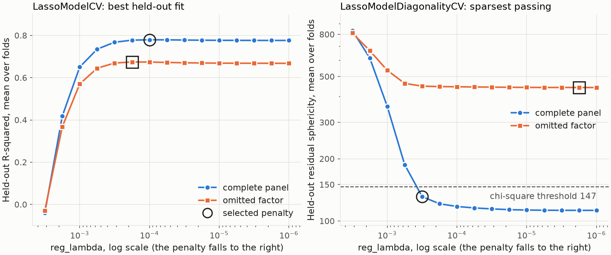

---
myst:
  html_meta:
    description: >-
      Regularisation path and penalty selection in factorlasso: expanding-window selection of
      reg_lambda by held-out R-squared and by held-out residual diagonality, why the two disagree,
      what an omitted factor does to each, and the path solver that sweeps a grid.
---

# Regularisation path and penalty selection

*Author: [Artur Sepp](https://github.com/ArturSepp)*

Implemented in [factorlasso](https://github.com/ArturSepp/factorlasso).
Software citation: [CITATION.cff](https://github.com/ArturSepp/factorlasso/blob/main/CITATION.cff).

Every estimator in factorlasso has a penalty strength, `reg_lambda`, and the package offers two
ways to choose it on a grid. `LassoModelCV` takes the penalty with the best held-out $R^2$.
`LassoModelDiagonalityCV` takes the sparsest penalty whose held-out residuals are consistent with a
diagonal residual covariance. The two answer different questions and can disagree; this article
shows where, and what each reports when the factor set is incomplete.

## Overview

Both selectors fit a template `LassoModel` on expanding windows, one fit per penalty and fold,
and score the next window with loadings fitted before it. They differ in the score. Held-out
$R^2$ asks how well the loadings predict. Residual diagonality asks whether the factors and the
residuals have been separated, which is what a factor covariance
$\Sigma = \beta \Sigma_F \beta^{\top} + D$ with diagonal $D$ asserts, and what any use that inverts
$D$ relies on. A model can predict well and still leave a common component in its residuals.

For the group-LASSO family, `solve_group_lasso_path` solves the whole grid from one compiled
programme, and both selectors can use it. The software paper describes the path solve (Sepp and
Kastenholz, 2026b, Section 3.5).

## Inputs, notation, and assumptions

| Symbol or input | Meaning | Units and convention |
|---|---|---|
| $\lambda_1 > \dots > \lambda_L$ | The penalty grid, `lambdas` | Default: 20 values from $10^{-6}$ to $10^{-1}$ |
| $K$ | Number of expanding-window folds, `n_splits` | Default 5 |
| $R^2_{\ell k}$ | Held-out $R^2$ at penalty $\ell$ in fold $k$, mean over responses | `LassoModel.score` |
| $S_{\ell k}$ | Held-out sphericity statistic at penalty $\ell$ in fold $k$ | See [residual diagnostics](residual_diagnostics.md) |
| $c_a$ | Chi-square critical value of the diagonality test at size $a$ | `significance`, default 0.05 |

The grid is on the scale of `reg_lambda`, which depends on the units of the data and on the loss
normalisation; the [conventions page](conventions.md) and the
[EWMA weighting](ewma_weighting_and_ragged_histories.md) article give the conversions.

## Methodology

### Expanding-window folds

With $T$ observations and $K$ folds, the window length is $h = \lfloor T / (K + 1) \rfloor$. Fold
$k$ trains on the first $k h$ observations and tests on the next $h$, so every score is out of
sample and no fold sees the future. Random $K$-fold splits would leak later observations into
training and are not offered.

### Selection by held-out $R^2$

`LassoModelCV` averages $R^2_{\ell k}$ over the folds and takes the maximiser,
$\hat\lambda_{R^2} = \arg\max_\ell \bar R^2_\ell$. The criterion rewards prediction, which
tolerates small false loadings: each costs little variance and may pick up a little signal.

### Selection by held-out residual diagonality

`LassoModelDiagonalityCV` forms the residuals of each held-out window at the fold's loadings and
computes the sphericity statistic $S = \nu \sum_{i<j} r_{ij}^2$ of their correlations, with
$\nu = n - k - 1$ charged for the loadings the fit kept. A penalty passes when the fold mean of
$S$ is at most $c_a$ and the mean largest residual eigenvalue is at most the Marchenko-Pastur
edge. The statistic falls as the model gets denser and then flattens, so its minimum is not
identified; the selector takes the sparsest passing penalty,

$$
\hat\lambda_{D} = \max \lbrace \lambda_\ell : \bar S_\ell \le c_a \text{ and the edge check passes} \rbrace .
$$

This is the rule of taking the most parsimonious model a specification test does not reject, in
the shape Gagliardini, Ossola and Scaillet (2019) use to count omitted factors. When no penalty
passes, `passed_` is `False`, the selector falls back to the minimiser of $\bar S_\ell$, and
`missing_factors_` lists the residual components above the edge with the series that load on
them. No penalty can repair a factor the model does not carry.

### One programme for the whole grid

`solve_group_lasso_path` declares `reg_lambda` as a CVXPY parameter, so the disciplined
parametrised programme is canonicalised once and re-solved at each grid value (Agrawal et al.,
2019). The signs, prior and adaptive weights must not depend on `reg_lambda`, which holds in
this package because they come from univariate slopes. `LassoModel.fit_reg_lambda_path` wraps
it with the derivation of clusters, signs and weights done once, and both selectors use it with
`use_lambda_path=True` for `GROUP_LASSO`, `HIERARCHICAL_CLUSTER_GROUP_LASSO` and
`FACTOR_CLUSTER_GROUP_LASSO`. The other modes fit once per grid point.

## Worked example

The canonical script [`examples/docs/penalty_selection.py`](../examples/docs/penalty_selection.py)
simulates 240 months of four uncorrelated factors with 4% monthly volatility and 16 responses
with 2% residual volatility. Each response loads 1.0 on one factor and every second response
also 0.3 on another, 24 non-zero loadings in all. A second panel adds a fifth factor, not given
to the model, on which six responses load 0.8. Both selectors run on the same 15-point grid
from $10^{-6}$ to $10^{-2.5}$ with four folds:

```python
def select_both(x: pd.DataFrame, y: pd.DataFrame) -> tuple:
    """Select reg_lambda on one grid by held-out R-squared and by held-out residual diagonality."""
    base = fl.LassoModel(model_type=fl.LassoModelType.LASSO)
    by_r2 = fl.LassoModelCV(
        lambdas=LAMBDAS, n_splits=N_SPLITS, base_model=base,
    ).fit(x=x, y=y)
    by_diagonality = fl.LassoModelDiagonalityCV(
        lambdas=LAMBDAS, n_splits=N_SPLITS, base_model=base,
    ).fit(x=x, y=y)
    return by_r2, by_diagonality
```

| Panel | Selector | `reg_lambda` | Held-out $R^2$ | Loadings kept | Diagonality |
|---|---|---|---|---|---|
| Complete | `LassoModelCV` | $1.0 \times 10^{-4}$ | 0.780 | 45 | passes |
| Complete | `LassoModelDiagonalityCV` | $3.2 \times 10^{-4}$ | 0.768 | 26 | passes |
| Omitted factor | `LassoModelCV` | $1.8 \times 10^{-4}$ | 0.675 | 44 | fails |
| Omitted factor | `LassoModelDiagonalityCV` | no penalty passes | | | fails |

Loadings kept are fold averages, counted by `effective_sparsity`. On the complete panel the
held-out $R^2$ is nearly flat below its maximum, and its choice keeps 45 loadings against 24 true
ones. The diagonality selector moves to the sparsest penalty that still passes, with 26 loadings,
for 0.012 of held-out $R^2$. One grid step further, the fits keep 23.5 loadings on average, fewer
than the true 24, and the statistic crosses its threshold of 146.6.

With the omitted factor, held-out $R^2$ falls by about 0.1 but its choice barely moves: nothing in
the score says what is missing. No penalty passes the diagonality test; the statistic never falls
below 440. `missing_factors_` reports one residual component, with eigenvalue 4.6, loading about
0.40 on each of the six responses that carry the hidden factor. The script also checks that
`solve_group_lasso_path` reproduces one solve per penalty to $10^{-6}$, and that `LassoModelCV`
with and without `use_lambda_path` selects the same penalty on supplied groups.



*Synthetic teaching exhibit. Left: held-out $R^2$, mean over four folds and 16 responses; the
outlined markers are the penalties `LassoModelCV` selects. Right: held-out sphericity, mean over
the folds, against its chi-square threshold; the outlined markers are the penalties
`LassoModelDiagonalityCV` selects, the sparsest passing one on the complete panel and the
fallback minimiser on the other. Produced by `tools/docs_analytics/estimation.py` from the example
script.*

## Implementation in factorlasso

Verified with factorlasso 0.20.0 and CVXPY with the CLARABEL solver.

| Name | Role |
|---|---|
| `LassoModelCV` | Expanding-window selection by held-out $R^2$; `best_lambda_`, `best_score_`, `cv_scores_` (penalty by fold) and, with `refit=True`, `best_model_` fitted on the full sample. `use_lambda_path` defaults to `False`. |
| `LassoModelDiagonalityCV` | Expanding-window selection by held-out residual diagonality; `best_lambda_`, `passed_`, `threshold_`, `diagnostics_` (one row per penalty), `fold_scores_`, `missing_factors_` and `best_model_`. `use_lambda_path` defaults to `True`; `significance`, `zero_rtol` and `min_periods` set the test. |
| `solve_group_lasso_path` | The group-LASSO family over a grid from one canonical form, for NumPy inputs; one `LassoEstimationResult` per penalty, in grid order. |
| `LassoModel.fit_reg_lambda_path` | One fitted `LassoModel` per penalty, sharing the penalty-independent derivation. |

Both selectors inherit every setting of `base_model` except `reg_lambda`, including the model type,
the sign derivation, the span and `loss_normalization`. A fold whose solver fails is recorded as
`NaN` and skipped; the fit raises `RuntimeError` only when every fold fails. `LassoModelCV.score`
returns $R^2$, higher is better; `LassoModelDiagonalityCV.score` returns the sphericity statistic,
lower is better, so the two are not comparable. To run the example from a checkout:

```console
python examples/docs/penalty_selection.py
```

## Interpretation and limitations

- **Neither criterion finds the true support.** Held-out $R^2$ keeps false loadings because they
  are cheap; diagonality stops at the first penalty that still separates factors from residuals,
  which may keep a few. For the support itself, see the
  [sparse factor model](sparse_factor_model.md) article.
- **A dense truth leaves a selector little to reward.** In the software paper's calibrated
  multi-asset benchmark, with dense loadings, BIC chose its least-regularised grid point, where
  the unconstrained fits revert to least squares; only the configurations with signs, adaptive
  weights or a prior reached a regularised operating point (Sepp and Kastenholz, 2026b,
  Section 5.5).
- **A failed diagonality test is a statement about the factor set.** The remedy is a further
  factor, not a different penalty; `missing_factors_` points to the responses involved.
- **The grid matters.** At a penalty that empties the model, the relative tolerance of
  `effective_sparsity` counts solver noise as kept loadings, and the degrees of freedom of that
  fit are wrong. End the grid before the model is empty, as the example does.
- **Time dependence.** Expanding windows respect the order of the data but not serial
  correlation within a window; the chi-square threshold assumes independent observations.
- **Cost.** Each selector solves once per penalty and fold; the path solve saves the compilation,
  not the solver time, and helps only the group-LASSO family. The software paper measured it at
  about 1.5 times faster over a fifteen-point grid for 100 responses and 9 factors (Sepp and
  Kastenholz, 2026b, Section 3.5).

## See also

- [Residual diagnostics](residual_diagnostics.md): the sphericity statistic, the Marchenko-Pastur
  edge and the missing-factor components, in sample.
- [Sparse factor model](sparse_factor_model.md): the penalty path of the loadings.
- [Quickstart](quickstart.md): `LassoModelCV` with `use_lambda_path=True` in a complete workflow.
- [Group penalties](group_penalties_hcgl_fcgl.md): the models the path solver covers.

## References

- Agrawal, A., Amos, B., Barratt, S., Boyd, S., Diamond, S., and Kolter, J. Z. (2019).
  Differentiable convex optimization layers. *Advances in Neural Information Processing Systems*
  32. arXiv:1910.12430.
- Gagliardini, P., Ossola, E., and Scaillet, O. (2019). A diagnostic criterion for approximate
  factor structure. *Journal of Econometrics* 212(2), 503-521.
  DOI 10.1016/j.jeconom.2019.06.001.
- Sepp, A., and Kastenholz, M. A. (2026b). factorlasso: Sparse Multi-Output Regression with
  Cluster-Grouped Sign Constraints in Python. Submitted to the *Journal of Statistical
  Software*. [Manuscript](../papers/jss_2026/paper/article.pdf).
- [factorlasso software citation](https://github.com/ArturSepp/factorlasso/blob/main/CITATION.cff).
