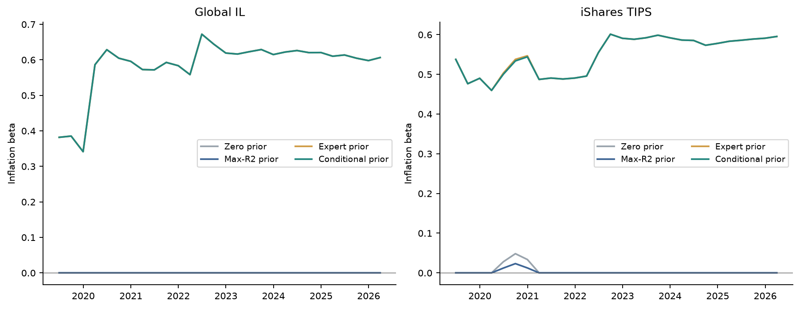

---
myst:
  html_meta:
    description: >-
      Prior targets in factorlasso: automatic highest-R-squared and mapped single- or joint-factor
      OLS centres for prior-centred penalties, how a centre's sign overrides a detected sign, the
      omitted-variable identity behind wrong-signed marginal slopes, and a worked example.
---

# Prior targets: automatic and mapped OLS centres

*Author: [Artur Sepp](https://github.com/ArturSepp)*

Implemented in [factorlasso](https://github.com/ArturSepp/factorlasso).
Software citation: [CITATION.cff](https://github.com/ArturSepp/factorlasso/blob/main/CITATION.cff).

A prior target, or prior centre, is the loading value that a prior-centred penalty shrinks
towards instead of zero. factorlasso can estimate the centres from the fitting window itself: for
each response it either takes the univariate OLS slope of the factor with the highest weighted
$R^2$, or the univariate or joint OLS slopes of factors named for that response. The choice
matters twice, because a finite non-zero centre also decides the sign of a loading where the
automatically detected sign disagrees with it.

## Overview

The [sign constraints and prior-centred penalties](sign_constraints_and_priors.md) article
describes what a centre does: the penalty applies to $\beta - \beta_0$, so a strong penalty returns
$\beta_0$ rather than an empty model. It leaves open where $\beta_0$ comes from. Three sources are
available:

- **Supplied centres.** `factors_beta_prior` holds centres chosen by the user, for example from
  economic reasoning or an earlier estimation.
- **Automatic centres.** With `apply_ols_prior=True`, each response receives the univariate OLS
  slope of the factor with the highest weighted $R^2$ as its centre, and zero on the other
  factors. No mapping is needed.
- **Mapped centres.** `factor_for_prior` names, per response, one factor whose univariate slope
  becomes the centre, or an ordered set of factors whose slopes are estimated jointly in one
  weighted OLS regression.

Automatic centres are a sensible default when nothing is known about a response. They can
mislead when factors are strongly correlated: the factor with the highest marginal $R^2$ may be a
proxy, and a marginal slope can have the opposite sign to the loading it stands for. A joint
centre on a reviewed set of factors avoids that for the factors in the set. The
fixed-income prior working paper (Sepp, 2026) studies these choices for thirty bond indices and twelve
funds; the worked example below reproduces its central mechanism on synthetic data.

## Inputs, notation, and assumptions

| Symbol or input | Meaning | Units and convention |
|---|---|---|
| $x_{tj}$, $y_{ti}$ | Factor $j$ and response $i$ at date $t$ | Decimal returns per period |
| $w_t$ | Observation weight | EWMA with the effective loss span; equal weights when `span=None` |
| $b_{ij}$ | Weighted univariate OLS slope of response $i$ on factor $j$, with intercept | Dimensionless |
| $R^2_{ij}$ | Weighted $R^2$ of that regression | Between 0 and 1 |
| $J(i)$ | Ordered set of factors named for response $i$ in `factor_for_prior` | Factor column labels |
| $\beta_0$ | Resolved centres, $N \times M$, after explicit overrides | Same units as $\beta$ |

The centres are computed on the same window as the fit, with the effective squared-loss span of
that fit, so they carry no look-ahead in rolling or cross-validated use: `LassoModelCV`
recomputes them on each training fold. A regression needs at least $\max(3, w)$ observations,
where $w$ is `warmup_period`; a joint regression uses the rows on which the response and every
named factor are finite. The other conventions are those of the [conventions page](conventions.md).

## Methodology

### Univariate slopes and the automatic centre

With weighted means $\bar x_j$ and $\bar y_i$, the univariate slope and its $R^2$ are

$$
b_{ij} = \frac{\sum_t w_t (x_{tj} - \bar x_j)(y_{ti} - \bar y_i)}{\sum_t w_t (x_{tj} - \bar x_j)^2},
\qquad
R^2_{ij} = 1 - \frac{\sum_t w_t (y_{ti} - a_{ij} - b_{ij} x_{tj})^2}{\sum_t w_t (y_{ti} - \bar y_i)^2},
$$

where $a_{ij}$ is the fitted intercept. The automatic centre, `prior_selection_type="highest_r2"`,
keeps one slope per response:

$$
\beta_{0,ij} = b_{ij} \quad \text{if } j = \arg\max_k R^2_{ik}, \qquad \beta_{0,ij} = 0 \quad \text{otherwise}.
$$

Ties go to the factor that comes first in the input columns.

### Mapped and joint centres

A single named factor replaces the $\arg\max$ with that factor. An ordered set $J(i)$ of named
factors gives the centres of all of them at once, from the weighted regression

$$
(\hat a_i, \hat c_i) = \arg\min_{a, c} \sum_t w_t \left(y_{ti} - a - \sum_{j \in J(i)} c_j x_{tj}\right)^2,
$$

with $\beta_{0,ij} = \hat c_{ij}$ for $j$ in $J(i)$ and zero elsewhere. An unidentified regression
gives a zero row; no other factor is selected in its place. Responses that the mapping omits keep
the automatic centre. Finite entries of `factors_beta_prior` then override the computed centres,
including with zero, and missing entries defer to them.

### Why a marginal slope can point the wrong way

For a centred linear response $y = \sum_k \beta_k x_k + \varepsilon$ with an exogenous error, the
population slope of the univariate regression on factor $j$ is

$$
b_j^{\mathrm{marg}} = \beta_j + \sum_{k \ne j} \beta_k \frac{\mathrm{Cov}(x_j, x_k)}{\mathrm{Var}(x_j)}.
$$

A marginal slope therefore absorbs the loadings of every correlated factor. With two factors of
equal volatility and correlation $\rho$, the two slopes are $\beta_1 + \rho \beta_2$ and
$\beta_2 + \rho \beta_1$. For an inflation-linked bond with a Rates loading of 0.9, an Inflation
loading of 0.45 and $\rho = -0.8$, the marginal slopes are 0.54 and $-0.27$: the Inflation
exposure has the wrong sign, and Rates, the factor with the higher $R^2$, wins the automatic
selection. The joint regression on both factors removes each factor's contribution to the other's
slope. It does not remove the contribution of a factor left out of $J(i)$.

### Centres and signs

When automatic signs are enabled (`auto_sign_constraints=True`), a finite non-zero centre whose
sign conflicts with the detected sign replaces it, including a detected zero. An explicit entry of
`factors_beta_loading_signs` still wins over both, and with `apply_ols_prior=True` a centre that
conflicts with it is set to zero rather than moved to another factor. The complete order is set
out in the [precedence rules](conventions.md#precedence-of-signs-and-priors). A centre thus
changes the fit in two ways: through the penalty, which pulls towards it, and through the sign
set, which decides which loadings are allowed at all. The JSS manuscript (Sepp and Kastenholz,
2026, Section 2.5) describes an earlier rule under which a derived sign blocked an opposing prior;
since release 0.20.0 the prior's sign overrides a derived sign, and only explicit signs block it.

## Worked example

The example has one inflation-linked response on a Rates and an Inflation factor. The factors
have a monthly volatility of 0.02 and a correlation of $-0.8$, the true loadings are 0.9 and 0.45,
and the residual is scaled so that the population $R^2$ is 0.8. There are 360 monthly
observations with equal weights. The code is taken from
[`examples/docs/prior_targets.py`](../examples/docs/prior_targets.py), which checks every number
below against `numpy.linalg.lstsq` and `scipy.optimize.lsq_linear`.

```python
SEED = 20260926
N_OBS = 360
RHO = -0.8
FACTOR_VOL = 0.02
TRUE_BETA = np.array([0.9, 0.45])
TARGET_R2 = 0.8
FACTORS = ["rates", "inflation"]
REG_LAMBDAS = np.logspace(-8, -2, 13)
POLICIES = {
    "zero centre": {},
    "automatic centre": {"apply_ols_prior": True},
    "joint centre": {
        "apply_ols_prior": True,
        "factor_for_prior": {"linker": ("rates", "inflation")},
    },
}
```

Each policy is fitted as a LASSO with automatically derived signs:

```python
def fit(x: pd.DataFrame, y: pd.DataFrame, reg_lambda: float, **policy) -> fl.LassoModel:
    """LASSO with automatically derived signs and the given prior-centre policy."""
    model = fl.LassoModel(
        model_type=fl.LassoModelType.LASSO,
        reg_lambda=reg_lambda,
        auto_sign_constraints=True,
        **policy,
    )
    return model.fit(x=x, y=y)
```

The fitted diagnostics show the marginal slopes, their $R^2$ and the resolved centres:

```python
automatic = fit(x, y, 1e-4, **POLICIES["automatic centre"])
joint = fit(x, y, 1e-4, **POLICIES["joint centre"])
print(automatic.ols_betas_.round(3))
print(automatic.ols_r2_.round(3))
print(automatic.effective_beta_prior_.round(3))
print(joint.effective_beta_prior_.round(3))
```

```text
        rates  inflation
linker  0.544     -0.261
        rates  inflation
linker  0.634      0.152
        rates  inflation
linker  0.544        0.0
        rates  inflation
linker  0.929      0.468
```

The sample marginal slopes, 0.544 and $-0.261$, are close to the population values 0.54 and
$-0.27$ of the identity above. Rates has the higher $R^2$, so the automatic centre is 0.544 on
Rates and zero on Inflation. The joint centre, 0.929 and 0.468, is the two-factor OLS fit.

The detected signs follow the marginal slopes, so Inflation is constrained to be non-positive.
The joint centre's positive Inflation value overrides that sign:

```python
zero = fit(x, y, 1e-4, **POLICIES["zero centre"])
print(zero.derived_signs_)
print(joint.derived_signs_)
```

```text
        rates  inflation
linker    1.0       -1.0
        rates  inflation
linker    1.0        1.0
```

The automatic centre leaves the detected signs unchanged, because its Inflation centre is zero and
a zero centre carries no direction.


*Synthetic teaching exhibit. Fitted loadings of the inflation-linked response for 13 penalties
from $10^{-8}$ to $10^{-2}$ under the three policies; dashed lines mark the true loadings.
Produced by `tools/docs_analytics/estimation.py` from the example script.*

The exhibit separates the two channels through which a centre acts:

- **Sign set.** Under the zero and the automatic centre, Inflation is held at zero at every
  penalty. At the smallest penalty both fits equal the sign-constrained least-squares fit, which
  drops Inflation and therefore returns the marginal Rates slope of 0.544. Under the joint centre
  the sign set allows a positive Inflation loading, and the fit is 0.929 and 0.468.
- **Penalty.** As the penalty grows, the zero-centred fit shrinks Rates to zero, the automatic fit
  stays at its centre 0.544, and the joint fit stays at 0.929 and 0.468. On the fitting sample
  the joint centre equals the unpenalised fit, so the penalty has nothing to pull against.

A last check in the script adds an explicit non-positive sign on Inflation to the joint policy.
The explicit sign wins, the Inflation centre becomes zero and the Rates centre stays 0.929.

The same mechanism appears in the fixed-income study. Figure 4 of that paper, reproduced below,
tracks the quarterly Inflation loading of an inflation-linked index and a TIPS fund. The automatic
(Max-R2) and zero policies leave it at or near zero; the policies with a Rates/Inflation centre
recover a positive loading.



*Paper exhibit. Sepp (2026), Figure 4: quarterly refits with FCGL, EWMA span 60 and a fixed
monthly penalty on licensed index and fund histories. The expert and conditional policies use the
same Rates/Inflation centre for inflation-linked assets. The figure cannot be regenerated without
the licensed data.*

## Implementation in factorlasso

Verified with factorlasso 0.20.0 and CVXPY with the CLARABEL solver.

| Parameter or attribute | Role |
|---|---|
| `apply_ols_prior` | Compute OLS centres on the fitting window. Default `False`, which keeps supplied centres only. |
| `prior_selection_type` | Selector of the automatic centre. `"highest_r2"` is the only value; others raise. |
| `factor_for_prior` | Mapping or Series from response to one factor label or an ordered list or tuple of labels. Requires `apply_ols_prior=True`; unknown factors raise; omitted responses keep the automatic centre. |
| `map_expert_factor_priors`, `ExpertPriorResolution` | Optional metadata-to-label helper and its selection/audit result; the estimator still computes the OLS slopes on its fitting window. |
| `factors_beta_prior` | Explicit centres. With `apply_ols_prior=True`, finite entries override the computed centres and NaN defers to them. |
| `ols_betas_`, `ols_r2_` | Univariate slopes and their $R^2$, response by factor. |
| `ols_beta_prior_` | Selected OLS centres before explicit overrides and sign conflicts. |
| `effective_beta_prior_` | Centres the solver used, after overrides and the zeroing of centres that conflict with hard signs. |
| `ols_prior_span_` | The span used for the OLS weights. |
| `derived_signs_` | The final sign matrix, after a centre's sign has replaced a conflicting detected sign. |

The OLS weights use the effective squared-loss span of the fit, including a span passed to
`fit`, and are independent of `cluster_correlation_span`. The regularisation path of the group
estimators reuses one calculation of the centres across penalties. `UNILASSO` rejects
`apply_ols_prior=True` and an explicit `factors_beta_prior`. The feature is off by default, so
fits that do not request it are unchanged.

`map_expert_factor_priors` accepts a ticker-indexed Series of instrument names and a collection
of available factor names (a dictionary contributes its keys). Broad equity and unambiguous
fixed-income descriptions can select a factor; mixed names retain automatic selection. A caller
may supply reviewed ticker overrides and its own policy version for the audit. The helper has no
knowledge of a portfolio universe, regional CMA add-ons or a vendor data provider. Its
`selection` can be passed directly to `LassoModel(factor_for_prior=..., apply_ols_prior=True)`;
it does not supply numerical beta targets. These metadata rules are an implementation choice,
not a statistical inference from the return panel.

To run the example from a checkout:

```console
python examples/docs/prior_targets.py
```

## Interpretation and limitations

- **A centre is a hypothesis, not an observation.** The centres are estimated from the same
  returns as the fit. The guarantees of transfer-learning estimators that shrink towards an
  externally estimated coefficient (Bastani, 2021; Takada and Fujisawa, 2020; Craig et al., 2026)
  and of beta priors built from firm fundamentals (Cosemans et al., 2016) are not imported: those
  methods use information from outside the fitting sample, while an OLS centre does not.
- **The penalty can be idle.** When a joint centre covers every factor of a single response, it
  equals the unpenalised fit, as in the example. The centre then acts only through the sign set.
  It acts through the penalty when factors outside $J(i)$ remain, and in HCGL and FCGL, where
  responses share a penalty.
- **Joint centres remove only named factors.** A factor missing from $J(i)$ still contributes to
  the slopes of the factors it is correlated with, by the identity above.
- **Prediction does not validate attribution.** For two standardised factors with correlation
  $\rho$, an attribution error of $a$ on one factor and $-a$ on the other leaves a prediction error
  with variance $2a^2(1-\rho)$, which vanishes as $\rho$ approaches one, while the error in expected
  return is $a(\pi_1 - \pi_2)$ for factor premia $\pi_1$ and $\pi_2$. In the paper's known-truth
  experiments, a deliberately wrong credit mapping raised the loading error of the affected index
  and yet lowered its expected-return error at the paper's premium calibration (Sepp, 2026,
  Sections 6 and 8). A small prediction or expected-return error therefore does not confirm a
  mapping.
- **Shared penalties spread a change.** Under FCGL a cluster's deviations from its centres are
  penalised jointly for each factor. In the paper's full monthly estimation block, changing only
  the inflation-linked centres lowered the fitted $R^2$ of a global investment-grade aggregate from
  87.86% to 82.58%, although that index's own settings were unchanged (Sepp, 2026, Table 4).
  Refit the whole estimation block when a mapping changes.
- **The sign set carries much of the effect.** On the paper's thirty-index panel, the mean fitted
  $R^2$ was 68.63% with a zero centre and detected signs, 70.32% with the conditional centre and
  detected signs, and 73.62% when the conditional centre also supplied the signs (Sepp, 2026,
  Table 3). These are in-sample figures from one fixed-penalty specification; the working paper
  is a draft whose Monte Carlo tables are marked for a rerun.

## See also

- [Sign constraints and prior-centred penalties](sign_constraints_and_priors.md): the penalty
  that the centres feed.
- [Conventions: precedence of signs and priors](conventions.md#precedence-of-signs-and-priors).
- [Group penalties: HCGL, sparse-group and FCGL](group_penalties_hcgl_fcgl.md): the shared
  penalties through which a centre affects neighbouring responses.
- [Credit attribution in a multi-asset ETF factor model](app_multi_asset_credit_attribution.md):
  supplied credit centres in the JSS study.
- [Research papers and replication](scientific-replication.md).

## References

- Bastani, H. (2021). Predicting with proxies: transfer learning in high dimension. *Management
  Science* 67(5), 2964-2984. DOI 10.1287/mnsc.2020.3729.
- Black, F., and Litterman, R. (1992). Global portfolio optimization. *Financial Analysts Journal*
  48(5), 28-43.
- Cosemans, M., Frehen, R., Schotman, P. C., and Bauer, R. (2016). Estimating security betas using
  prior information based on firm fundamentals. *Review of Financial Studies* 29(4), 1072-1112.
  DOI 10.1093/rfs/hhv131.
- Craig, E., et al. (2026). Pretraining and the lasso. *Journal of the Royal Statistical Society:
  Series B* 88(1), 261-281. DOI 10.1093/jrsssb/qkaf050.
- Sepp, A. (2026). Selecting Priors for Fixed-Income Factor Models: Validation and Capital Market
  Assumptions. Working paper, revised 26 September 2026.
  [Manuscript](../papers/prior_targets_2026/paper/article.pdf).
- Sepp, A., and Kastenholz, M. A. (2026). factorlasso: Sparse Multi-Output Regression with
  Cluster-Grouped Sign Constraints in Python. Submitted to the *Journal of Statistical
  Software*. [Manuscript](../papers/jss_2026/paper/article.pdf).
- Takada, M., and Fujisawa, H. (2020). Transfer learning via l1 regularization. *Advances in Neural
  Information Processing Systems* 33.
- Tibshirani, R. (1996). Regression shrinkage and selection via the lasso. *Journal of the Royal
  Statistical Society: Series B* 58(1), 267-288. DOI 10.1111/j.2517-6161.1996.tb02080.x.
- [factorlasso software citation](https://github.com/ArturSepp/factorlasso/blob/main/CITATION.cff).
