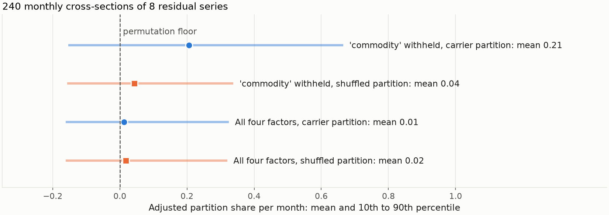

---
myst:
  html_meta:
    description: >-
      Residual diagnostics in factorlasso: a sphericity test and the Marchenko-Pastur edge check
      whether a fitted factor model leaves a diagonal residual covariance, name the missing
      factor when it does not, and count the loadings a fit actually kept.
---

# Residual diagnostics for strict factor structure

*Author: [Artur Sepp](https://github.com/ArturSepp) / First recorded: [2026-09-20](https://github.com/ArturSepp/factorlasso/commit/3a91426d6f1c93c1da08a02e70d592d14758078f)*

Implemented in [factorlasso](https://github.com/ArturSepp/factorlasso).
Software citation: [CITATION.cff](https://github.com/ArturSepp/factorlasso/blob/main/CITATION.cff).

A factor model has a *strict factor structure* when the returns left after removing the factors
are mutually uncorrelated, so that the residual covariance matrix is diagonal. Residual
diagnostics test that property on a residual panel: a sphericity statistic measures the total
off-diagonal correlation, the largest eigenvalue of the residual correlation matrix is compared
with the Marchenko-Pastur edge, and eigenvalues above the edge identify the series that an
omitted factor would load on.

## Overview

The covariance decomposition used throughout the package,

$$
\Sigma_y = \beta \Sigma_x \beta^{\top} + D,
$$

assumes that $D$ is diagonal. Estimation does not enforce that assumption. A penalty set too
high, or a factor set that lacks a common driver, leaves shared variation in the residuals while
the fit can still score well on out-of-sample $R^2$. Every downstream calculation that treats
$D$ as diagonal, or inverts it, then works with a misspecified matrix: generalised least squares
in the cross-section, risk budgeting, and any split of variance into systematic and idiosyncratic
parts.

The diagnostics answer three questions.

1. Is the residual covariance statistically indistinguishable from a diagonal matrix?
2. If it is not, how many common components remain, and which series carry them?
3. How many loadings did the fit keep, given that an interior-point solver returns small
   non-zero numbers in place of exact zeros?

The statistics take a residual panel, not a fitted estimator. They apply to residuals from any
loading estimate: a LASSO fit, a time-series regression, or loadings built from observed
characteristics. None of them originates in this package. The
[limitations](#interpretation-and-limitations) section states what each adaptation does not
inherit from its source.

## Inputs, notation, and assumptions

| Symbol or input | Meaning | Units and convention |
|---|---|---|
| `resid` | Residual panel $\hat\varepsilon = Y - \hat\alpha - X\hat\beta^{\top}$ | $n \times p$; rows are observations, columns are series; same units as the returns; missing values allowed |
| $n$ | Observations | The smallest non-missing count over the $p$ series |
| $p$ | Residual series | At least two |
| $k$ | Loadings fitted per series, `n_fitted_per_asset` | A mean count, not necessarily an integer; zero by default |
| $\nu$ | Degrees of freedom, $\nu = n - k - 1$ | Must exceed one |
| $R = (r_{ij})$ | Sample correlation matrix of the residuals | Pairwise-complete; a pair with fewer than `min_periods` (default 30) common observations is left undefined and excluded |
| $m$ | Number of defined pairs $i<j$ | $m = p(p-1)/2$ for a complete panel |
| $a$ | Test size, `significance` | Default 0.05 |
| $\hat\beta$ | Fitted loading matrix | $N \times M$, responses by factors |

Correlations are scale-free, so the return frequency and any annualisation of the residuals do
not affect the statistics. The observation count does: $n$ is a number of periods at the
frequency of the panel. The test treats observations as independent over time. It gives every
observation the same weight, including when the loadings were estimated with exponentially
decaying weights.

## Methodology

### Sphericity statistic

Under the null hypothesis that the residual covariance is exactly diagonal, the sum of squared
sample correlations is small. With the degrees of freedom $\nu$ in place of the sample size,

$$
S = \nu \sum_{i<j} r_{ij}^{2}
$$

is referred to a chi-square distribution with $m$ degrees of freedom, and the null is rejected
at size $a$ when $S$ exceeds the quantile

$$
c_a = \chi^{2}_{m, 1-a}.
$$

The sum of squared correlations as a test of complete independence is due to Schott (2005).
$S$ is the chi-square limit of that statistic for fixed $p$: each $\sqrt{\nu} r_{ij}$ is
approximately standard normal when series $i$ and $j$ are independent, and the $m$ terms are
asymptotically independent. Replacing $n$ by $\nu = n - k - 1$ charges the fit for the $k$
loadings and the intercept estimated for each series, so that a denser model is held to the same
threshold with fewer effective observations. This charge is a heuristic correction introduced in
this package. It is not part of Schott's result.

### Spectral edge

The eigenvalues of a sample correlation matrix are dispersed around one even when the series are
independent. For $p$ independent series observed over $\nu$ periods, with $p/\nu$ held fixed as
both grow, the largest eigenvalue converges to the upper edge of the Marchenko-Pastur
distribution (Marchenko and Pastur 1967):

$$
\lambda_{+} = \left(1 + \sqrt{p/\nu}\right)^{2}.
$$

An eigenvalue of $R$ above $\lambda_{+}$ indicates common variation that estimation noise does not
explain. Laloux, Cizeau, Bouchaud and Potters (1999) applied this comparison to financial
correlation matrices. The package counts the eigenvalues above the edge, `n_above_edge`, and
reads the count as the number of common components the factor set does not carry. For the
eigenvalue calculation only, an undefined correlation is set to zero.

### Decision rule

A residual panel passes when both conditions hold:

$$
S \le c_a
\qquad \text{and} \qquad
\lambda_{\max}(R) \le \lambda_{+}.
$$

The two criteria respond to different departures from the null. $S$ accumulates many small
correlations spread across the matrix. The largest eigenvalue responds to one coherent
component, which is the signature of an omitted factor.

### Missing-factor components

When the panel fails, the eigenvectors of $R$ that belong to eigenvalues above the edge show
where the common variation sits. For each reported component the package lists the series whose
absolute eigenvector entry is at least `loading_floor` (default 0.25), with the sign fixed so
that the largest entry is positive. A component concentrated on a recognisable group, for
example the commodity-sensitive assets, points to the factor that should be added. Extending
the factor set is the remedy. Retuning the penalty is not, because no penalty can assign common
variation to a factor that is absent from $X$.

Reading the largest eigenvalue of a residual covariance as a test for an omitted common factor,
and selecting the smallest model that the test does not reject, is the approach of Gagliardini,
Ossola and Scaillet (2019). Their criterion subtracts a penalty from the scaled eigenvalue and is
calibrated for panels with many more series than periods, allowing for the fact that the
loadings are estimated. The edge comparison here does neither.

### Why the off-diagonal mass is not minimised

The unscaled sum $\sum_{i<j} r_{ij}^2$, returned by `raw_offdiagonal_mass`, looks like a natural
objective for choosing the penalty. It is not. As the penalty falls and the model becomes denser,
the fit absorbs the factor-driven co-movement and the sum falls. Once the systematic variation
has been absorbed, it stays near its null expectation of about $m/\nu$ and moves only with
sampling noise. Its minimum therefore lies in a flat region and does not identify a penalty. The
package compares $S$ with the fixed threshold $c_a$ instead and prefers the sparsest model that
passes. The worked example below shows the flat region.

### Effective sparsity and the degrees-of-freedom charge

The count $k$ entering $\nu$ should be the number of loadings the fit kept. An interior-point
solver such as CLARABEL returns a numerically zero loading as a small non-zero value, so a bare
non-zero count reports every cell as occupied. `effective_sparsity` counts the cells whose
magnitude exceeds

$$
\tau = \max\left(\text{tol}, \text{rtol} \cdot \max_{i,j} \lvert\hat\beta_{ij}\rvert\right),
$$

with `tol = 0` and `rtol = 1e-4` by default. The cut is relative because loadings scale with the
units of the inputs, so an absolute cut does not carry over from decimal to percentage returns.
`suggest_tolerance` sorts the non-zero magnitudes and reports the largest multiplicative gap
between neighbours; a gap of several orders of magnitude separates solver residue from kept
loadings, and any cut inside it gives the same count. The result also lists factors that no
series loads on. Each such factor makes $\hat\beta^{\top} D^{-1} \hat\beta$ singular, so any
quantity built from its inverse needs a rank-safe form. Non-finite coefficients are counted
separately and never as zeros, so that a failed solve cannot be read as a sparse one.

### Partition share of the cross-section

The sphericity test and the edge look for common variation in any direction. A partition of the
series, such as the clusters that define the HCGL groups, names one block structure, and the
partition share measures how much of it a cross-section carries. For a cross-section
$x_1, \dots, x_N$ on one date and a partition into $K$ non-empty groups of sizes $n_k$ with
group means $\bar x_k$,

$$
s = \frac{\sum_{k=1}^{K} n_k (\bar x_k - \bar x)^2}{\sum_{i=1}^{N} (x_i - \bar x)^2}
$$

is the share of the cross-sectional variance that demeaning within groups removes. Any
partition removes some variance, a meaningless one included. Under a uniformly random
permutation of the labels with the group sizes held fixed, each group mean is the mean of a
sample drawn without replacement, and

$$
E[s] = \frac{K - 1}{N - 1}
$$

for every cross-section and every size profile. The package reports this floor together with
the adjusted share

$$
s_{\text{adj}} = \frac{s - (K - 1)/(N - 1)}{1 - (K - 1)/(N - 1)} = 1 - (1 - s) \frac{N - 1}{N - K},
$$

which is the adjusted $R^2$ of a one-way analysis of variance on group indicators. It is zero in
expectation under permutation, so partitions with different $K$ are compared on $s_{\text{adj}}$
and not on $s$. On factor-model residuals a positive adjusted share means that the model leaves
block structure among the grouped series. On returns it separates an informative partition from
the mechanical effect of grouping. The floor is a first moment, and no test is attached.

Pitman (1938) studied the permutation distribution of the analysis-of-variance ratio, of which
the floor is the first moment. Zhu, He and Cucuringu (2026) use the same floor for an i.i.d.
uniform random partition of equity residuals, where it holds up to empty groups. Conditioning on
the realised group sizes, as the package does, makes it exact.

## Worked example

The example uses synthetic data with a fixed seed. Eight monthly return series over $n = 240$
months load sparsely on four factors named equity, rates, credit and commodity. Factor returns
have a volatility of 0.04 per month and idiosyncratic returns 0.02 per month, in decimal units;
nothing is annualised. Four of the eight series load on the commodity factor. The panel is fitted
twice with `LassoModel` in `LASSO` mode at `reg_lambda = 1e-4`, uniform observation weights and
the CLARABEL solver: once on all four factors and once with the commodity factor withheld. The
diagnostics are computed on the in-sample residuals.

| Quantity | All four factors | Commodity withheld |
|---|---|---|
| Kept loadings (bare non-zero count) | 19 of 32 (32) | 15 of 24 (24) |
| Loadings per series, $k$ | 2.38 | 1.88 |
| Degrees of freedom, $\nu$ | 237 | 237 |
| Sphericity $S$ against $c_{0.05} = 41.3$ | 29.3 | 559 |
| Largest eigenvalue against $\lambda_{+} = 1.40$ | 1.30 | 2.87 |
| Components above the edge | 0 | 1 |
| Passes | yes | no |

With the full factor set the residual correlation matrix is indistinguishable from the identity.
With the commodity factor withheld, $S$ exceeds its threshold by a factor of more than ten and one
eigenvalue stands above the edge. `missing_factor_components` reports that component with
eigenvector entries of 0.52, 0.50, 0.49 and 0.47 on `asset_7`, `asset_8`, `asset_2` and
`asset_5`. These are exactly the four series that load on the withheld factor in the generating
model.

The solver output illustrates the counting problem. At `reg_lambda = 1e-4` all 32 coefficients
are non-zero, but thirteen of them are below $4 \times 10^{-5}$ in magnitude while the smallest
kept loading is $2.7 \times 10^{-3}$. The default relative cut falls inside that gap and counts 19
loadings, against 15 non-zero cells in the generating matrix.

[](images/residual_diagnostics_spectrum.png)

**Figure 1.** Synthetic teaching exhibit. Left: eigenvalues of the residual correlation matrix at
`reg_lambda = 1e-4`. With all four factors (blue circles) every eigenvalue lies below the
Marchenko-Pastur edge of 1.40. With the commodity factor withheld (orange squares) the largest
eigenvalue is 2.87. Right: in-sample sphericity along a grid of nine penalties from $10^{-2}$ to
$10^{-6}$, on logarithmic axes, with the penalty falling to the right. With the full factor set
the statistic falls below the threshold of 41.3 at a penalty of $3.2 \times 10^{-4}$ and then
stays between 29.3 and 31.2, which is the flat region in which a minimiser is not identified.
With the factor withheld it levels off near 559, and no penalty on the grid passes. At the two
largest penalties every loading is zero and the two curves coincide. Select the image for the
full-resolution view.

The sparsest passing penalty on this grid is $3.2 \times 10^{-4}$, which keeps 15 loadings. The
lowest value of $S$ occurs at $10^{-4}$, but the differences across the passing region are
sampling noise.

The size of the joint rule was checked by simulation for this panel shape. Over 2,000 simulated
panels of eight independent standard normal series and 240 observations, with $\nu = 236.6$,
the sphericity criterion rejected in 4.6% of panels, the edge criterion in 1.9%, and at least one
of the two in 5.2%. The Monte Carlo standard error of these frequencies is about 0.5 percentage
points. This is a result for this shape only.

The two functions that produce the table and the penalty path follow. The
[complete script](https://github.com/ArturSepp/factorlasso/blob/main/examples/docs/residual_diagnostics.py)
also asserts every number quoted above against an independent reference: the threshold against
`scipy.stats.chi2.ppf`, the edge against its closed form, $S$ against a direct sum over
`numpy.corrcoef`, and the reported component against `numpy.linalg.eigh`.

```python
def fit_and_diagnose(
    x: pd.DataFrame,
    y: pd.DataFrame,
    reg_lambda: float = REG_LAMBDA,
) -> tuple[fl.LassoModel, fl.Sparsity, pd.DataFrame, fl.ResidualDiagnostics]:
    """Fit a LASSO factor model and test its in-sample residuals for diagonality."""
    model = fl.LassoModel(model_type=fl.LassoModelType.LASSO, reg_lambda=reg_lambda).fit(x=x, y=y)
    sparsity = fl.effective_sparsity(model.coef_)
    residuals = y - model.predict(x)
    diagnostics = fl.diagnose_residuals(
        residuals,
        n_fitted_per_asset=sparsity.per_asset,
        significance=SIGNIFICANCE,
    )
    return model, sparsity, residuals, diagnostics
```

```python
def penalty_path(x: pd.DataFrame, y: pd.DataFrame) -> pd.DataFrame:
    """Tabulate the in-sample diagnostics over a grid of penalties, sparsest model first."""
    rows = []
    for reg_lambda in PENALTY_GRID:
        model, sparsity, _, diagnostics = fit_and_diagnose(x, y, reg_lambda=float(reg_lambda))
        rows.append({
            "reg_lambda": float(reg_lambda),
            # An absolute cut: a fully collapsed fit defeats the default relative tolerance.
            "n_loadings": fl.effective_sparsity(model.coef_, tol=1e-3, rtol=0.0).n_nonzero,
            "sphericity": diagnostics.sphericity,
            "threshold": diagnostics.threshold,
            "raw_offdiag_ss": diagnostics.raw_offdiag_ss,
            "n_above_edge": diagnostics.n_above_edge,
            "passes": diagnostics.passes,
        })
    return pd.DataFrame(rows).set_index("reg_lambda")
```


### Partition share of the residuals

The sphericity test says that something is left; the partition share says whether a named block
carries it. The four series that load on the withheld factor are one group and the other four
the second, so $K = 2$, $N = 8$ and the floor is $(K-1)/(N-1) = 1/7$. The script computes the
adjusted share of every monthly cross-section of residuals, for this carrier partition and for
one shuffled partition with the same group sizes:

```python
def partition_shares(
    residual_panels: dict,
    labels: pd.Series,
    seed: int = SEED + 2,
) -> pd.DataFrame:
    """Per-date adjusted partition share of residual panels, for a partition and a shuffled one."""
    rng = np.random.default_rng(seed)
    shuffled = pd.Series(rng.permutation(labels.to_numpy()), index=labels.index)
    columns = {}
    for panel_name, panel in residual_panels.items():
        for partition_name, partition in (("carriers", labels), ("shuffled", shuffled)):
            share = fl.partition_variance_share(panel, partition)
            columns[f"{panel_name}, {partition_name}"] = share["adjusted_share"]
    return pd.DataFrame(columns)
```

```text
Mean adjusted partition share of the residuals
complete, carriers    0.01
complete, shuffled    0.02
withheld, carriers    0.21
withheld, shuffled    0.04
```

With the factor withheld, the adjusted share of the carrier partition averages 0.21: the carriers
move together in the residuals. With the complete factor set the same partition averages 0.01,
and a shuffled partition stays near zero in both fits. The script checks the share of one
cross-section against the $R^2$ of a regression on group indicators, and checks that the floor
$1/7$ is the exact mean share over all 70 relabellings that keep the group sizes.



*Synthetic teaching exhibit. Adjusted partition share of 240 monthly cross-sections of eight
residual series from LASSO fits at `reg_lambda = 1e-4`, with all four factors and with the
commodity factor withheld. Dots are means, bars the 10th to 90th percentiles. Produced by
`tools/docs_analytics/covariance_residuals.py` from the example script.*

A single cross-section of eight series is noisy: the bars span negative values in every case.
The mean over many dates is what separates an informative partition from the mechanical effect
of grouping.

## Implementation in factorlasso

All names below are exported from the top-level package and documented in the
[API reference](api.rst).

| Public name | Role |
|---|---|
| `diagnose_residuals` | Runs the test on a residual panel and returns a `ResidualDiagnostics` record. |
| `ResidualDiagnostics` | Holds `sphericity`, `threshold`, `top_eigenvalue`, `mp_edge`, `n_above_edge`, `mean_abs_offdiag`, `max_abs_offdiag`, `raw_offdiag_ss`, `nu`, `n_obs`, `n_series`, `n_pairs` and the `correlation` matrix. The property `passes` applies the decision rule and `to_dict` flattens the record for a table. |
| `residual_correlation` | Pairwise-complete correlation matrix with the `min_periods` rule. |
| `null_threshold` | The quantile $c_a$ for a given number of pairs and test size. |
| `marchenko_pastur_edge` | The edge $\lambda_{+}$ for $p$ series and $\nu$ degrees of freedom. |
| `missing_factor_components` | Eigenvalue, series and eigenvector entry for each component above the edge, or for a requested number of components. |
| `raw_offdiagonal_mass` | The unscaled sum of squared off-diagonal correlations, for comparison only. |
| `effective_sparsity` | Counts kept loadings at a stated tolerance and returns a `Sparsity` record. |
| `Sparsity` | Holds `n_nonzero`, `n_total`, `density`, `per_asset`, `max_per_asset`, `per_factor`, `empty_factors`, `empty_assets`, `n_nonfinite` and `tol_used`. The property `is_rank_deficient` is true when some factor has no carrier. |
| `suggest_tolerance` | Locates the gap between solver residue and kept loadings. |
| `partition_variance_share` | Per date, the share $s$ of cross-sectional variance that a partition removes, the floor $(K - 1)/(N - 1)$, the adjusted share, and the counts $N$ and $K$. Accepts a static or a date-varying partition. |

The intended call sequence passes the mean loading count of the fit into the test:

<!-- fragment -->
```python
import factorlasso as fl

model = fl.LassoModel(reg_lambda=1e-4).fit(x=x, y=y)
sparsity = fl.effective_sparsity(model.coef_)
residuals = y - model.predict(x)
diagnostics = fl.diagnose_residuals(residuals, n_fitted_per_asset=sparsity.per_asset)
if not diagnostics.passes:
    components = fl.missing_factor_components(residuals, n_fitted_per_asset=sparsity.per_asset)
```

This fragment assumes factor and response panels `x` and `y`. The runnable version is the
canonical script `examples/docs/residual_diagnostics.py`. It needs only the core dependencies
and runs offline:

```console
python examples/docs/residual_diagnostics.py
```

`diagnose_residuals` raises `ValueError` when no pair of series has `min_periods` common
observations, or when $\nu \le 1$. `missing_factor_components` applies the default test size
when it counts the components above the edge.

The numbers in this article were produced with factorlasso 0.19.0, CVXPY 1.9 and
CLARABEL, on Python 3.12. Figure 1 is regenerated from the same script by the documentation
analytics runner described in the [documentation standard](documentation_standard.md); its
[provenance record](images/analytics_manifest.json) holds the configuration, the source
identity and the hash of the image.

`LassoModelDiagonalityCV` applies the same statistic to held-out residuals on expanding windows
and selects the sparsest penalty that passes. It is documented, with a comparison against
held-out $R^2$, in [penalty selection](penalty_selection.md).

## Interpretation and limitations

**In-sample optimism.** The loadings are chosen to minimise the residual variance of the sample
on which the test is then computed, which biases the statistic toward passing. The worked example
is in-sample. Use `LassoModelDiagonalityCV` when the conclusion has to hold out of sample.

**Calibration regime.** The chi-square reference for $S$ is a result for fixed $p$ and large $\nu$.
When $p$ is comparable to $\nu$, or exceeds it, the reference distribution is wrong, and the
high-dimensional normalisation in Schott (2005) or one of the criteria below is the appropriate
tool. The Marchenko-Pastur edge is an asymptotic limit in both dimensions. At small $p$ the
largest eigenvalue of a finite sample fluctuates around and below the edge, so the edge is a
bound and not a critical value with a known size. On a short cross-section, read `n_above_edge`
as descriptive and place the weight on the sphericity statistic.

**Estimated loadings.** The charge $\nu = n - k - 1$ is heuristic. Neither criterion accounts
for the sampling error of the estimated loadings. Gagliardini, Ossola and Scaillet (2019) do,
and Onatski (2009) and Ahn and Horenstein (2013) derive a factor count from the same residual
eigenvalues under asymptotics in which the two dimensions grow proportionally. Prefer those
criteria when the conclusion rests on the number of missing factors and not on the choice of
penalty.

**Distributional assumptions.** The reference distributions assume observations that are
independent over time with finite fourth moments. Serial correlation, volatility clustering and
heavy tails inflate the variance of sample correlations and raise the rejection rate of a truly
diagonal panel. The package applies no correction.

**Weighting and missing data.** The residual correlation is equally weighted and does not
reproduce the exponential weights of the estimation. With missing values, correlations are
pairwise-complete, $n$ is the smallest series length, and the matrix need not be positive
semi-definite. Undefined pairs are excluded from $S$ and set to zero for the spectrum, which
biases the largest eigenvalue downward on a sparse panel.

**Approximate factor structure.** A rejection says that $D$ is not diagonal. It does not say
that the model is unusable. An approximate factor structure with weak, local residual correlation
is common in asset returns, and a full residual covariance can then be the better model. In a
large cross-section $S$ also detects economically negligible correlations.

**Collapsed fits and the relative tolerance.** When the penalty is high enough to drive every
loading to zero, the largest magnitude in $\hat\beta$ is itself solver residue. The default
relative cut then scales with that residue and `effective_sparsity` counts the residue as kept
loadings. In the worked example, at `reg_lambda = 1e-2` the default reports 32 kept loadings of
32, while an absolute cut of `tol=1e-3, rtol=0.0` reports none. Pass an absolute tolerance, or
inspect `suggest_tolerance`, whenever a fit may have collapsed.

**Unsuitable uses.** The statistics do not test whether the loadings are correct, whether the
factors are priced, or whether residuals are independent in any sense beyond zero correlation.

## See also

- [Factor covariance assembly](factor_covariance_assembly.md) for the decomposition whose
  diagonal residual block this test examines.
- [Sparse factor model](sparse_factor_model.md) for the fit that produces the residuals and for
  the numerical zeros that `effective_sparsity` counts.
- [Quickstart](quickstart.md) for the test inside the full workflow.
- [Penalty selection](penalty_selection.md): model selection by prediction score and by held-out
  residual diagonality.
- [API reference](api.rst)
- [Documentation standard](documentation_standard.md)

## References

- Ahn, S. C., and Horenstein, A. R. (2013). Eigenvalue ratio test for the number of factors.
  *Econometrica* 81(3), 1203-1227. DOI 10.3982/ECTA8968.
- Gagliardini, P., Ossola, E., and Scaillet, O. (2019). A diagnostic criterion for approximate
  factor structure. *Journal of Econometrics* 212(2), 503-521.
- Laloux, L., Cizeau, P., Bouchaud, J.-P., and Potters, M. (1999). Noise dressing of financial
  correlation matrices. *Physical Review Letters* 83(7), 1467-1470.
  DOI 10.1103/PhysRevLett.83.1467.
- Marchenko, V. A., and Pastur, L. A. (1967). Distribution of eigenvalues for some sets of random
  matrices. *Mathematics of the USSR-Sbornik* 1(4), 457-483.
  DOI 10.1070/SM1967v001n04ABEH001994.
- Onatski, A. (2009). Testing hypotheses about the number of factors in large factor models.
  *Econometrica* 77(5), 1447-1479. DOI 10.3982/ECTA6964.
- Pitman, E. J. G. (1938). Significance tests which may be applied to samples from any
  populations. III. The analysis of variance test. *Biometrika* 29(3-4), 322-335.
  DOI 10.1093/biomet/29.3-4.322.
- Schott, J. R. (2005). Testing for complete independence in high dimensions. *Biometrika* 92(4),
  951-956.
- Zhu, L., He, Y., and Cucuringu, M. (2026). Quantifying the contributions of clustering to
  statistical arbitrage. Working paper, September 2026.
- [factorlasso software citation](https://github.com/ArturSepp/factorlasso/blob/main/CITATION.cff).
