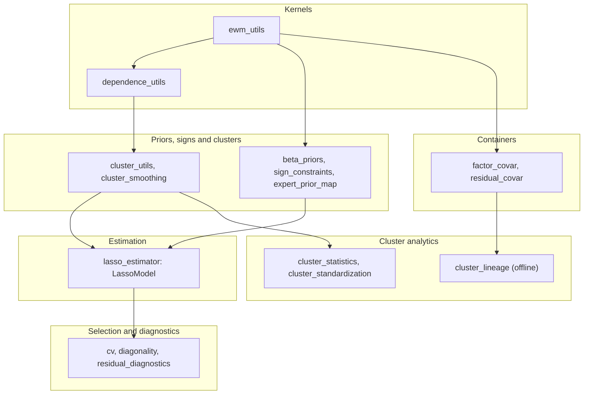

---
myst:
  html_meta:
    description: >-
      Software design of factorlasso: the module layers from EWMA kernels to covariance
      containers, the data flow of a fit and of a rolling estimation, the scikit-learn boundary
      and the dependency surface.
---

# Software design

*Author: [Artur Sepp](https://github.com/ArturSepp)*

Implemented in [factorlasso](https://github.com/ArturSepp/factorlasso).
Software citation: [CITATION.cff](https://github.com/ArturSepp/factorlasso/blob/main/CITATION.cff).

factorlasso is one estimator surrounded by the pieces it needs: numerical kernels below it, the
derivation of clusters, signs and priors beside it, selection and diagnostics around it, and
covariance containers after it. This page maps the modules to those roles, follows the data
through a fit, and states where the package ends.

## Module layers

| Layer | Modules | Responsibility |
|---|---|---|
| Kernels | `ewm_utils`, `dependence_utils` | EWMA means and covariances, and the Pearson, Spearman and Gerber dependence matrices. |
| Priors and signs | `beta_priors`, `sign_constraints`, `expert_prior_map` | OLS prior centres, derived sign constraints, adaptive penalty weights, and the mapping of expert priors to factors. |
| Clusters | `cluster_utils`, `cluster_smoothing`, `cluster_statistics`, `cluster_standardization`, `cluster_lineage` | Distance, linkage and cut; causal rolling partitions; stability statistics and pooled scoring; offline lineage. |
| Estimation | `lasso_estimator` | `LassoModel` and the CVXPY programmes of every mode. |
| Selection and diagnostics | `cv`, `diagonality`, `residual_diagnostics` | Expanding-window selection by held-out $R^2$ or residual diagonality, and the residual tests. |
| Containers | `factor_covar`, `residual_covar` | Dated factor-model snapshots, covariance assembly, and the prepared residual correlation. |

Every public name is exported from the package root; the [API reference](api.rst) groups them by
the article that documents them. The import graph runs one way. The kernels import only each
other; the estimator imports the kernels, the prior centres and the cluster utilities, and the
sign derivation inside the fit; the selectors import the estimator; the containers import the
kernels; and the lineage imports only the containers. `cluster_smoothing` refers to `LassoModel`
only inside functions, which keeps the graph acyclic.

## A fit, step by step

`LassoModel.fit(x, y)` runs the same sequence for every mode; each step is skipped when the mode
or the settings do not need it.

1. **Prepare the panels.** Align dates, record the valid mask of every response, de-mean with
   uniform or EWMA weights, and zero-fill the masked cells for the solver
   ([EWMA weighting](ewma_weighting_and_ragged_histories.md)).
2. **Discover or accept clusters.** Build the dependence matrix of the responses, optionally
   remove the dominant mode, and cut the Ward tree; or take `group_data` or `external_clusters`
   ([cluster discovery](cluster_discovery.md)).
3. **Derive signs, centres and weights.** Pool univariate slopes over the clusters and gate them;
   compute OLS prior centres; resolve their precedence with explicit signs and priors; compute
   adaptive weights ([conventions](conventions.md)).
4. **Solve.** Build the CVXPY programme of the mode and solve it with the configured solver and
   fallbacks ([sparse factor model](sparse_factor_model.md)).
5. **Record.** Store the loadings, the intercepts, the fit diagnostics, the clusters and the
   solver-facing signs and centres, and the residual panel for nowcasts.

The penalty-independent part of steps 1 to 3 is shared across a grid by
`LassoModel.fit_reg_lambda_path`, which the selectors use for the group-LASSO family
([penalty selection](penalty_selection.md)).

## A rolling estimation

The package estimates one date at a time; the rolling loop belongs to the caller. A rolling
consumer computes causal partitions with `compute_rolling_smoothed_clusters`, fits a `LassoModel`
per date with `external_clusters`, and stores each date's loadings, factor covariance and residual
variances in a `CurrentFactorCovarData`, collected in a `RollingFactorCovarData`. OptimalPortfolios
does this in its
[factor covariance estimators](https://optimalportfolios.readthedocs.io/en/latest/covariance_estimators.html).
Stability statistics and pooled scoring read the partitions; the offline lineage reads the
rolling container and is the only component that looks at the whole panel at once
([offline cluster lineage](cluster_lineage.md)).

## The scikit-learn boundary

`LassoModel` follows the scikit-learn estimator protocol, `fit`, `predict`, `score`, `get_params`
and `set_params`, without inheriting from a scikit-learn class and without importing scikit-learn
at module level; a guarded hook imports it only when an installed scikit-learn asks for estimator
tags. The package's own selectors split time series by expanding windows, which generic shuffled
cross-validation does not ([scikit-learn interoperability](interoperability.md)).

## Dependency surface

The runtime dependencies are NumPy, pandas, SciPy, CVXPY and openpyxl. The default solver,
CLARABEL, is installed with CVXPY; other CVXPY solvers can be named in `solver` and
`solver_fallbacks`. factorlasso is a leaf of the author's package stack: it imports none of the
other packages, and OptimalPortfolios depends on it rather than the reverse. The linter bans
imports of the other stack packages outright and bans a module-level scikit-learn import.

## See also

- [Conventions and glossary](conventions.md): the notation, the loss and the precedence rules.
- [API reference](api.rst): every public name and the `LassoModel` parameter map.
- [Examples and recipes](task-guides.md): every runnable script.
- [Choosing a sparse-regression workflow](comparison.md).
