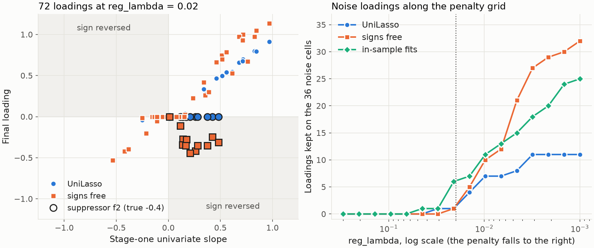

---
myst:
  html_meta:
    description: >-
      UniLasso in factorlasso: the two-stage univariate-guided sparse regression of Chatterjee,
      Hastie and Tibshirani, its leave-one-out and non-negativity options, how each loading
      inherits the sign of its univariate slope, and what that means for a suppressor factor.
---

# UniLasso

*Author: [Artur Sepp](https://github.com/ArturSepp)*

Implemented in [factorlasso](https://github.com/ArturSepp/factorlasso).
Software citation: [CITATION.cff](https://github.com/ArturSepp/factorlasso/blob/main/CITATION.cff).

UniLasso fits each response in two stages. It first regresses the response on every factor alone,
then runs a LASSO of the response on those univariate fits, with non-negative coefficients. Each
final loading is a non-negative multiple of its univariate slope, so it keeps that slope's sign
or is zero. factorlasso offers it as `LassoModelType.UNILASSO`.

## Overview

The univariate-guided sparse regression of Chatterjee, Hastie and Tibshirani (2025) uses the
marginal evidence on each predictor twice: its univariate slope fixes the direction of the
loading, and its leave-one-out fit is the feature on which a second, non-negative LASSO selects
and scales. The method is per response, with no grouping, no clustering and no significance
gate. The [gated sign derivation](gated_cluster_pooled_signs.md) takes the univariate sign from
the same place, pools it within clusters, tests it against a noise floor and imposes it as a hard
constraint on the original factors, as in equation 3.3 of Richland et al. (2025); the sign-pooling
paper sets the two side by side (Sepp and Kastenholz, 2026a, Section 1).

UniLasso's sign is not tested. It is right when the marginal slope points the way the joint
loading does, and it cannot be right when they disagree, which happens when correlated factors
offset each other (see [why a marginal slope can point the wrong way](prior_targets.md)). The
worked example below is built on that case.

## Inputs, notation, and assumptions

| Symbol or input | Meaning | Units and convention |
|---|---|---|
| $x_{tj}$, $y_t$ | Factor $j$ and one response at date $t$, after de-meaning | $T$ valid dates of the response |
| $b_j$ | Univariate slope, $b_j = \sum_t x_{tj} y_t / \sum_t x_{tj}^2$ | Through the origin, on de-meaned data |
| $b_j^{(-t)}$ | The same slope with date $t$ left out | Closed form below |
| $\eta_{tj}$ | Stage-one fit, $x_{tj} b_j^{(-t)}$, or $x_{tj} b_j$ in-sample | Units of the response |
| $\theta_j$ | Stage-two coefficient | Unitless; $\theta_j \ge 0$ by default |
| $\lambda$ | `reg_lambda`, the stage-two L1 weight on $\theta$ | Not on the scale of the LASSO's `reg_lambda` |

The general conventions of the package are on the [conventions page](conventions.md).

## Methodology

### Stage one: univariate slopes and their leave-one-out fits

For each response and factor, stage one computes the univariate slope $b_j$. Leaving out date $t$
changes both sums by one term, so every leave-one-out slope has a closed form,

$$
b_j^{(-t)} = \frac{\sum_s x_{sj} y_s - x_{tj} y_t}{\sum_s x_{sj}^2 - x_{tj}^2} ,
$$

and the prevalidated fit $\eta_{tj} = x_{tj} b_j^{(-t)}$ is what the factor would have predicted at
date $t$ without seeing it. With `unilasso_loo=False` the in-sample fits $x_{tj} b_j$ are used
instead.

### Stage two: a non-negative LASSO on the fits

Stage two solves, per response,

$$
\hat\theta = \arg\min_{\theta \ge 0} \quad \frac{1}{T} \sum_t \Big( y_t - \sum_j \eta_{tj} \theta_j \Big)^2 +
\lambda \sum_j \lvert \theta_j \rvert ,
$$

and the final loading is $\hat\beta_j = \hat\theta_j b_j$, with the full-sample slope. Because
$\hat\beta_j b_j = \hat\theta_j b_j^2 \ge 0$, every loading has the sign of its univariate slope or
is zero. With `unilasso_non_negative=False` the constraint $\theta \ge 0$ is dropped, and stage two
may reverse a slope.

$\theta_j = 1$ reproduces the univariate slope, so the stage-two penalty shrinks each loading
towards zero in proportion to its own slope. For a factor without signal, the in-sample fit is
correlated with the response by construction, because its slope was fitted to that response; the
leave-one-out fit is not, so stage two has less reason to keep the factor.

## Worked example

The canonical script [`examples/docs/unilasso.py`](../examples/docs/unilasso.py) simulates 12
responses on six unit-variance factors over 120 dates. The first two factors have correlation
0.7. Every response loads between 0.6 and 1.2 on the first and $-0.4$ on the second, so the second
factor is a suppressor: its univariate slope, $0.7 \beta_1 - 0.4$, is positive for every response.
The third factor is independent, with loadings from $-0.6$ to $0.6$, and the last three carry no
signal. Three settings of the two options are fitted at `reg_lambda` $= 0.02$:

```python
def fit_unilasso(x: pd.DataFrame, y: pd.DataFrame, reg_lambda: float = REG_LAMBDA,
                 loo: bool = True, non_negative: bool = True) -> pd.DataFrame:
    """UniLasso through LassoModel; loo and non_negative are the two stage-two options."""
    model = fl.LassoModel(
        model_type=fl.LassoModelType.UNILASSO,
        reg_lambda=reg_lambda,
        unilasso_loo=loo,
        unilasso_non_negative=non_negative,
    ).fit(x=x, y=y)
    return model.coef_
```

Mean loadings over the 12 responses:

| Factor | True | Joint OLS | Univariate slope | UniLasso | In-sample fits | Signs free |
|---|---|---|---|---|---|---|
| f1 | 0.90 | 0.91 | 0.61 | 0.59 | 0.60 | 0.80 |
| f2, the suppressor | $-0.40$ | $-0.40$ | 0.23 | 0.00 | 0.00 | $-0.29$ |

The joint least-squares fit recovers the suppressor. UniLasso cannot give it a negative loading,
so it drops it for all 12 responses, and the first factor keeps roughly its univariate slope,
0.59 against a true 0.90: the omitted suppressor is absorbed. With the signs free, stage two
reverses the positive slope for every response, to $-0.29$ on average, and the first loading
rises to 0.80. On the third factor, 10 of the 12 loadings are kept, each with the sign of its own
univariate slope, which is here the true sign.

Of the 36 cells of the three noise factors, UniLasso keeps 1, in-sample fits 6 and free signs 1
at `reg_lambda` $= 0.02$; at `reg_lambda` $= 0.001$ the counts are 11, 25 and 32. The script also
solves stage two independently, by coordinate descent, and checks every loading against the
package to $10^{-5}$.



*Synthetic teaching exhibit. Left: the 72 loadings at `reg_lambda` $= 0.02$ against their
univariate slopes; the shaded quadrants reverse the slope's sign, and the outlined markers are
the suppressor. Right: loadings kept on the 36 noise cells for 16 penalties, from 0.3 on the left
to 0.001 on the right; the dotted line marks 0.02. Produced by `tools/docs_analytics/estimation.py`
from the example script.*

## Implementation in factorlasso

Verified with factorlasso 0.20.0 and CVXPY with the CLARABEL solver.

| Name | Role |
|---|---|
| `LassoModelType.UNILASSO` | The two-stage fit, one response at a time. |
| `unilasso_loo` | Default `True`: stage two uses the leave-one-out fits, as in the published method; `False` uses in-sample fits. |
| `unilasso_non_negative` | Default `True`: $\theta \ge 0$, so each loading keeps its univariate sign; `False` frees the sign. |
| `solve_unilasso_cvx_problem` | The solver for NumPy inputs, with `loo` and `non_negative`; `reg_lambda` weights the L1 penalty on $\theta$. |

The software paper lists the mode and its two options (Sepp and Kastenholz, 2026b, Section 3.1).
Each response uses its own valid rows; a response with fewer than `warmup_period` valid rows is
zeroed with a warning, as in the other modes. To run the example from a checkout:

```console
python examples/docs/unilasso.py
```

## Interpretation and limitations

- **The sign is inherited, not tested.** A factor whose marginal and joint effects disagree is
  dropped under the default, and its omission biases the loadings of correlated factors. The
  gated sign derivation abstains on weak marginal evidence instead, and the free-sign setting
  lets stage two reverse the slope.
- **`reg_lambda` has a different scale.** It penalises $\theta$, which is near one for a kept
  loading, not the loading itself; a value tuned for `LASSO` does not carry over.
- **Several package options do not apply.** `UNILASSO` rejects `factors_beta_loading_signs`,
  `nonneg=True`, `apply_ols_prior=True` and `loss_normalization="weight_sum"` with `ValueError`.
  With `auto_sign_constraints=True` the fit is unchanged and `derived_signs_` is `None`. An
  explicit `factors_beta_prior` is accepted but has no effect. `span` sets the de-meaning and the
  reported diagnostics; the stage-two loss is unweighted.
- **No pooling across responses.** Each response is fitted alone, so clusters of responses do not
  share evidence.

## See also

- [Gated cluster-pooled sign derivation](gated_cluster_pooled_signs.md): pooled, tested and
  hard-imposed univariate signs.
- [Adaptive penalty weights](adaptive_penalty_weights.md): univariate magnitudes as penalty
  weights.
- [Cooperative LASSO](cooperative_lasso.md): sign coherence as a soft group preference.
- [Prior targets](prior_targets.md): why a marginal slope can point the wrong way, and how a
  joint prior centre overrides it.

## References

- Chatterjee, S., Hastie, T., and Tibshirani, R. (2025). Univariate-guided sparse regression.
  *Harvard Data Science Review* 7(3). DOI 10.1162/99608f92.c79ff6db.
- Richland, J., Kiiskinen, T., Wang, W., Lu, S., Narasimhan, B., Hastie, T., Rivas, M., and
  Tibshirani, R. (2025). Univariate-guided sparse regression for biobank-scale high-dimensional
  -omics data. arXiv:2511.22049.
- Sepp, A., and Kastenholz, M. (2026a). Gated Cluster-Pooled Sign Constraints for Multi-Output
  Sparse Regression. Submitted to *Computational Statistics & Data Analysis*.
  [Manuscript](../papers/sign_pooling_2026/paper/article.pdf).
- Sepp, A., and Kastenholz, M. A. (2026b). factorlasso: Sparse Multi-Output Regression with
  Cluster-Grouped Sign Constraints in Python. Submitted to the *Journal of Statistical
  Software*. [Manuscript](../papers/jss_2026/paper/article.pdf).
- [factorlasso software citation](https://github.com/ArturSepp/factorlasso/blob/main/CITATION.cff).
